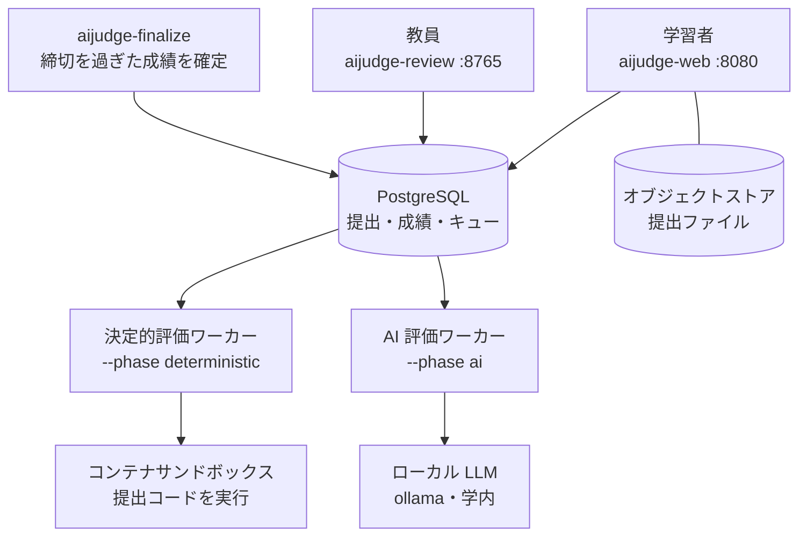
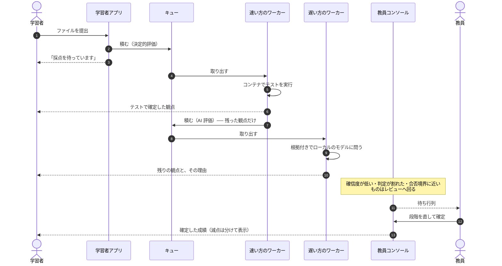
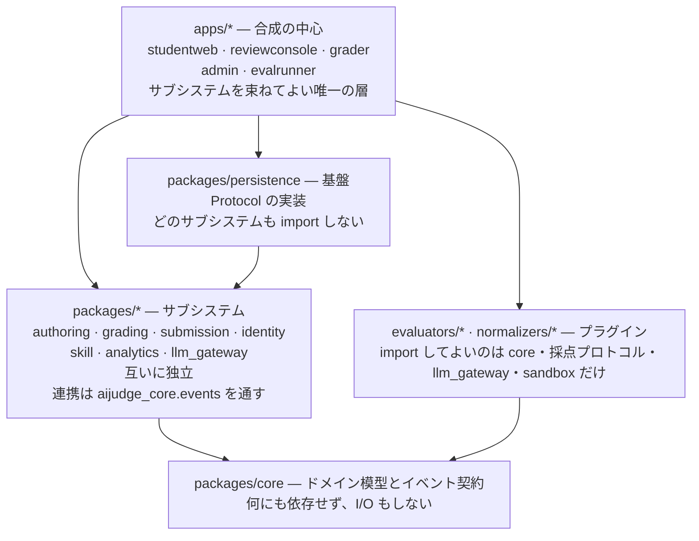
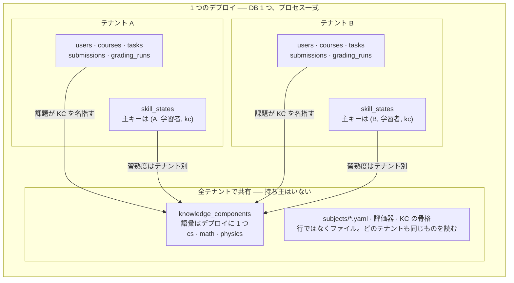

# aiJudge

English: [README.md](README.md)

aiJudge は、理系科目の課題 ── プログラミング・数学・レポート ── をひとつのプラットフォームで採点します。提出された時点で自動採点が走り、判定には必ず根拠が付き、**最終的に決めるのは必ず教員**です。

学内の 1 台で動きます。学習者のデータはそこから出ません。

---

## 何ができるか

### 学習者から見て

出せば、採点日を待たずに結果が返ります。

- **結果は段階的に届きます。** テスト実行の判定は数秒、モデルによる判定は 30 秒ほど後に届きます。画面は**いま何を待っているか**を示し、届いたら自分で更新します。
- **判定には必ず理由が付きます** ── どの観点で、何を根拠に、提出のどの行を見てそう判断したか。
- **点は人が確認するまで暫定です。** 画面はそのどちらかを隠しません。納得できなければ、理由を書いて再確認を依頼できます。
- **遅延の減点は中身と分けて出ます。** 点が低い理由が「内容」なのか「遅れたこと」なのか、学習者が区別できます。

### 教員から見て

コンソールは**届いたものを読んで決めるため**の画面で、採点はしません。

- **人が見る必要のある順に並んだ待ち行列** ── 確信度が低い、評価器の判定が割れた、合否境界の近く。
- **1 件ずつでも問題セットごとでも確定でき**、その根拠が記録に残ります。
- **科目の運用はブラウザから** ── 締切、猶予、遅延減点の段、受講、ルーブリック、問題セット。
- **測定のためのブラインド採点**は、教員が選ぶのではなく**システムが標本抽出** します。選ばせると難しい提出ばかりが集まり、測った一致率が歪むためです。

### 何を採点できるか

| 提出物 | 採点するもの |
|---|---|
| プログラム（C・Python） | コンテナ内でのテスト実行、そのあと読みやすさをモデルが判定 |
| レポート（日本語） | 構成の機械的な検査、そのあとコースのルーブリックでモデルが判定 |
| 画像・PDF（スクリーンショット、手書き） | 教員。観点を「人が採点する」と宣言するので、モデルには渡りません |

プログラミングとレポートは**科目プロファイル**（どの評価器がどの順で走るかを書いた YAML）で表され、コードではありません。レポート採点を足したとき、 `packages/core` と `packages/grading` の変更は**0 行**でした。個々の課題が画像を受けるか PDF を受けるか、どの観点を人に任せるかは、課題ごとにコンソールから設定します。

---

## 何がどう組み合わさっているか



PostgreSQL へ向かう矢印は、そのまま PostgreSQL から出る矢印でもあります。ワーカーはそこのキューからジョブを取り、採点結果を書き戻し、コンソールは書かれたものを読みます。結果を誰かが誰かへ直接渡す経路はありません。

ワーカーが 2 本あり、キューも別なのは、**遅いモデルの呼び出しが 2 秒で終わるテスト実行を待たせてはならない**からです。**AI のワーカーを抜いても採点は完結します** ── モデルが担当するはずだった観点は「未採点」として記録され、総合点は黙って比例配分されるのではなく**保留**されます。

モデルの提供元を直接呼ぶ経路はありません。すべての呼び出しは 1 つのゲートウェイを通り、学習者のデータをローカルのモデルに限り、応答をスキーマで検証し、どのプロンプト版とモデルで付いた点かを成績に記録します。

---

## 提出物に何が起きるか



この順序が表している 3 つの規則。

- **決定的評価が先。** テストで確定した観点はモデルに問い合わせません。
- **採点はレビューを待ちません。** ワーカーは提出時に採点し、コンソールは届いたものを読みます。レビューは採点の前提ではありません。
- **結果は追記のみ。** 採点し直しても上書きしません。それぞれの成績はルーブリック版・プロンプト版・モデル ID・入力を保持するので、過去の点もあとから説明できます。

---

## 動かす

[uv](https://docs.astral.sh/uv/) とコンテナ実行環境（Docker、macOS なら colima）が要ります。

```fish
docker compose up -d                        # PostgreSQL + オブジェクトストア
uv sync --extra dev
uv run alembic upgrade head                 # スキーマの作成・更新

uv run aijudge-admin staff --login sensei --role instructor \
    --course <id> --password '...'      # 利用者の作成は CLI だけ（画面には出さない）
uv run aijudge-web                          # 学習者      :8080
uv run aijudge-review                       # 教員        :8765
uv run aijudge-worker --phase deterministic
uv run aijudge-worker --phase ai
```

どちらも既定では `127.0.0.1` にしか bind しません。配置・tailnet 越しの TLS 公開・スキーマ移行・サンドボックスの準備は [`docs/RUNNING.md`](docs/RUNNING.md) にあります。**実提出を通す前に、コンテナの脱出試験を必ず走らせてください。** skip は「安全」ではなく「検証していない」という意味です。

### 試すためのもの

入れた直後に始められるよう、2 つをサンプルとして同梱しています。

**お試しコース。**1 コースに 3 課題、それぞれ採点のされ方が違います ──
写真は人だけが見る、C 言語はテスト実行で判定する、レポートはモデルが根拠を
添えて判定する。**ここでの提出は何にも数えません**。成績にも、得点の分布にも、
習熟度にも、精度の測定にも入りません。画面がそう言いますし、判定は提出が
持つ 1 つの性質で決まります（数える場所ごとに検査を書き足しません）。

```fish
uv run aijudge-admin kc seed --namespace demo   # このコースが指す語彙
uv run aijudge-admin demo seed                  # コース本体
uv run aijudge-admin demo reset                 # 学期の初めに戻す
```

定義は `subjects/demo/course.yaml` にあり、**リセットはこのファイルから作り
直します** ── 初期状態が誰かの記憶ではなく、ファイルに書いてあります。

**知識要素の骨格。**そのコースが「何を教えたと言えるか」の語彙で、ここで
考案したものではなく公開された基準から取っています。

| 名前空間 | 出典 | 件数 |
|---|---|---|
| `cs` | CS2023（ACM/IEEE-CS/AAAI） | 987 |
| `math` | CUPM 2015（MAA）＋ 高等学校学習指導要領（平成30年告示）数学 | 939 |
| `physics` | 参照基準 物理学・天文学分野（2016）＋ FCI ＋ 物理基礎・物理 | 535 |
| `demo` | お試しコース専用 | 13 |

```fish
uv run aijudge-admin kc seed --namespace cs     # 冪等。骨格を直して再実行できる
```

**語彙はテナントをまたいで共有し、習熟度は共有しません。**2 つの機関が
`math.calculus.integral.ftc` と書けば同じものを指し、誰が何を身につけたかは
その機関の中に留まります。

既存の Sharif Judge の課題資産はそのまま取り込めます。

```fish
uv run aijudge-admin task import --course <id> --dir 課題のディレクトリ
```

---

## いまどこまで動くか

| 対象 | 状態 |
|---|---|
| 提出 → 採点 → 確定 → 返却 | 一巡して動く |
| プログラミング（C・Python）とレポート | 動く。1 つのインスタンスで 2 科目 |
| サンドボックスの隔離 | 検証済み ── fork bomb を封じ込め、通信なし、家目録も見えず、非 root |
| 採点精度 | **まだ測っていない。** 記録は取り始めているが、精度の門は NOT_MEASURED を返す |
| 知識要素と習熟度 | 骨組みは通しで動く。受け入れ基準はまだ 1 つも判定できない |

下 2 行を省かずに書いてあるのは意図的です。このコードベースは、根拠を示せない数字を出さず `NOT_MEASURED` と言う作法を持っており、**それは合格とは別**です。

---

## 今後の予定

各フェーズはアーキテクチャ上の仮説を 1 つ検証し、基準を満たしてから次へ進みます。基準の全文は [`docs/design/`](docs/design/) にあります。

| 次にやること | 何が増えるか | 合格の基準 |
|---|---|---|
| 採点精度の測定 | すでに貯めている観測レコードから一致度を計算する | 観点ごとに Cohen's κ ≥ 0.65、見逃し ≤ 5%、教員の採点時間が従来比 50% 以下 |
| **数学** | CAS による数式の同値判定、数値の許容誤差と有効数字、LaTeX 入力、答えだけでなく**途中式**の評価 | 実際の答案で同値判定が成立し、CAS が決める部分と LLM に任せる部分の切り分けが実用水準で保つこと |
| 作問と知識要素 | 狙った知識要素に向けて課題を生成し、解けること・解が一意であることを機械で検証してから教員に見せる | 教員の承認率 ≥ 60%、習熟度が次の課題の正誤を AUC ≥ 0.70 で予測 |
| **手書きと OCR** | 手書き答案を撮影して提出。ローカルの VLM が書き起こし、**学習者が確認・修正**し、確定したテキストが提出物になる | 学習者の修正率（文字単位）≤ 10%、確定テキストでの採点精度がテキスト直接入力に対して κ の低下 ≤ 0.05 |
| ポートフォリオ | 科目と学期をまたいだ知識要素ごとの習熟度。Open Badges 3.0 として発行 | 学習者が公開範囲を制御でき、外部のウォレットで検証できること |
| 複数機関での運用 | 機関単位のテナント、SSO（学認/SAML）、LTI 1.3 | 2 機関の同時運用。同時提出 500 件のバーストを 10 分以内に捌く |

このうち 2 つは、なぜその作りなのかを書いておきます。

**OCR の結果を採点に直接流しません。** 書き起こしは学習者に見せて確認・修正させ、学習者が確定させたものが提出物になります。その時点で内容の責任は学習者に移るので、「OCR が間違えたせいで減点された」という異議申し立ての構造そのものが消えます。修正箇所の集積は、書き起こし精度の唯一まともな実測データでもあります。

**手書きは数学の後**です。手書きされるのは主に数式で、数式を採点できない段階で書き起こし精度を測っても意味がありません。

---

## 設計方針（要点）

9 つの原則がありますが、使っていて最初に気づくのは次の 5 つです。

- **決定的評価が AI より先**。モデルが使えないときは止まるのではなく、 degrade して動き続けます。
- **AI は提案し、人が決めます。** 確信度・判定の不一致・境界への近さが、人のところへ回す条件です。
- **判定には必ず根拠** ── 観点・根拠・判定・点・理由。
- **学習者のデータは外に出ません。** 既定の設定では出せません。
- **科目は宣言です。** 科目を足すのにエンジンを触らせません。

全体と、各決定の理由は [`docs/design/`](docs/design/) と [`docs/adr/`](docs/adr/) にあります。モジュール境界は `import-linter` が強制し、レビューではなくビルドを落とします。

---

## 構成

| パス | 内容 |
|---|---|
| `packages/core` | ドメイン模型とイベント契約。何にも依存せず、I/O もしない。 |
| `packages/grading` | 採点パイプラインと評価器の登録簿。科目を知らない。 |
| `packages/llm_gateway` | モデルへの唯一の経路。方針・スキーマ検証・プロンプト版の記録。 |
| `packages/submission` | 受け付け・提出物の保存・ジョブの積み込み。 |
| `packages/identity` | ローカル認証・コース・受講。 |
| `packages/authoring` | 作問と、既存課題資産の取り込み。 |
| `packages/feedback` | 採点結果を「次にやること」に変える。 |
| `packages/observation` | 採点が測定のために残す記録。 |
| `packages/analytics` | 一致率の計算。消しても採点は動く。 |
| `packages/skill` | 知識要素と習熟度の推定。 |
| `packages/persistence` | PostgreSQL の保存実装。基盤であり、どのサブシステムも import しない。 |
| `packages/telemetry` | 運用ログ。書式を 1 つに決め、相関 ID を通す。載せるのは識別子だけ。 |
| `packages/audit` | 誰が成績に届く何を変えたか。追記専用で、操作と同じトランザクションに載る。 |
| `packages/webui` | 画面の共通の見た目。CSS と配色の切り替えを 1 か所に置き、両アプリが読む。 |
| `apps/studentweb` | 学習者向けアプリ。 |
| `apps/reviewconsole` | 教員コンソールと `/manage`。 |
| `apps/grader` | 採点ワーカー。 |
| `apps/admin` | 学期頭の一括操作と作問（CLI）。 |
| `apps/evalrunner` | 一致率を測る。採点はしない。 |
| `evaluators/`, `normalizers/` | 採点プラグインと入力の変換器。 |
| `subjects/` | 科目プロファイル ── どの評価器がどの順で走るか。 |

開発するには [`docs/DEVELOPING.ja.md`](docs/DEVELOPING.ja.md) に、コマンドとモジュール境界の規則、各設計判断の理由があります。短い版はこれです。

```fish
uv run pytest
uv run ruff check .
uv run mypy packages/core/src
uv run lint-imports
```

---

## モジュールとテナント

このコードベースには境界が 2 つ通っていて、**それは同じ境界ではありません**。
モジュール境界は「何が何を import してよいか」を決めます。ビルド時に
`import-linter` が検査し、レビューではなく**ビルドを落とします**。
テナント境界は「どの行がどの機関のものか」を決めます。こちらは実行時のデータの中に
あります。1 つのモジュールが 2 つ目の境界の両側に状態を持つのが普通で、
`packages/skill` は**デプロイ全体で共有する**知識要素の語彙と、**共有しない**
習熟度の推定値の両方を持ちます。

### モジュール境界 ── 何が何を import してよいか



矢印は import が通ってよい向きで、逆は通りません。`.importlinter` の 19 の契約が
これを保っており、**いくつかは逆向きが実際に起きたから存在します** ──
観測レコードが `analytics` にあったために、測定を消すと採点が止まりました
（ADR 0005・ADR 0007）。

### テナント境界 ── どの行が誰のものか



**2 つのテナントが同じ `math.calculus.integral.ftc` を参照するのは正常**で、
習熟度は混ざりません（`skill_states` の主キーが
`(tenant_id, learner_id, kc_id)` だからです）。テナントごとに語彙を複製すると、
同じ CS2023 の概念に機関ごとの別 ID が付き、骨格の更新がテナントの数だけ必要になり、
機関をまたいだ測定の比較ができなくなります。

### `tenant_id` が無いことには 2 つの意味がある

| 表 | `tenant_id` | テナントの決まり方 |
|---|---|---|
| `users`・`courses`・`submissions`・`skill_states`・`audit_events` | あり | 列そのもの |
| `tasks`・`task_versions`・`grading_runs`・`human_reviews`・`finalizations` | 無し | **親から決まる。** 列を複製すると、コースを移したときに片方だけ古くなる余地が生まれる |
| `knowledge_components` | 無し | **持ち主がいない。** 語彙はデプロイに 1 つ |

「`tenant_id` が無い＝みんなのもの」と読んでよいのは、この表の**1 行だけ**です。

### いま何が成り立っているか

- 教員が足した知識要素は、同じ名前空間を宣言したコースであれば**どのテナントからも見えます**
- 利用件数（課題数・コース数）は**テナントをまたいで**数えます。自分のところだけ数えると、
  「ここでは誰も使っていない」が、他機関が依存している知識要素を引退させる理由になってしまいます
- **名前は越えません。** 画面に出るのは件数と日付だけで、他テナントのコース名も、
  誰が足したかも出しません
- **できないことが 1 つ** ── テナントに閉じた名前空間は持てません。マルチテナントの実装は
  PoC-5（`packages/core/src/aijudge_core/tenancy.py`）で、単独機関の運用ではテナントは 1 件、
  そこから育つ形がこれです

---

## 何の上に作っているか

Python 3.12 以降、**uv のワークスペース** 1 つ。`packages/*`・`apps/*`・
`evaluators/*`・`normalizers/*` はそれぞれ独立した配布物で、だからこそ境界を
越えた import を `import-linter` が**ビルドとして落とせます**（レビューに
任せません）。

| | |
|---|---|
| **Pydantic** | 直列化の層ではなく**ドメイン模型そのもの**。不変条件を型に書くので、理由の無い採点は作れない |
| **FastAPI** / **Uvicorn** / **Jinja2** | 2 つのアプリ。**サーバ側描画**が基本で、JavaScript は補助（採点中の自動更新・行クリック・配色の切り替え）。無くても全機能が動く |
| **SQLAlchemy 2** / **Alembic** | 運用は PostgreSQL、開発は SQLite。**同じテストを両方に当てる** ── 行ロックがあるのは片方だけだから |
| **httpx** / **joserfc** | OIDC の認可コードフロー。署名検証はライブラリの仕事で、自前で書かない |
| **ollama**（OpenAI 互換の口なら可） | ローカルのモデル。**既定が学習者のデータを機械の外へ出してはいけない** |
| **Docker** / **gVisor** | 提出コードを動かす場所。`sandbox-exec` だけでは fork bomb を封じ込められないので、macOS は開発用 |
| **markdown-it-py** / **latex2mathml** | 問題文と数式の表示 |
| **pytest** / **ruff** / **mypy** / **import-linter** | CI が回す 5 つの検査。`mypy` は `packages/core` に strict で当てる |

**クライアント側のフレームワークも、ドメインの ORM も、メッセージブローカーも
使いません。**採点の待ち行列は PostgreSQL の行で、行ロックを取って 1 件ずつ
取り出します。1 台・1 デプロイ単位・1 データベースで、複数機関はデータの側で
分けます（構成の側ではなく）。

---

## ライセンス

[Apache License 2.0](LICENSE)。特許条項が入っているのが要点で、各サブシステムは他の機関が単独で採用できる大きさに保つことを意図しています。特許条項の無いライセンスでは、その採用が技術ではなく法務の問題になります。

学生の提出物・教員の採点・そこから導かれるものは、**このリポジトリには含まれず**、ライセンスの対象でもありません。
