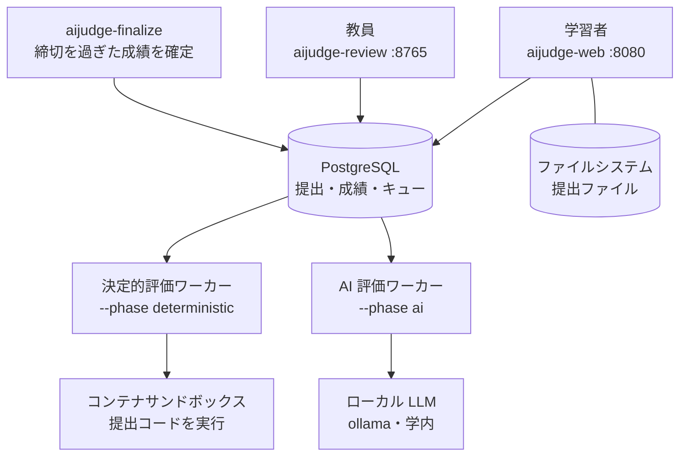
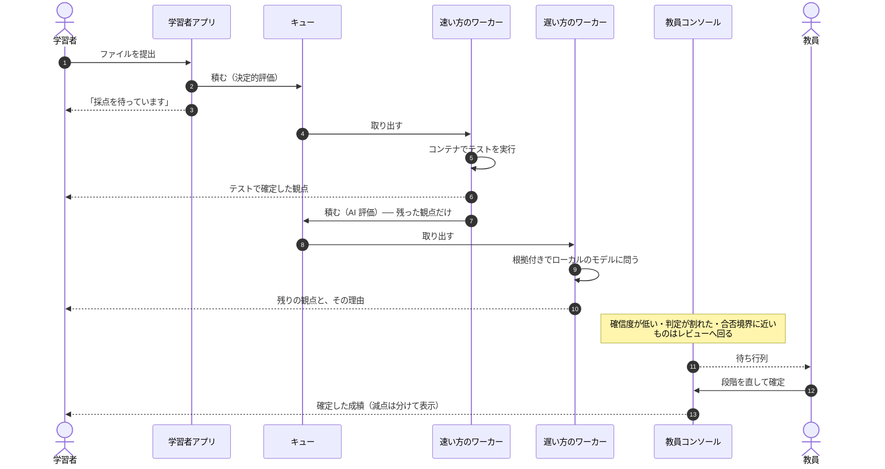
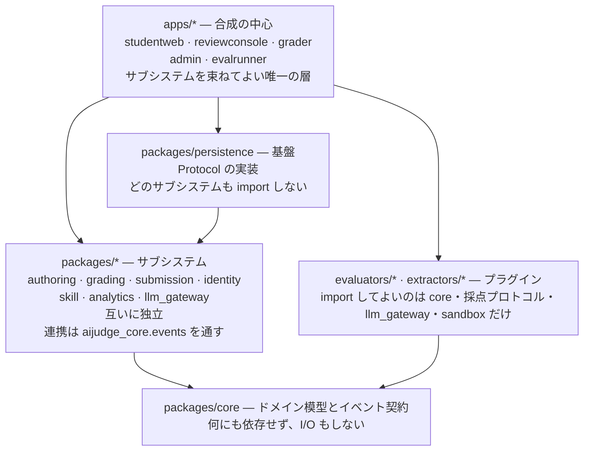
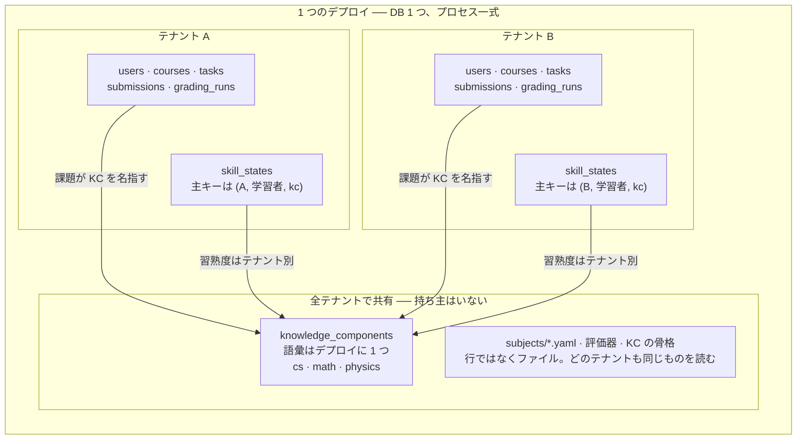

# aiJudge

English: [README.md](README.md)

aiJudge は、理系科目の課題（プログラミング・数学・レポート）をひとつのプラットフォームで採点します。課題が提出されるとすぐに自動採点を始め、判定には必ず根拠を付けます。**成績を最終的に決めるのは、必ず教員**です。

aiJudge は学内のサーバ 1 台で動き、学習者のデータをそのサーバの外へ出しません。

**利用ガイド**（学生・TA・教員向け、画面付き）: <https://sanoakr.github.io/aijudge/>
（原稿は [`docs/guide/`](docs/guide/) にあります）

---

## 何ができるか

### 学習者から見て

学習者が課題を提出すると、採点日を待たずに結果が返ります。

- **結果は段階的に届きます。** テスト実行の判定は数秒で、モデルによる判定は 30 秒ほどで届きます。画面は**いま何を待っているか**を示し、結果が届くと自動で表示を更新します。
- **判定には必ず理由が付きます。** どの観点で、何を根拠に、提出のどの行を見てそう判断したかを示します。
- **点は人が確認するまで暫定です。** 画面は、点が暫定か確定かを必ず示します。学習者は判定に納得できなければ、理由を書いて再確認を依頼できます。
- **遅延の減点は、内容の評価と分けて表示します。** 学習者は、点が低い理由が「内容」なのか「遅れたこと」なのかを区別できます。
- **携帯でも同じ操作ができます。** 幅の狭い画面では、表を 1 件 1 枚のカードで表示し、各欄に見出しを付けます。列を画面の外へ送ると見出しが見えなくなり、見出しの無い値は意味を読み取れないためです。
- **ブラウザで書いて提出できます。** 問題セットによっては、学習者はファイルの代わりにエディタで答えます。エディタには、課題ごとのタブ、課題が受け付ける形式（`.c`・`.py` はプログラム、`.md` はオンラインのレポート試験の文章）、採点と同じ sandbox での試しの実行、10 秒ごとの自動保存があります。受付が終わると、最後に保存した内容を、保存した時刻の提出として自動的に提出します。

### 教員から見て

教員コンソールは、**届いた採点結果を読んで成績を決めるため**の画面です。コンソール自身は採点しません。

- **人が確認すべき提出が、待ち行列に並びます。** 確信度が低い提出、評価器の判定が割れた提出、合否境界に近い提出が対象です。
- **成績は 1 件ずつでも問題セットごとでも確定でき**、確定の根拠が記録に残ります。
- **科目の運用はブラウザで行えます。** 締切、猶予、遅延減点の段階、受講、ルーブリック、問題セットを設定できます。
- **試験と追試に対応します。** 問題セットを公開まで TA に見せないことも、名簿で
  選んだ学習者にだけ出すこともできます。追試は学習者ごとの締切ではなく別の問題セット
  として作ります。名簿は画面・API・CLI のどれからでも登録できます（ADR 0025）。
- **オンラインのコーディングテストを実施できます。** 問題セットを、ブラウザのエディタで解く形式に切り替えられます（補完の有無も選べます）。試しの実行は採点と同じ sandbox を使いますが、採点ではありません。システムは答えを書く過程（打鍵・貼り付け・画面を離れた時間）を記録します。記録を再生できるのはそのコースの教員だけで、再生したことは監査ログに残ります。システムは確かめる価値のある箇所に印を付けますが、判定も減点もしません（ADR 0023・0024・0026）。
- **提出どうしの類似を調べられます。** 受付が閉じて採点が終わった課題について、似ている提出の組を Dolos で調べ、そのコースの教員にだけ示します。Dolos はネットワークの無い sandbox で動かすので、提出を外へ送りません。判定も減点もしません（ADR 0029）。
- **測定のためのブラインド採点**の対象は、教員が選ぶのではなく、**システムが標本抽出**します。教員に選ばせると難しい提出ばかりが集まり、測った一致率が偏るためです。
- **画面の作りは学習者側と共通**です。各画面へのリンクを並べた帯は、狭い画面では畳まれ、押すと同じ縦並びの一覧が開きます。一方の画面で覚えた操作が、もう一方でもそのまま使えます。

### 何を採点できるか

| 提出物 | 採点するもの |
|---|---|
| プログラム（C・Python） | コンテナ内でのテスト実行、そのあと読みやすさをモデルが判定 |
| レポート（日本語） | 構成の機械的な検査、そのあとコースのルーブリックでモデルが判定 |
| 画像・PDF（スクリーンショット、手書き） | PDF は本文を取り出してレポートと同じように採点。画像は、**ローカルの** VLM が書き起こして課題の照合パターンで決定的に判定する（修了証のスクリーンショットなど・ADR 0021/0022）か、観点を「人が採点する」と宣言して教員が採点する |

プログラミングとレポートの違いは、コードではなく**科目プロファイル**（どの評価器をどの順で実行するかを書いた YAML）で表します。レポート採点を追加したとき、`packages/core` と `packages/grading` の変更は**0 行**でした。課題が画像と PDF のどちらを受け付けるか、どの観点を人に任せるかは、課題ごとにコンソールで設定します。

---

## 何がどう組み合わさっているか


```mermaid
flowchart TB
    L["学習者<br/>aijudge-web :8080"]
    I["教員<br/>aijudge-review :8765"]
    F["aijudge-finalize<br/>締切を過ぎた成績を確定"]

    DB[("PostgreSQL<br/>提出・成績・キュー")]
    S[("ファイルシステム<br/>提出ファイル")]

    DW["決定的評価ワーカー<br/>--phase deterministic"]
    AW["AI 評価ワーカー<br/>--phase ai"]

    SB["コンテナサンドボックス<br/>提出コードを実行"]
    LLM["ローカル LLM<br/>ollama・学内"]

    L --- S
    L --> DB
    I --> DB
    F --> DB

    DB --> DW
    DB --> AW

    DW --> SB
    AW --> LLM
```

提出ファイルは**ディスクにそのまま保存します**。S3 互換のストアへ差し替えるためのインタフェース（`ObjectArtifactStore`）はありますが、いま使っている実装はありません。S3 互換のストアが必要になるのは、動画のような大きな提出を大量に受け付けるようになってからです。

図の PostgreSQL へ向かう矢印は、データの読み出しも表します。ワーカーは PostgreSQL のキューからジョブを取り出し、採点結果を PostgreSQL に書き戻します。コンソールは、書き戻された結果を読みます。プロセスどうしが結果を直接渡す経路はありません。

ワーカーを 2 本に分け、キューも分けているのは、**時間のかかるモデルの呼び出しのせいで、2 秒で終わるテスト実行を待たせないため**です。**AI のワーカーを止めても、採点は最後まで進みます。** モデルが担当するはずだった観点は「未採点」として記録し、総合点は残りの観点で比例配分せずに**保留**します。

どのコードも、モデルの提供元を直接呼び出しません。モデルの呼び出しはすべて 1 つのゲートウェイを通ります。ゲートウェイは、学習者のデータをローカルのモデルにだけ送り、応答をスキーマで検証し、どのプロンプト版とモデルで付けた点かを成績に記録します。

---

## 提出物に何が起きるか


```mermaid
sequenceDiagram
    autonumber
    actor 学習者
    participant Web as 学習者アプリ
    participant Q as キュー
    participant Fast as 速い方のワーカー
    participant Slow as 遅い方のワーカー
    participant Console as 教員コンソール
    actor 教員

    学習者->>Web: ファイルを提出
    Web->>Q: 積む（決定的評価）
    Web-->>学習者: 「採点を待っています」

    Q->>Fast: 取り出す
    Fast->>Fast: コンテナでテストを実行
    Fast-->>学習者: テストで確定した観点
    Fast->>Q: 積む（AI 評価）── 残った観点だけ

    Q->>Slow: 取り出す
    Slow->>Slow: 根拠付きでローカルのモデルに問う
    Slow-->>学習者: 残りの観点と、その理由

    Note over Console: 確信度が低い・判定が割れた・合否境界に近い<br/>ものはレビューへ回る
    Console-->>教員: 待ち行列
    教員->>Console: 段階を直して確定
    Console-->>学習者: 確定した成績（減点は分けて表示）
```

この順序は、次の 3 つの規則を表しています。

- **決定的評価が先です。** テストで確定した観点は、モデルに問い合わせません。
- **採点はレビューを待ちません。** ワーカーは提出の時点で採点し、コンソールは届いた結果を読みます。レビューは採点の前提ではありません。
- **結果は追記だけです。** 採点し直しても、前の結果を上書きしません。各成績はルーブリック版・プロンプト版・モデル ID・入力を保持するので、過去の点もあとから説明できます。

---

## 動かす

[uv](https://docs.astral.sh/uv/) とコンテナ実行環境（Docker、macOS なら colima）が必要です。

```fish
docker compose up -d                        # PostgreSQL
uv sync --extra dev
uv run alembic upgrade head                 # スキーマの作成・更新

uv run aijudge-admin staff --login sensei --role instructor \
    --course <id> --password '...'      # 利用者の作成は CLI だけ（画面には出さない）
uv run aijudge-web                          # 学習者      :8080
uv run aijudge-review                       # 教員        :8765
uv run aijudge-worker --phase deterministic
uv run aijudge-worker --phase ai
uv run aijudge-runner                       # ブラウザのエディタの試しの実行（採点ではない）
uv run aijudge-ide-close --once             # エディタの問題セットの受付終了時に自動保存を提出
```

どちらのアプリも、既定では `127.0.0.1` にだけ bind します。配置、tailnet 越しの TLS 公開、スキーマ移行、サンドボックスの準備は [`docs/RUNNING.md`](docs/RUNNING.md) に書いてあります。**実際の提出を受け付ける前に、コンテナの脱出試験を必ず実行してください。** 試験が skip になった場合、それは「安全」ではなく「検証していない」という意味です。

### 試すためのもの

導入した直後から試せるように、次の 2 つをサンプルとして同梱しています。

**お試しコース。** 2 つの問題セットに 4 課題があり、課題ごとに採点のされ方が違います。
プログラム（C・Python）はテスト実行で判定し、レポートはモデルが根拠を添えて判定します。
2 つ目の問題セットは試験を想定した設定（エディタからだけ提出・学内からだけ受け付け）です。**このコースの提出は、どこにも数えません**。
成績にも、得点の分布にも、習熟度にも、精度の測定にも入りません。画面にもそう表示します。
数えるかどうかは提出が持つ 1 つの性質で決まるので、数える場所ごとに検査を書き足す必要はありません。

```fish
uv run aijudge-admin kc seed --namespace demo   # このコースが指す語彙
uv run aijudge-admin demo seed                  # コース本体
uv run aijudge-admin demo reset                 # 学期の初めに戻す
```

定義は `subjects/demo/course.yaml` にあり、**リセットはこのファイルからコースを作り
直します**。初期状態は、誰かの記憶ではなくファイルに書いてあります。

**知識要素の骨格。** コースが「何を教えたと言えるか」を表す語彙です。この語彙は
このプロジェクトで考案したものではなく、公開された基準から取っています。

| 名前空間 | 出典 | 件数 |
|---|---|---|
| `cs` | CS2023（ACM/IEEE-CS/AAAI） | 987 |
| `math` | CUPM 2015（MAA）＋ 高等学校学習指導要領（平成30年告示）数学 | 939 |
| `physics` | 参照基準 物理学・天文学分野（2016）＋ FCI ＋ 物理基礎・物理 | 535 |
| `demo` | お試しコース専用 | 13 |

```fish
uv run aijudge-admin kc seed --namespace cs     # 冪等。骨格を直して再実行できる
```

**語彙はテナントをまたいで共有し、習熟度は共有しません。** 2 つの機関が
`math.calculus.integral.ftc` と書けば同じ概念を指しますが、誰が何を身につけたかは
それぞれの機関の中に留まります。

既存の Sharif Judge の課題資産はそのまま取り込めます。

```fish
uv run aijudge-admin task import --course <id> --dir 課題のディレクトリ
```

コース 1 つ分（コース・課題・回ごとの日程）を 1 つのファイルに書いて、まとめて投入する
こともできます。画像で提出する課題（認定証のスクリーンショットなど）は、取り込み元の
形式では表せないので、このファイルで宣言します。既存の課題ディレクトリは
`problem_dir` で指定できます。同じファイルを何度投入しても、課題は増えません。

```fish
uv run aijudge-admin course apply --file network/2026/course.yaml
```

形式は `packages/course_admin/src/aijudge_course_admin/course_definition.py` の冒頭と
`subjects/demo/course.yaml`（お試しコースの定義。同じ形式）にあります。

同じ構成のファイルを、DB から**書き出す**こともできます。正本を DB ではなくファイルの側に
置くための手段で、`export` は `apply` の逆の操作、`diff` は両者の差を表示する操作です。
コンソールで直した課題をファイルに反映する方法はこれだけです。コンソールだけで
作った課題は、書き出さない限り、ファイルには記録が残りません。

```fish
uv run aijudge-admin course export --course <id> --out network/2026/assignments
uv run aijudge-admin course diff --file network/2026/assignments/course.yaml
```

`export` は、書き出す直前に課題を 1 件ずつ組み立て直して確かめ、**忠実に書き出せない課題は
書き出さずに報告します**。欠けたファイルを正本にすると、次に投入したときに、その課題が
知らないうちに変わってしまうためです。このリポジトリ（公開）のチェックアウトへの書き出しは
拒否します。書き出す内容には問題文・テストケース・参照解答が含まれ、未公開の回も含むためです。

`diff` の終了コードは、一致なら `0`、差があれば `1`、判定できなければ `2`
（定義が読めない・まだ投入していない）です。**「判定できない」を成功として扱いません。**
公開の手順が、この終了コードを関門として使うためです。

`snapshot` は、定義ファイルか DB のどちらか一方を**項目ごとの値**に展開し、JSON で出力します。
`--file` は定義ファイル側、`--course` は DB 側を出力します。DB 側には、項目ごとに「いまの値に
なった時刻」（課題の版と監査記録から求めます）も付きます。両側を同じ規則で展開するので、
定義ファイルの書き方（`problem_dir` か直書きか、日程を回に書くか課題に書くか）の違いは
差として現れません。このコマンドは、ファイルとコンソールの両方で課題を直す運用で、両者を揃えるために使います。
同期する側は「前回揃えた状態」と各側を比べ、**同じ項目が両側で変わったときだけ**
時刻を比べます。

```fish
uv run aijudge-admin course snapshot --file network/2026/assignments/course.yaml
uv run aijudge-admin course snapshot --course <id>
```

**動画の提出は、課題の締切から 6 ヶ月で削除します**（ADR 0020）。起点は提出でも
成績確定でもなく締切なので、**動画は問題セット単位でまとめて削除されます**。最も早い回の動画でも、
削除はその学期の成績への異議申し立てが終わったあとになります。削除するのはファイルだけで、`Artifact` の行も
採点結果も残ります。そのため、採点が何を見て付いたかは、削除後も読めます。削除した
動画を開いた人には、404 ではなく削除した理由を表示します。

締切の無い課題には共通の起点が無いので、**提出から 1 年**で削除します。長く保存する
代わりに、受け付ける大きさを 1 件 256 MiB に制限しています（通常は 5 GiB）。
大きさの上限と保存期間は、組で決めています。

```fish
uv run aijudge-admin video purge            # 下見。何件・何 GB か出す
uv run aijudge-admin video purge --apply    # 実際に消す
```

ブラウザのエディタの作業の記録と自動保存も、同じ期間で、同じく運用者がコマンドで削除します。

```fish
uv run aijudge-admin activity purge         # 下見
uv run aijudge-admin activity purge --apply # 実際に消す
```

---

## いまどこまで動くか

| 対象 | 状態 |
|---|---|
| 提出 → 採点 → 確定 → 返却 | 一巡して動く |
| プログラミング（C・Python）とレポート | 動く。1 つのインスタンスで 2 科目 |
| サンドボックスの隔離 | 検証済み（fork bomb を封じ込め、通信なし、ホームディレクトリも見えず、非 root） |
| 採点精度 | **まだ測っていない。** 記録は取り始めているが、精度の門は NOT_MEASURED を返す |
| 知識要素と習熟度 | 骨組みは通しで動く。受け入れ基準はまだ 1 つも判定できない |
| ブラウザのエディタ（オンラインのコーディングテスト） | 動く。手元で 150 名の負荷試験済み、**運用機ではまだ測っていない** |
| 提出どうしの類似（Dolos） | 動く。採点の後に sandbox で調べ、そのコースの教員にだけ示す。成績にはつながない |

未完了の行も省かずに書いているのは、意図的です。このコードベースでは、根拠を示せない数字は出さずに `NOT_MEASURED` と報告します。**`NOT_MEASURED` は合格ではありません。**

### 1.0.0 が意味すること

**運用を始められる、という意味です。精度の保証ではありません。**

提出から返却までの一巡が動き、サンドボックスの隔離も検証済みです。本番の構成で、提出から確定までを
通しで確かめてあります。学期を運用するうえで不足しているものは、いまのところ見つかって
いません。

**採点精度は、まだ測れません。** 測るには、1 学期分の提出と、教員が実際に読んだ
記録（`HumanReview`）が必要です。どちらも、運用を始めてからでないと蓄積されません。
**測れないものを「測った」とは報告しない**ので、精度の関門は運用開始後も、根拠が蓄積されるまでは
`NOT_MEASURED` を返します。

つまり 1.0.0 は「**ここから実データを取り始める**」という区切りであって、
「精度が保証された」という区切りではありません。

---

## 今後の予定

各フェーズでは、アーキテクチャ上の仮説を 1 つ検証し、基準を満たしてから次のフェーズへ進みます。基準の全文は [`docs/design/`](docs/design/) にあります。

| 次にやること | 何が増えるか | 合格の基準 |
|---|---|---|
| 採点精度の測定 | すでに貯めている観測レコードから一致度を計算する | 観点ごとに Cohen's κ ≥ 0.65、見逃し ≤ 5%、教員の採点時間が従来比 50% 以下 |
| **数学** | CAS による数式の同値判定、数値の許容誤差と有効数字、LaTeX 入力、答えだけでなく**途中式**の評価 | 実際の答案で同値判定が成立し、CAS が決める部分と LLM に任せる部分の切り分けが実用水準で保つこと |
| 作問と知識要素 | 狙った知識要素に向けて課題を生成し、解けること・解が一意であることを機械で検証してから教員に見せる | 教員の承認率 ≥ 60%、習熟度が次の課題の正誤を AUC ≥ 0.70 で予測 |
| **手書きと OCR** | 手書き答案を撮影して提出。ローカルの VLM が書き起こし、**学習者が確認・修正**し、確定したテキストが提出物になる（書き起こし自体は、照合パターンで判定する画像について稼働済み・ADR 0021。残っているのは学習者が確認・修正する流れ） | 学習者の修正率（文字単位）≤ 10%、確定テキストでの採点精度がテキスト直接入力に対して κ の低下 ≤ 0.05 |
| ポートフォリオ | 科目と学期をまたいだ知識要素ごとの習熟度。Open Badges 3.0 として発行 | 学習者が公開範囲を制御でき、外部のウォレットで検証できること |
| 複数機関での運用 | 機関単位のテナント、SSO（学認/SAML）、LTI 1.3 | 2 機関の同時運用。同時提出 500 件のバーストを 10 分以内に捌く |

このうち 2 つについては、その設計にした理由を書いておきます。

**OCR の結果を、そのまま採点には使いません。** 書き起こした結果を学習者に見せて確認・修正させ、学習者が確定させた文章を提出物にします。確定した時点で内容の責任は学習者に移るので、「OCR が間違えたせいで減点された」という異議申し立ては起こりません。学習者が修正した箇所の記録は、書き起こし精度を実測できる唯一の信頼できるデータにもなります。

**手書きの対応は、数学の対応の後**です。手書きされるのは主に数式なので、数式を採点できない段階で書き起こし精度を測っても意味がありません。

---

## 設計方針（要点）

設計原則は 9 つあります。そのうち、使い始めて最初に気づくのは次の 5 つです。

- **決定的評価が AI より先です。** モデルが使えないときも、システムは止まらずに機能を絞って動き続けます。
- **AI は提案し、人が決めます。** 確信度の低さ、判定の不一致、合否境界への近さが、人に回す条件です。
- **判定には必ず根拠を付けます。** 判定は、観点・根拠・判定・点・理由の形で記録します。
- **学習者のデータは外に出ません。** 既定の設定では、外に出すこともできません。
- **科目は宣言で表します。** 科目を追加するときに、採点エンジンを変更する必要はありません。

設計の全体と各決定の理由は、[`docs/design/`](docs/design/) と [`docs/adr/`](docs/adr/) にあります。モジュール境界は `import-linter` が検査し、違反があればレビューを待たずにビルドを失敗させます。

---

## 構成

| パス | 内容 |
|---|---|
| `packages/core` | ドメイン模型とイベント契約。何にも依存せず、I/O もしない。 |
| `packages/grading` | 採点パイプラインと評価器の登録簿。科目を知らない。 |
| `packages/llm_gateway` | モデルへの唯一の経路。方針・スキーマ検証・プロンプト版の記録。 |
| `packages/submission` | 受け付け・提出物の保存・ジョブの積み込み。 |
| `packages/identity` | ローカル認証・コース・受講。 |
| `packages/authoring` | 作問と、既存課題資産の取り込み。 |
| `packages/feedback` | 採点結果を「次にやること」に変える。 |
| `packages/observation` | 採点が測定のために残す記録。 |
| `packages/analytics` | 一致率の計算。消しても採点は動く。 |
| `packages/skill` | 知識要素と習熟度の推定。 |
| `packages/persistence` | PostgreSQL の保存実装。基盤であり、どのサブシステムも import しない。 |
| `packages/telemetry` | 運用ログ。書式を 1 つに決め、相関 ID を通す。載せるのは識別子だけ。 |
| `packages/audit` | 誰が成績に届く何を変えたか。追記専用で、操作と同じトランザクションに載る。 |
| `packages/ide` | ブラウザのエディタ。実行要求・自動保存・作業の記録とその検査。コードは動かさない。 |
| `packages/webui` | 画面の共通の見た目。CSS と配色の切り替えを 1 か所に置き、両アプリが読む。 |
| `packages/webapp` | 両 Web アプリが共有する部品（フッターの版と著作権表示、相手の画面への URL、動画の配信）。import してよいのはアプリだけ。 |
| `packages/unit_of_work` | 全リポジトリの UnitOfWork の Protocol（`UnitOfWork`・`StoreUnitOfWork`・`Store`）。Protocol だけで、実装は保存層。import してよいのはアプリと `course_admin` だけ。 |
| `packages/course_admin` | コース運営の業務処理（課題・問題セット・名簿・グループ・確定・KC・束・コースの複製・定義・保存期間）。admin の CLI も教員コンソールもここを呼ぶ。保存先は `unit_of_work` 越しで、保存層は import しない。 |
| `apps/studentweb` | 学習者向けアプリ。 |
| `apps/reviewconsole` | 教員コンソールと `/manage`。 |
| `apps/grader` | 採点ワーカー。 |
| `apps/runner` | エディタの試しの実行を sandbox で動かし、受付終了時に自動保存を提出する。採点ではない。 |
| `apps/admin` | 学期頭の一括操作と作問（CLI だけ。処理は `course_admin`）。 |
| `apps/evalrunner` | 一致率を測る。採点はしない。 |
| `evaluators/`, `extractors/` | 採点プラグインと入力の変換器。 |
| `subjects/` | 科目プロファイル ── どの評価器がどの順で走るか。 |

開発に必要なコマンド、モジュール境界の規則、各設計判断の理由は、[`docs/DEVELOPING.ja.md`](docs/DEVELOPING.ja.md) にあります。最低限のコマンドは次のとおりです。

```fish
uv run pytest
uv run ruff check .
uv run mypy packages/core/src packages/submission/src packages/persistence/src packages/unit_of_work/src packages/course_admin/src
uv run lint-imports
```

---

## モジュールとテナント

このコードベースには 2 種類の境界があり、**この 2 つは別の境界です**。
モジュール境界は「何が何を import してよいか」を決めます。ビルド時に
`import-linter` が検査し、違反があれば**ビルドを失敗させます**。
テナント境界は「どの行がどの機関のものか」を決めます。こちらは実行時のデータの中に
あります。1 つのモジュールがテナント境界の両側に状態を持つことは普通にあります。たとえば
`packages/skill` は、**デプロイ全体で共有する**知識要素の語彙と、**共有しない**
習熟度の推定値の両方を持ちます。

### モジュール境界 ── 何が何を import してよいか


```mermaid
%%{init: {"flowchart": {"wrappingWidth": 460}} }%%
flowchart TB
    APPS["apps/* — 合成の中心<br/>studentweb · reviewconsole · grader<br/>admin · evalrunner<br/>サブシステムを束ねてよい唯一の層"]
    INFRA["packages/persistence — 基盤<br/>Protocol の実装<br/>どのサブシステムも import しない"]
    PLUG["evaluators/* · extractors/* — プラグイン<br/>import してよいのは core・採点プロトコル・<br/>llm_gateway・sandbox だけ"]
    SUBS["packages/* — サブシステム<br/>authoring · grading · submission · identity<br/>skill · analytics · llm_gateway<br/>互いに独立<br/>連携は aijudge_core.events を通す"]
    CORE["packages/core — ドメイン模型とイベント契約<br/>何にも依存せず、I/O もしない"]

    APPS --> SUBS
    APPS --> INFRA
    APPS --> PLUG
    SUBS --> CORE
    PLUG --> CORE
    INFRA --> SUBS
```

矢印は import してよい向きを表し、逆向きの import は許しません。`.importlinter` の契約が
この向きを守っています。**いくつかの契約は、逆向きの依存が実際に問題を起こしたために追加しました。**
たとえば、観測レコードが `analytics` にあったために、測定の機能を消すと採点が止まりました
（ADR 0005・ADR 0007）。

### テナント境界 ── どの行が誰のものか


```mermaid
%%{init: {"flowchart": {"wrappingWidth": 460}} }%%
flowchart LR
    subgraph DEP["1 つのデプロイ ── DB 1 つ、プロセス一式"]
        subgraph TEN_A["テナント A"]
            CA["users · courses · tasks<br/>submissions · grading_runs"]
            SA["skill_states<br/>主キーは (A, 学習者, kc)"]
        end
        subgraph TEN_B["テナント B"]
            CB["users · courses · tasks<br/>submissions · grading_runs"]
            SB["skill_states<br/>主キーは (B, 学習者, kc)"]
        end
        subgraph SHARED["全テナントで共有 ── 持ち主はいない"]
            KC["knowledge_components<br/>語彙はデプロイに 1 つ<br/>cs · math · physics"]
            FILES["subjects/*.yaml · 評価器 · KC の骨格<br/>行ではなくファイル。どのテナントも同じものを読む"]
        end
    end

    CA ~~~ SA
    CB ~~~ SB
    CA -- "課題が KC を名指す" --> KC
    SA -- "習熟度はテナント別" --> KC
    CB -- "課題が KC を名指す" --> KC
    SB -- "習熟度はテナント別" --> KC
```

**2 つのテナントが同じ `math.calculus.integral.ftc` を参照するのは正常**で、
習熟度は混ざりません（`skill_states` の主キーが
`(tenant_id, learner_id, kc_id)` だからです）。テナントごとに語彙を複製すると、
同じ CS2023 の概念に機関ごとの別 ID が付き、骨格の更新がテナントの数だけ必要になり、
機関をまたいだ測定の比較ができなくなります。

### `tenant_id` が無いことには 2 つの意味がある

| 表 | `tenant_id` | テナントの決まり方 |
|---|---|---|
| `users`・`courses`・`submissions`・`skill_states`・`audit_events` | あり | 列そのもの |
| `tasks`・`task_versions`・`grading_runs`・`human_reviews`・`finalizations` | 無し | **親から決まる。** 列を複製すると、コースを移したときに片方だけ古くなる余地が生まれる |
| `knowledge_components` | 無し | **持ち主がいない。** 語彙はデプロイに 1 つ |

「`tenant_id` が無い＝みんなのもの」と読んでよいのは、この表の**1 行だけ**です。

### いま何が成り立っているか

- 教員が足した知識要素は、同じ名前空間を宣言したコースであれば**どのテナントからも見えます**
- 利用件数（課題数・コース数）は**テナントをまたいで**数えます。自分のところだけ数えると、
  「ここでは誰も使っていない」が、他機関が依存している知識要素を引退させる理由になってしまいます
- **名前は越えません。** 画面に出るのは件数と日付だけで、他テナントのコース名も、
  誰が足したかも出しません
- **できないことが 1 つあります。** テナントに閉じた名前空間は持てません。マルチテナントの実装は
  PoC-5（`packages/core/src/aijudge_core/tenancy.py`）です。単独機関の運用ではテナントは 1 件で、
  機関が増えたときにはこの形のまま拡張します

---

## 何の上に作っているか

Python 3.12 以降で、**uv のワークスペース** 1 つにまとめています。`packages/*`・`apps/*`・
`evaluators/*`・`extractors/*` はそれぞれ独立した配布物です。そのため、境界を
越えた import を `import-linter` が検出し、**ビルドを失敗させられます**（レビューに
任せません）。

| | |
|---|---|
| **Pydantic** | 直列化の層ではなく**ドメイン模型そのもの**。不変条件を型に書くので、理由の無い採点は作れない |
| **FastAPI** / **Uvicorn** / **Jinja2** | 2 つのアプリ。**サーバ側描画**が基本で、JavaScript は補助（採点中の自動更新・行クリック・配色の切り替え）。無くても全機能が動く |
| **SQLAlchemy 2** / **Alembic** | 運用は PostgreSQL、開発は SQLite。**同じテストを両方に当てる** ── 行ロックがあるのは片方だけだから |
| **httpx** / **joserfc** | OIDC の認可コードフロー。署名検証はライブラリの仕事で、自前で書かない |
| **ollama**（OpenAI 互換の口なら可） | ローカルのモデル。**既定が学習者のデータを機械の外へ出してはいけない** |
| **Docker** / **gVisor** | 提出コードを動かす場所。`sandbox-exec` だけでは fork bomb を封じ込められないので、macOS は開発用 |
| **markdown-it-py** / **latex2mathml** | 問題文と数式の表示 |
| **pytest** / **ruff** / **mypy** / **import-linter** | CI が回す 5 つの検査。`mypy` は `packages/core` に strict で当てる |

**クライアント側のフレームワークも、ドメインの ORM も、メッセージブローカーも
使いません。** 採点の待ち行列は PostgreSQL の行で、ワーカーは行ロックを取って 1 件ずつ
取り出します。サーバ 1 台・1 デプロイ単位・1 データベースで動かし、複数の機関はシステム構成ではなく
データの側で分けます。

---

## ライセンス

[Apache License 2.0](LICENSE) です。このライセンスを選んだのは、特許条項が入っているためです。各サブシステムは、他の機関が単独で採用できる大きさに保つ方針です。特許条項の無いライセンスでは、その採用が技術ではなく法務の問題になってしまいます。

学生の提出物・教員の採点・そこから導かれるものは、**このリポジトリには含まれず**、ライセンスの対象でもありません。
