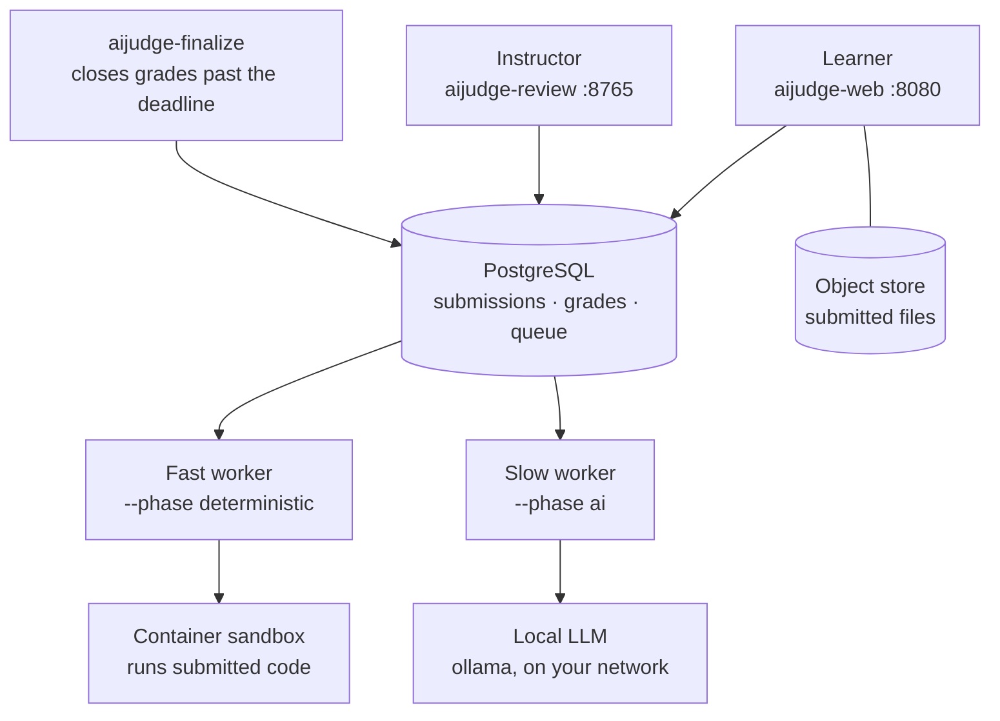
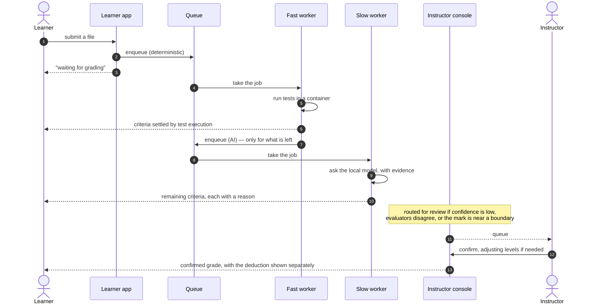

# aiJudge

日本語版: [README.ja.md](README.ja.md)

aiJudge grades STEM coursework — programming, mathematics and written reports —
on one platform. Automatic marking runs the moment a submission arrives, every
judgement carries the evidence behind it, and **an instructor always has the
final say**.

It runs on a single machine inside your institution. Learner work never leaves it.

---

## What it does

### For learners

Submit, and the result comes back without waiting for a marking session.

- **Results arrive in stages.** Test execution lands in seconds. The judgements
  a model makes follow about half a minute later. The page says which one it is
  waiting for and updates itself.
- **Every judgement is shown with its reason** — which criterion, what was
  found, which lines of the submission it came from.
- **The mark is provisional until a person confirms it.** The page never hides
  which it is, and the learner can ask for a second look with a stated reason.
- **Lateness is shown separately from the work.** A low mark reads as either
  "the work" or "it was late", never a single unexplained number.

### For instructors

The console is for reading what arrived and deciding — it never grades.

- **A queue ordered by what needs a person**: low confidence, evaluators
  disagreeing, marks near a pass boundary.
- **Confirm one submission or a whole problem set**, with the reason recorded.
- **Course management in the browser**: deadlines, grace periods, late-penalty
  ladders, enrolment, rubrics, problem sets.
- **Blind marking for measurement**, sampled by the system — never by choice —
  so agreement between人 and machine can be measured honestly.

### What can be marked

| Work | Marked by |
|---|---|
| Programming (C, Python) | Test execution in a container, then a model on readability |
| Reports (Japanese) | Structural checks, then a model against the course rubric |
| Images and PDFs (screenshots, handwriting) | An instructor — the criterion is declared human-scored, so it is never sent to a model |

Programming and reports are **subject profiles** — a YAML declaration naming
which evaluators run and in what order, not code. Adding report grading changed
`packages/core` and `packages/grading` by **zero lines**. Whether a particular
task takes an image or a PDF, and whether a criterion is left to a person, is
set per task in the console.

---

## How it fits together



Every arrow into PostgreSQL is also an arrow out of it: the workers take jobs
from the queue there and write the grades back to it, and the console reads what
they wrote. Nothing passes results to anything else directly.

Two workers, not one, and on separate queues: a slow model call must never hold
up a test run that finishes in two seconds. **Pull the AI worker out and grading
still completes** — the criteria a model would have judged are recorded as
unscored, and the overall total is withheld rather than quietly renormalised.

Nothing calls a model provider directly. Every call goes through one gateway
that keeps learner data on local models, validates the reply against a schema,
and records the prompt version and model id against the grade.

---

## What happens to a submission



Three rules this order encodes:

- **Deterministic first.** A criterion a test settles is never sent to a model.
- **Grading does not wait for review.** The worker grades on submission; the
  console reads what arrived. Reviewing is not a precondition for grading.
- **Results are append-only.** Re-grading does not overwrite. Each grade keeps
  the rubric version, prompt version, model id and inputs it was produced from,
  so any past mark can be explained later.

---

## Running it

Requires [uv](https://docs.astral.sh/uv/) and a container runtime
(Docker, or colima on macOS).

```fish
docker compose up -d                        # PostgreSQL + object store
uv sync --extra dev
uv run alembic upgrade head                 # create or update the schema

uv run aijudge-admin staff --login sensei --role instructor \
    --course <id> --password '...'      # accounts are CLI-only, never a web form
uv run aijudge-web                          # learners      :8080
uv run aijudge-review                       # instructors   :8765
uv run aijudge-worker --phase deterministic
uv run aijudge-worker --phase ai
```

Both apps bind to `127.0.0.1` only. [`docs/RUNNING.md`](docs/RUNNING.md) covers
deployment, exposing them over a tailnet with TLS, schema migrations, and the
sandbox setup — **including the container escape suite you must run before real
submissions go through the system.** A skipped test there means "unverified",
not "safe".

Existing Sharif Judge course material imports as-is:

```fish
uv run aijudge-admin task import --course <id> --dir path/to/exercises
```

---

## Where it stands

| Area | State |
|---|---|
| Submit → grade → confirm → return | Working end to end |
| Programming (C, Python) and reports | Working; two subjects on one instance |
| Sandbox isolation | Verified — fork bomb contained, no network, no host home, non-root |
| Grading accuracy | **Not yet measured.** The records are being captured; the gate reports NOT_MEASURED |
| Knowledge components and mastery | Skeleton running; none of its acceptance criteria can be judged yet |

The two "not yet" rows are stated rather than omitted on purpose: this codebase
reports `NOT_MEASURED` wherever it cannot justify a number, and treats that as
distinct from a pass.

---

## What is planned

Each phase tests one architectural claim and has to pass a stated bar before the
next one starts. The full criteria are in
[`docs/design/`](docs/design/).

| Next | What it adds | Passes when |
|---|---|---|
| Measuring accuracy | Agreement metrics over the records already being captured | Cohen's κ ≥ 0.65 per criterion, misses ≤ 5%, instructor marking time halved |
| **Mathematics** | Symbolic equivalence (CAS), numeric tolerance and significant figures, LaTeX entry, judgement of the working, not just the answer | Equivalence decided correctly on real answers; the split between what CAS settles and what a model judges holds up |
| Authoring and knowledge components | Generated tasks aimed at a named component, machine-checked for solvability and a unique answer before an instructor sees them | Instructor approval ≥ 60%, mastery predicts the next result at AUC ≥ 0.70 |
| **Handwriting and OCR** | Photograph a handwritten answer; a local vision model transcribes it, **the learner checks and corrects it**, and the corrected text is what gets submitted | Learner correction rate ≤ 10% of characters, and grading the corrected text loses ≤ 0.05 κ against typed entry |
| Portfolio | Mastery per knowledge component across courses and terms, exportable as Open Badges 3.0 | The learner controls what is shared and an external wallet can verify it |
| Multiple institutions | Per-institution tenancy, SSO, LTI 1.3 | Two institutions running at once; a 500-submission burst cleared within 10 minutes |

Two of these deserve a word on why they are built the way they are.

**OCR never feeds grading directly.** The transcription is shown to the learner
to check and correct, and what they confirm is the submission. Responsibility
moves to the learner at that point, which removes "the OCR misread me" as a
category of appeal entirely. The corrections are also the only honest
measurement of how good the transcription actually is.

**Handwriting comes after mathematics**, not before. What gets handwritten is
mostly formulae, and measuring transcription accuracy is meaningless while there
is nothing that can grade a formula.

---

## Design, in brief

Nine principles drive the architecture; the ones you will notice first:

- **Deterministic before AI**, and the system degrades rather than stops when
  the model is unavailable.
- **AI proposes, a human decides.** Confidence, disagreement and boundary
  proximity route work to a person.
- **Evidence with every judgement** — criterion, evidence, judgement, score,
  reason.
- **Learner data stays local.** The default configuration cannot send it
  anywhere else.
- **Subjects are declarations.** Adding one must not touch the engine.

The full set, and the reasoning behind each decision, is in
[`docs/design/`](docs/design/) and [`docs/adr/`](docs/adr/). Module boundaries
are enforced by `import-linter` and fail the build, not the review.

---

## Layout

| Path | Contents |
|---|---|
| `packages/core` | Domain model and event contracts. Depends on nothing, performs no I/O. |
| `packages/grading` | The grading pipeline and evaluator registry. Knows no subject. |
| `packages/llm_gateway` | The only path to a model. Policy, schema validation, prompt versioning. |
| `packages/submission` | Intake, artifact storage, job orchestration. |
| `packages/identity` | Local authentication, courses, enrolment. |
| `packages/authoring` | Task authoring and importers for existing course material. |
| `packages/feedback` | Turns results into the learner's next step. |
| `packages/observation` | What grading leaves behind for measurement to read. |
| `packages/analytics` | Agreement metrics. Delete it and grading still runs. |
| `packages/skill` | Knowledge components and mastery estimation. |
| `packages/persistence` | PostgreSQL storage. Infrastructure — no subsystem imports it. |
| `apps/studentweb` | The learner app. |
| `apps/reviewconsole` | The instructor console and `/manage`. |
| `apps/grader` | The grading worker. |
| `apps/admin` | Start-of-term bulk operations and authoring (CLI). |
| `apps/evalrunner` | Measures agreement. Never grades. |
| `evaluators/`, `normalizers/` | Grading plugins and input converters. |
| `subjects/` | Subject profiles — which evaluators run, in what order. |

Working on it: [`docs/DEVELOPING.md`](docs/DEVELOPING.md) has the commands,
the module boundary rules, and the argument behind each design decision.
The short version:

```fish
uv run pytest
uv run ruff check .
uv run mypy packages/core/src
uv run lint-imports
```

---

## License

[Apache License 2.0](LICENSE). The patent grant is deliberate: each subsystem is
meant to be small enough for another institution to adopt on its own, and a
licence without one makes that adoption a legal question rather than a technical
one.

Student submissions, instructor marks, and anything derived from them are **not**
in this repository and are not covered by it.
