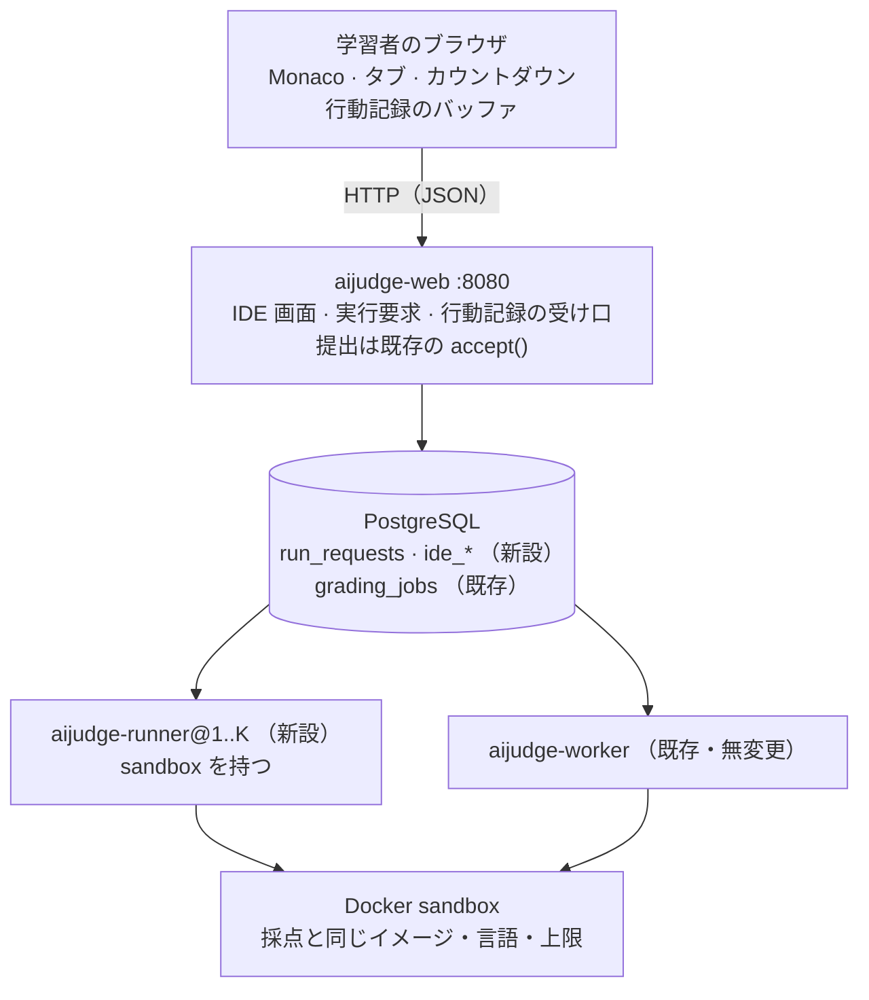

# オンラインコーディングテスト（ブラウザ IDE）設計

- ステータス: **段階 2 まで実装（`feat/online-coding-test` 系のブランチ）**（`feat/online-coding-test` ブランチ。運用中の main には入れない）
- 日付: 2026-09-24
- 関連: 設計原則 P2, P3, P5, P7, P8 / ADR 0006, 0011, 0016, 0018, 0019, 0020, 0025 /
  **本書から起こした ADR 0023（行動記録）・0024（実行は採点ではない）・0026（答え方）** /
  設計方針 §2.2 の S10（Integrity）

## 0. 何を作るか

学習者が自分の PC のブラウザで問題セットを開くと、**問題ごとのタブ**に
問題文・エディタ・入力欄・出力欄が並び、次のことができる。

- コードを書く（手で打つ、貼り付ける、PC のファイルを読み込む）
- 自分で与えた標準入力で**サーバ上で実行**し、stdout / stderr / 終了コード /
  時間切れを見る
- タブごとの**提出**ボタンで、その問題に現在のコードを提出する
- 右上で**問題セットの締切までの残り時間**を見る

その間の操作は**時刻付きの行動記録**としてサーバに送り、保存する。生成 AI や
他の学習者からの貼り付けを**推定する材料**にするためで、判定には使わない（§7）。

想定規模は**最大 150 名の同時利用**。

### やらないこと

- 画面・カメラの録画。ブラウザからは他のアプリの画面が見えず、得られるものに
  比べて負担と個人情報の重さが釣り合わない。代わりにコード全文の
  スナップショットを撮る（§6.4）
- 対話的な標準入力（実行中に 1 行ずつ打つ）。stdin は実行前に一括で渡す。
  採点（`code_test_runner`）と同じ形であり、sandbox に手を入れずに済む
- 貼り付けの禁止・ウィンドウ移動の禁止。ブラウザでは強制できず、
  強制したふりをすると記録の信頼性だけが下がる
- 行動記録からの自動減点（§7）

## 1. judge0/ide をベースにしない理由（決定の記録）

候補だった [judge0/ide](https://github.com/judge0/ide)（MIT, 2026-01 時点）を読んだ。

| judge0/ide の性質 | 衝突するもの |
|---|---|
| 実行を外部の `ce.judge0.com` に送る | P7（学習者データを外に出さない） |
| `puter.js` の AI チャットとインライン補完が組み込まれている | 試験の趣旨。しかもコードを外部 LLM に送る（P7） |
| judge0 本体を自前で立てると Rails + Redis + 特権コンテナ | ADR 0006「提出物を動かす経路はひとつ」 |
| jQuery + GoldenLayout + Semantic UI、CDN 読み込み | 既存の Jinja + 素の JS + `packages/webui` の CSS と二本立てになる |

**採る案（B）: エディタに Monaco（MIT、judge0/ide が使っているもの）だけを
ローカルに置き、画面は既存の学生画面と同じ Jinja で作る。実行は既存の
`aijudge_sandbox` を通す。** 認証・カウントダウン・テーマ・狭幅での折り畳みの
規約が、そのまま使える。

## 2. 既存を壊さないための不変条件

運用中のシステムに足すので、**何を変えないか**を先に固定する。各項は
テストで確かめる。

| # | 不変条件 | 確かめ方 |
|---|---|---|
| I1 | `packages/core` の `Submission`・`packages/grading`・評価器は **0 行** | 差分に現れないこと（レビュー）。IDE からの提出で既存の採点テストが通ること |
| I2 | IDE からの提出は既存の `SubmissionService.accept()` を通る。採点側は提出の出どころを知らない | IDE の提出と `/submit` の提出が同じ `Submission` を作るテスト |
| I3 | 「実行」は採点キュー（`grading_jobs`）に入れない。`GradingPhase` も増やさない | runner が止まっても採点が進むテスト、その逆も |
| I4 | 既存の `Task` への追加は `answer_mode`（既定 `upload`）と `editor_completion`（既定 切）だけ（`document` の JSON に入るので列は増えない）。あとは新テーブル | `test_migrations.py`。既定値で既存の課題の見え方・数え方が変わらないテスト |
| I5 | `answer_mode=upload` の課題には何も起きない。新しい画面は `editor` の課題にしか出ない | 既存の学生画面のテストが無変更で通る |
| I6 | web プロセスに Docker の権限を与えない | systemd unit の差分。web の依存に `aijudge-sandbox` が入らないこと（import 契約） |
| I7 | 行動記録が書けなくても、編集・実行・提出は止めない | 記録の保存を失敗させる fake でのテスト |
| I8 | 提出の関門（学内限定・受付期間・役割）は `/submit` と IDE で **同じ関数** | #119 の教訓。関門を 1 つに抜き出し、両経路から呼ぶ |

既存コードへの手入れは次のとおり。

- I8: `app.py` の関門を関数に抜き出す。振る舞いは変えない純粋な抜き出しで、
  既存の提出テストがそのまま守りになる
- 出題先と秘匿の判定は `docs/design/task-visibility.md` 側の変更（v1.17.0 で main に
  入った）で、本書では足さない

## 3. 全体構成



- ブラウザとは **HTTP だけ**で話す。WebSocket は使わない（§8.3）
- 新しいサブシステムは `packages/ide`（依存は core のみ）。セッション・実行要求・
  行動記録の型、Protocol、in-memory 実装、受付側の検証を持つ
- 新しい合成ルートは `apps/runner`（`aijudge-runner`）。`packages/ide` +
  `aijudge_sandbox` + `aijudge_toolchain` + `aijudge_grading`（有効プロファイルの
  解決のみ）+ persistence を組み合わせる
- SQL 実装は `packages/persistence`。**in-memory と SQL に同じテストを掛ける**既存の
  慣行に乗せる

### import 契約（`.importlinter` に足すもの）

- `packages/ide` を `subsystems-are-independent` に加える（他のサブシステムと
  イベント以外で結合しない）
- `ide-does-not-run-code`: `aijudge_ide` は `aijudge_sandbox` を import しない。
  実行するのは runner（合成ルート）だけ
- `web-does-not-run-code`: `aijudge_studentweb` は `aijudge_sandbox` を import しない（I6）
- `grading-does-not-know-ide`: `aijudge_grading` と `evaluators/*` は `aijudge_ide` を
  import しない（I2 を構造で固定する）

## 4. 課題側の設定

### 4.1 `Task.answer_mode`

```python
class AnswerMode(StrEnum):
    UPLOAD = "upload"  # 既存。ファイルを選んで出す
    EDITOR = "editor"  # ブラウザのエディタで書いて出す
```

`campus_only` と同じ性質の値である ── **課題が持つが、値を決めるのは問題セット
単位**で、コンソールの画面もそう作る。問題セットは `Task.unit` の束ね方にすぎず
実体が無い（ADR 0018 の背景と同じ）ので、ここに新しいエンティティは作らない。
この値と §9 の提出の扱いは ADR 0026 に起こした。

`editor` にできるのは、課題の提出形式に `.c`・`.py`・`.md` のどれかがある課題だけ
（2026-09-24 改訂・ADR 0026）。検査は保存時にコンソール側で行う（画面で灰色に
するだけでは境界にならない、#146）。

| 拡張子 | エディタでの扱い | 提出するファイル | 実行 |
|---|---|---|---|
| `.c` | プログラム | `main.c`（CODE） | 採点の言語が C のとき |
| `.py` | プログラム | `main.py`（CODE） | 採点の言語が Python のとき |
| `.md` | テキスト | `answer.md`（MARKDOWN） | しない（レポート試験） |

タブごとに選べる形式は、その課題の提出形式との共通部分だけ（`aijudge_ide.formats`）。
受け口は画面の選択肢を信じず、送られてきた形式をもう一度確かめる。

### 4.2 言語・イメージ・上限は採点から引く

**IDE で動いたものが採点で動かない、を起こさない。** runner は、採点ワーカーと
同じ手順（`effective_profile(task_version.subject_profile, course.grading_overrides)`）
で `evaluator_options.code_test_runner` を解決し、そこから

- 言語（`language` → `resolve_language`）
- コンテナイメージ（`image`）
- 1 回の実行上限（`case_timeout_seconds`）・コンパイル上限

を取る。コンパイルのフラグ（`-std=c11 -O0`）も toolchain の表から来るので同じになる。
**IDE 独自の設定値は持たない。**

### 4.3 出題先と TA からの秘匿（別の設計書）

追試のために出題先を名簿で絞ることと、試験を公開まで TA に見せないことは、
IDE とは独立した問題として `docs/design/task-visibility.md` で先に決めた
（ADR 0025。v1.17.0 で main に入り、このブランチにも取り込み済み）。
**本書はそれを前提にする。** IDE 画面・実行・提出・行動記録の受け口は、すべて
同じ判定（`aijudge_core.access.may_see`）を通す。試験を公開まで TA に見せない
には `confidential_until_open` を使い、追試は出題先の名簿で絞った別の課題にする。

## 5. 学生画面

### 5.1 入口と URL

- コースページの問題セットに `editor` の課題が含まれていれば「エディタで解く」を出す
- `GET /courses/{course_id}/sets/{session}/{unit}/ide` ── その問題セットのうち
  `editor` の課題をタブにする
- 権限の検査は既存の `_task_and_course` と同じ（受講していなければ 404）

### 5.2 画面の構成

```
┌────────────────────────────────────────────────────────────────┐
│ [p1 ●提出済 2] [p2 ◐未提出] [p3 ✎変更あり]         残り 00:42:13 │
├──────────────────┬─────────────────────────────────────────────┤
│ 問題文            │  エディタ（Monaco）                          │
│ （render_statement│                                              │
│  そのまま）        │                                              │
│                  ├─────────────────────────────────────────────┤
│ 公開サンプル       │ stdin            │ 出力 stdout / stderr     │
│ [サンプルで実行]   │                  │ 終了コード・時間・状態    │
│                  │ [ファイルを読込] [実行] [提出]                 │
└──────────────────┴─────────────────────────────────────────────┘
```

- **タブ**: 課題ごと。状態（未提出・提出済み n 回・前回の提出から変更あり）を示す
- **問題文**: 既存の `aijudge_authoring.render_statement` の出力をそのまま使う
- **実行**: 自分で打った stdin で実行するか、公開サンプル（`hidden=False` の
  テストケース）の入力で実行する。**非公開ケースは実行も表示もしない** ── 試験中の
  テスト結果は答えの一部である（#67 のコメントと同じ理由）
- **提出**: 確認の一言のあとで提出する。結果は既存の提出ページへのリンクで示す
  （試験中の採点保留 `grading_starts_at` はそのまま効く）
- **ファイル読み込み**: `<input type=file>` から `FileReader` で読む。サイズの
  上限はソースの上限（§8.1）と同じ
- **カウントダウン**: 既存の `base.html` と同じく、サーバが返す残り秒数から数える
  （学習者の PC の時計に依存しない）。対象は問題セットの `accepts_until`
  （受付の終わり）。`due_at` と違う場合は両方を出す
- **自動保存**: タブごとの最新の内容をサーバに保存する（§6.5）。リロードしても、
  PC を替えても続きから書ける
- **狭い画面**: 試験は PC 前提だが、狭幅で壊れないこと（縦に積む）は既存の規約どおり守る

### 5.3 エディタの設定

- Monaco の言語定義は C/C++ 共用の `basic-languages/cpp` と `python` だけを読み込む。
  TypeScript などのワーカーは載せない
- **補完は問題セットごとに「切／入」の 2 択**（2026-09-24 決定）。値は `Task.editor_completion`
  で、答え方とは独立に持つ（2026-09-24、I4 を改めて追加。学内限定・秘匿と同じ形）

| 設定 | できること |
|---|---|
| 切（**試験の既定**） | 入力の補助だけ: 括弧・引用符を閉じる、改行時の字下げ、対応する括弧の強調、色分け |
| 入（**演習の既定**） | 上に加えて、**ファイル内の単語**（前に書いた `count` を `cou` で候補に出す）と**言語のキーワード**（`whi` → `while`） |

- **雛形（`for` を打つと繰り返しの定型が展開される類）は作らない。** 意味を理解した
  補完（構造体のメンバ・関数の引数の案内・エラーの波線）は言語サーバを学習者ごとに
  動かす必要があり、作らない。AI による補完は作らない
- **キーワード補完は自前で登録する。** Monaco の `basic-languages` はキーワードの一覧を
  色分けのためだけに持ち、補完は提供しない（0.44 で `registerCompletionItemProvider` 0 件を
  確認）。さらに C は C++ と共用の定義なので、その一覧には `class`・`catch` のように
  C に無い語が混じる。C は C11 のキーワード、Python は `keyword.kwlist` を一覧として持つ
- 補完を確定したら行動記録に `suggest` として残す（確定した語・長さ）。補完で入った
  数文字を、貼り付けや自動入力と取り違えないため。確定の瞬間を Monaco から拾えるかは
  採用する版で確かめ、拾えなければ「入」の問題セットでは短い一括挿入を補完由来の
  可能性ありとして扱う

### 5.4 静的ファイルの配り方

`editor.main.js` は 3.4 MB（gzip 後 0.87 MB）。試験開始の瞬間に 150 名が一斉に
取りに来るので、

- `packages/webui/assets/vendor/monaco/` に版を固定して置く（AMD の `min/` ビルドを
  同梱する版を採る。採用時に確認する）
- nginx に `location /static/vendor/` を足し、`gzip_static` と長期キャッシュで
  **nginx が直接配る**（uvicorn の 2 ワーカーに 150 MB を配らせない）
- 問題セットの一覧ページで先読み（`<link rel=prefetch>`）させ、開始時の集中を均す

## 6. 行動記録

### 6.1 位置づけ ── ADR 0016 の 4 つ目の記録

ADR 0016 は「新しい種類の記録は、まず表の行を名乗れ」と定めている。行動記録は
既存の 3 つのどれでもない。

| | 何の記録か | 置き場 | 消えてよいか | 書けなかったら |
|---|---|---|---|---|
| 運用ログ | プロセスに何が起きたか | journald | よい | 何もしない |
| 監査ログ | 誰が成績に関わる何をしたか | `audit_events` | だめ | 操作ごと失敗 |
| 採点記録 | どの版・どのモデルで採点したか | `GradingRun` | だめ | 採点を保存しない |
| **行動記録（新）** | **学習者がコードをどう書いたか** | 本体は動画と同じストレージのファイル、索引は DB（§6.6） | **保存期間を過ぎたら消す** | **何も止めない。欠落として残す** |

- **学習者のコードそのものを含む**ので journald には一切流さない（P7。
  `aijudge_telemetry.bind` の規則と同じ理由）
- 監査ログにも入れない。量が桁違いで（§6.6）、`detail` の 4000 字上限にも収まらない。
  「監査ログはゴミ捨て場ではない」（ADR 0016）
- **書けなかったら何も止めない**（P2・I7）。記録が欠けた区間は「欠落」として
  それ自体を記録する。欠落は不正の証拠として扱わない（通信の不調と区別できない）

→ ADR 0023 に起こした。

### 6.2 記録するイベント

時刻は 2 本持つ。イベントごとの `t` はページを開いてからの `performance.now()`
（単調・ms）。バッチごとにクライアントの壁時計とサーバの受信時刻を持ち、
両者の差から学習者の PC の時計のずれを推定する。

| 種類 | 中身 | 目的 |
|---|---|---|
| `suggest` | 補完を確定した語・長さ（補完が「入」の問題セットのみ） | 補完による挿入を貼り付け・自動入力と区別する |
| `edit` | タブ・位置・削除長・挿入文字列・undo/redo か | 書いた経過の再構成、打鍵のリズム |
| `paste` | タブ・範囲・長さ・ハッシュ・**出どころ**（下記） | 外部からの貼り付けの検出 |
| `copy` / `cut` | どこから（エディタ／問題文）・長さ・ハッシュ | 問題文を外へ持ち出したか、貼り付けの出どころの判別 |
| `file_load` | ファイル名・サイズ・ハッシュ | PC のファイルの読み込み（内容はスナップショットで残る） |
| `run` | タブ・入力の種類（自由入力／サンプル名）・結果の要約 | 試行錯誤の経過 |
| `submit` | タブ・内容のハッシュ・提出 ID | 提出との突き合わせ |
| `tab` | 切替先 | 問題間の移動 |
| `focus` | blur / focus、`visibilitychange` | ウィンドウを離れていた時間 |
| `hello` / `heartbeat` | UA・画面サイズ（開始時のみ） | 同時に複数の窓、記録の途切れ |

**貼り付けの出どころ**: エディタ内で `copy`/`cut` した内容のハッシュを
クライアントが直近分だけ覚えておき、貼り付けた内容と一致すれば `internal`、
一致しなければ `external` とする。サーバ側でも同じ判定をやり直せるように
ハッシュは両方を送る。

`edit` は打鍵をまとめずにそのまま記録する。まとめると、自動入力ツール
（貼り付けイベントを経ずに文字を流し込むもの）が人の打鍵と区別できなくなる。

### 6.3 送る頻度 ── 問題はデータ量ではなくリクエスト数

生の `edit` を全部送っても、150 名で合計 10 KB/秒程度にしかならない
（1 名が毎秒 3 文字 × 1 イベント 20 バイト前後）。効くのは **HTTP リクエストの本数と
DB への書き込み回数**である。

| きっかけ | 送り方 |
|---|---|
| 平常 | **10 秒ごと**に溜まった分をまとめて 1 リクエスト |
| `paste`・`file_load`・`run`・`submit`・`visibilitychange(hidden)` | **即時** |
| 何もしていない | **30 秒ごとのハートビート**（途切れの検出） |
| ページを閉じる | `pagehide` で `navigator.sendBeacon` |

- 平常時で約 15 req/s、即時送信を含めたピークで 30〜40 req/s の見積もり
- バッチには `(ide_session_id, seq)` を振り、**一意制約**を掛ける。再送は重複しない
  （同じ seq は 200 で受け流す）。seq の飛びは欠落として検出する
- 送れなかったバッチはメモリと `localStorage` に積み、指数バックオフで再送する
- 混んだらサーバは `503 + Retry-After` を返し、クライアントは送信間隔を広げる
  （既定 10 秒 → 最大 60 秒）。記録の欠けより、IDE が重くなるほうが試験を壊す
- 受け口は軽く保つ: 認証の解決 + 1 INSERT だけ。解析は受信時にしない

### 6.4 スナップショット（コード全文）

差分の列だけだと、1 バッチ欠けた時点から先を再構成できない。そこで
**全文のスナップショット**を要所で撮る。

- 撮るとき: 大きな貼り付け（既定 80 字以上）、ファイル読み込み、実行、提出、
  タブ切替、変更がある間は **60 秒ごと**
- 同じ内容はハッシュで重複排除する
- 各バッチの末尾には、そのときの各タブの内容ハッシュを付ける。サーバは
  「直前のスナップショット + 差分」の再構成が一致するかを後から検査できる
  （一致しなければ、記録か内容のどちらかが改変された印になる）

### 6.5 自動保存（下書き）との関係

自動保存は行動記録とは別の、**上書きで 1 件だけ**の表（`ide_buffers`）に持つ。
変更があれば 10 秒ごとのバッチに全文を載せて更新する。

ADR 0019 の `task_drafts`（承認待ちの課題）とは無関係なので、名前で取り違えない
ように `draft` は使わない。

### 6.6 保存の形と量

**本体（イベント列とスナップショット）は、動画と同じストレージに置く**
（2026-09-24 決定）。DB には索引だけを置く。

| 置き場 | 何を | 90 分の試験 × 150 名での見積もり |
|---|---|---|
| DB `ide_sessions` | 1 回のページの開閉 | 数百行 |
| DB `ide_event_batches` | 1 バッチの索引（seq・受信時刻・件数・大きさ・ハッシュ・ファイルの場所） | 約 8 万行 |
| DB `ide_buffers` | (学習者, 課題) の最新の内容（自動保存） | 150 × 問題数 |
| ファイル `.../events/{seq}.ndjson.gz` | 1 バッチのイベント列 | 約 8 万ファイル・数十 MB |
| ファイル `.../snapshots/{hash}.txt` | スナップショット（中身のハッシュで名付けて重複排除） | 約 60 MB 以下 |

- 置き場所は `AIJUDGE_ACTIVITY_DIR`（既定は動画と同じ `/work/aijudge` の下の
  `activity/`）。`{course}/{unit}/{learner}/{ide_session}/` の階層にし、保存期間の
  purge は問題セットの単位でディレクトリごと消す
- **web は既に `/work/aijudge` に書ける**（`aijudge-web.service.d/video.conf` の
  drop-in）。新しい書き込み権限は要らない
- 書く順は **ファイル → DB**。一時ファイルに書いて `rename` し（途中で落ちても
  半端なファイルを残さない）、そのあと索引の行を入れる。行の挿入が失敗しても
  残るのは孤立したファイルだけで、再送された同じ seq は同じ中身で上書きされる
- `ide_buffers` は DB に置く。学習者の画面の復元と締切時の自動提出（§9）が
  読むもので、採点の入口に近い。ファイルに置くと、ストレージの不調で提出が止まる
- **イベント 1 件を 1 行・1 ファイルにしない**。打鍵単位にすると 1 試験で数百万件になる

バックアップの扱いも動画に揃う。動画側で未了の「restic の保持期間と保存期間の
整合」（ADR 0020）は、行動記録にもそのまま当てはまる。

### 6.7 保存期間・閲覧・告知

- **保存期間**: **動画と同じ**（ADR 0020。2026-09-24 決定）。締切のある課題は締切から
  6 か月、締切の無い課題はセッションの開始から 1 年。過ぎたら `aijudge-admin activity
  purge` で消す（`video purge` と同じ型。既定は下見、`--apply` で実行・2026-09-24 実装）。
  **自動保存（書きかけのコード）も同じ期間で消す**（2026-09-24 決定）
- **閲覧**: そのコースの教員だけ。閲覧したことを監査ログに残す
  （`AuditAction` に `ACTIVITY_VIEWED` を足す）。学習者本人のデータなので、
  誰がいつ見たかは後から説明できなければならない
- **告知**: IDE を初めて開いたときに、何を記録するか・何に使うか・何に使わないか
  （自動で減点しない）を示し、確認を取ってから始める。確認したことを記録する

### 6.8 記録の限界（明記しておく）

行動記録は**クライアントが送ってくるもの**である。開発者ツールで止めることも
偽ることもできる。したがって

- 「記録がある」ことは材料になるが、「記録が無い」ことは潔白の証明にならない
- 欠落・再構成の不一致・提出内容とエディタ状態の不一致は、**それ自体を事実として**
  教員に示す

## 7. 不正の推定（後の段階。フラグのみ）

設計方針 §2.2 の S10 の方針どおり、**フラグを立てるだけで判定しない**。
誤検知の不利益が大きすぎる。成績には一切つながない（import 契約で
`grading` から切る）。

教員に示す候補:

- 外部からの大きな貼り付け（特にウィンドウを離れた直後）
- 複数の学習者が同じ内容のハッシュを貼り付けている
- 貼り付けイベントなしの一括挿入・人には無理な打鍵速度（自動入力ツール）
- 問題文をコピーしてからウィンドウを離れ、戻ってきて大きく貼り付けた
- 提出内容が、記録から再構成したエディタの状態と一致しない
- 記録の欠落、同時に複数の窓で開いている

コンソールには、提出ごとの要約（外部貼り付けの字数・離席の合計時間・欠落）と、
時間軸のスライダで経過を再生するビューアを置く。

## 8. 実行（runner）

実行を採点から切り離す決定（キュー・プロセス・関門・sandbox の共有）は ADR 0024 に
起こした。

### 8.1 実行要求

`POST /ide/tasks/{task_version_id}/run` に JSON で `{code, stdin | sample_name,
ide_session_id}` を送る。

受け付ける条件:

- `answer_mode=editor` の課題で、受講者であること
- 提出と同じ関門（学内限定・受付期間。I8）。**受付の外では実行もさせない** ──
  いつでも任意のコードを走らせられる窓口にしない
- ソース 64 KiB・stdin 64 KiB まで。出力は sandbox の上限（1 MiB）で切り、
  画面に出すのはその先頭 64 KiB
- **1 人が同時に待てるのは 1 件**。部分一意索引
  `UNIQUE (learner_id) WHERE state IN ('queued','running')` で DB が保証する
  （PostgreSQL・SQLite とも部分索引を持つ）
- 連続実行は 3 秒空ける（既定）

返すのは `run_request_id`。ブラウザは `GET /ide/runs/{id}` を 0.5 秒間隔で見に行き、
待ち順と結果を受け取る。

### 8.2 runner の処理

- `run_requests` を `FOR UPDATE SKIP LOCKED` で 1 件取る（採点キューと同じ型。
  SQLite では runner 1 本のみ）。見に行く間隔は 250 ms
- sandbox は**起動時に 1 度だけ**組み立てる（`DockerSandbox` の初期化は
  書き込み確認でコンテナを 2 回立てるので、要求ごとに作らない）
- 作業域を作り → ソースを書き → コンパイル（C のみ、`trusted_toolchain=True`）→
  実行、を行い、結果を書き戻す
- **30 秒以上待った要求は実行せずに期限切れにする**。混雑時に、とうに書き換えた
  古いコードを走らせても意味がない
- 実行 1 本 = 1 プロセス。同時実行数 K は `aijudge-runner@1..K` のユニット数で決める
  （`aijudge-worker-ai@` と同じ型）。runner の内部に並列性を持たせない

### 8.3 なぜ WebSocket にしないか

- 既存の web ハンドラは同期で、`unit_of_work()` を 1 リクエストごとに開く作りである。
  接続を張りっぱなしにする経路は、この前提から外れる
- nginx に Upgrade の設定が無い。足すことはできるが、大学のネットワークの
  プロキシや学習者の PC のセキュリティ製品を通るかは、HTTP のほうが確実である
- 150 名 × 0.5 秒間隔の問い合わせは 300 req/s ではない。実行を待っている人だけが
  問い合わせるので、同時に待つのは K + 待ち行列の数十名程度である
- long-poll もしない。同期ハンドラのスレッドを待ちの人数分占有するため

### 8.4 runner が落ちているとき

- 画面に「実行環境が停止しています」と出す。**編集・自動保存・提出・行動記録は動く**（P2）
- 待っている要求は 30 秒で期限切れになる。runner が戻れば新しい要求から処理する

## 9. 提出

`POST /ide/tasks/{task_version_id}/submit` に JSON で `{code, ide_session_id}` を送る。

1. 関門を通す（`/submit` と同じ関数。I8）
2. `IncomingFile(filename=<言語の source_name>, kind=CODE, payload=code)` を作り、
   **既存の `SubmissionService.accept()` に渡す**（I2）。同じ内容の再提出は
   既存どおり同じ提出に畳まれる
3. `ide_submission_links(submission_id, ide_session_id, content_hash)` を書く。
   `Submission` には何も足さない（I1）
4. 提出 ID と回数を JSON で返す。画面はタブの状態を更新し、提出ページへのリンクを出す

### 9.1 受付の終わりの自動提出（2026-09-24 決定）

**受付の終わり（`accepts_until`）に、サーバが `ide_buffers` の最新の内容を提出する。**
対象は、一度も提出していないタブと、最後の提出のあとに書き換えたタブ。

- ブラウザ主導にしない。通信が切れた・PC がスリープした学習者の分が漏れる
- **成績は最高得点の提出が採用される**（`progress.py`、同点なら後の提出）ので、
  本人が出すつもりのなかった版が自動で出ても、成績を下げることはない
- 自動提出は `aijudge-finalize` と同じく時刻で動く処理として置き、
  `ide_submission_links` に「受付終了時の自動提出」と印を付ける。本人が押した
  提出と区別して残す
- 自動保存の最後の更新から受付の終わりまでの差分（最大 10 秒）は失われうる。
  受付終了の直前にはクライアントが即時に自動保存を送る
- 受付を過ぎてから届いた自動保存は採用しない（受付判定は既存のまま）

## 10. 負荷の見積もりと増強

**数値はすべて見積もりである。段階 0 で運用機での実測に置き換える。**

### 10.0 運用機（2026-09-24 実測）

| 項目 | 値 |
|---|---|
| 論理 CPU | 16 |
| メモリ | 30 GiB（使用 3・available 26） |
| Docker ランタイム | runc（既定）・**runsc（gVisor）導入済み** |

`AIJUDGE_SANDBOX=auto` は gVisor を最初に試すので、採点は runsc で走っている
はずである（段階 0 で `ExecResult.isolation` の記録から確かめる）。IDE の実行も
**採点と同じバックエンド**を使う（§4.2 と同じ理由）。runsc は起動が runc より
遅いと見込んでいたが、実測では差が無かった（§10.1）。

**K の初期値は 8、上限の目安は 12** とする。web・PostgreSQL・relay と、
elite 上の PAIR（ollama）に 4〜6 スレッドを残す計算である。メモリは
8 × 512 MiB = 4 GiB で、余裕は十分にある ── 詰まるのは CPU の側である。

### 10.1 コンテナ 1 回の時間（2026-09-24 実測）

運用機で `gcc:14-bookworm`、`--network=none`、3 回ずつ。

| | runc | runsc |
|---|---|---|
| 起動のみ（`true`） | 157〜168 ms | 153〜162 ms |
| hello.c のコンパイル＋実行を 1 コンテナで | 173〜201 ms | 209〜217 ms |

**runsc の起動は runc と変わらなかった**（systrap プラットフォーム）。gVisor を
使うことが速さの制約にならないので、IDE も採点と同じ runsc で動かす。

sandbox はコンパイルと実行を別のコンテナで動かすので、C の実行要求 1 件は
**おおよそ 0.4〜0.5 秒**（小さなプログラムの場合）。

### 10.2 試験中の実行

- ピーク時に 1 名が 45 秒に 1 回実行 → 約 3.3 回/秒
- 1 件 0.5 秒なら、平均で 2 本弱が同時に走る。一斉に実行が集中しても（150 名が
  10 秒以内に 1 回ずつ）、K = 8 なら待ちは数秒で捌ける
- **K = 8 は十分に余裕がある**。効いてくるのは学生のプログラム自体の実行時間
  （無限ループは `case_timeout_seconds` まで CPU を占有する）で、最悪の場合は
  K 本すべてが時間切れまで塞がる。1 人 1 件の制限（§8.1）があるので、それでも
  1 人が複数本を塞ぐことはない
- 1 本あたりメモリ 512 MiB → K = 12 でも 6 GiB

### 10.3 締切直後の採点

- 150 名 × 3 問 = 450 件。1 件はコンパイル + テスト約 10 件で、上の実測から
  **約 2〜3 秒**（小さなプログラムの場合）
- 決定的評価のワーカー 1 本（現状）で約 20 分、4 本で約 5 分
- 対策
  - 試験中は既存の `grading_starts_at` で採点を止め、CPU を実行に回す（#67 の仕組みそのまま）
  - `aijudge-worker-det` を `aijudge-worker-det@1..N` のテンプレートユニットにする
    （AI ワーカーと同じ形）。試験後にだけ増やす運用も取れる
  - AI 評価（読みやすさ）は PAIR 側で走るので、ここでは数えない

### 10.4 web と DB

- 行動記録 15〜40 req/s + 実行の問い合わせ + 通常の画面。web のワーカー数
  （`AIJUDGE_WEB_WORKERS`、運用機は 2）で足りるかは段階 3 の負荷試験で決める
- **接続数**: web 1 本・runner 1 本ごとに最悪 30 接続（`pool_size 10 + max_overflow 20`）。
  runner は同期で 1 件ずつなので `pool_size` を小さく取る。
  `aijudge-config-check.sh` の `max_connections` 検査に runner の本数を足す

## 11. 決めていただきたいこと

| # | 論点 | 設計への影響 |
|---|---|---|
| Q1 | ~~運用機の CPU コア数・メモリ・gVisor の有無~~ → 16 スレッド・30 GiB・runsc あり（§10.0） | K = 8 から |
| Q2 | ~~制限時間は全員共通の時間枠か、学生ごとに「開始から N 分」か~~ → **全員共通の時間枠**（2026-09-24 決定） | 既存の課題の日程（`opens_at`・`accepts_until`）をそのまま使う。学生ごとの開始時刻の表は作らない |
| Q3 | ~~受付の終わりの自動提出~~ → **サーバが自動保存の最新を提出する**（§9.1）。最高得点が採用されるので成績は下がらない | 決定 |
| Q4 | ~~言語と stdin~~ → **当面は C と Python・stdin は一括** | 決定。対話入力は将来の課題 |
| Q5 | ~~用途~~ → **試験と普段の課題の両方**。演習でも、学習者の手元の環境が壊れたときの緊急の逃げ道になる | 決定。`answer_mode` で問題セットごとに選ぶ |
| Q6 | ~~エディタの補完~~ → **切／入の 2 択**。入はファイル内の単語と言語のキーワードまで（§5.3） | 決定 |
| Q7 | ~~行動記録の保存期間と置き場~~ → **動画と同じ期間・同じストレージ** | 決定（§6.6・§6.7） |

## 12. 段階と完了条件

各段階はブランチ → PR → リリースタグの単位で進めるが、**このブランチは運用中の
main に混ぜない**。main への取り込みは、段階 3 の負荷試験を通してから判断する。

| 段階 | 内容 | 完了の条件 |
|---|---|---|
| 0 | 運用機での実測（コンテナ 1 回の起動時間 runc / runsc、空き CPU・メモリ）。ADR 0023（行動記録）・0024（実行は採点ではない）・0026（課題の答え方）を起こす | K の初期値が数値で決まる |
| 1 | `packages/ide`・`run_requests`・`aijudge-runner`・利用制限 | in-memory / SQLite / PostgreSQL の同じテストが通る。runner を止めても採点が進む |
| 2 | IDE 画面（Monaco・タブ・実行・提出・カウントダウン・自動保存）、`Task.answer_mode`、関門の抜き出し | 既存の学生画面・提出・採点のテストが**無変更で**通る |
| 3 | 行動記録・スナップショット・欠落検出、負荷試験（150 クライアントの模擬） | 実行待ちの p95、記録の取りこぼし率を実測。基準は段階 0 のあとで決める |
| 4 | 教員向けの要約と再生ビューア、不正推定のフラグ、保存期間の purge | フラグが成績に一切届かないことを import 契約とテストで固定 |

### 段階 0 の結果（2026-09-24）

- [x] 運用機のスペックとコンテナ 1 回の時間を実測した（§10.0・§10.1）→ **K = 8**
- [x] ADR 0023・0024・0026 を起こした（ステータスは「提案」。main に入れるときに「採用」へ）
- [x] main（v1.17.0、ADR 0025 の `may_see`）をこのブランチに取り込んだ
- [x] 採点が実際に runsc で走っていることを、`grading_runs` の
  `raw_output.isolation` で確かめた ── `code_test_runner` の 263 件
  （2026-09-16〜09-24）がすべて `kernel_isolated`。runc で走った記録は無い
- [x] I8 の関門の現状を確かめた（2026-09-24）。#370 で動画の 2 経路（分割
  アップロードと 1 発の送信）は `_video_gate` に寄せられたが、**`/submit` は
  学内限定・受付期間・役割の判定をまだ自前で写して持っている**（`app.py` の
  `submit`）。抜き出しの範囲は本書の想定どおりで、`/submit`・`_video_gate`・
  IDE の 3 経路が同じ関数を呼ぶ形にする。段階 2 で行う

### 段階 1 の結果（2026-09-24、`feat/ide-run-queue`）

- `packages/ide`: 実行要求（`RunRequest`）・キューの口（`RunQueue`）・
  インメモリ実装・受付の検査（`request_run` / `view_run`）。sandbox も保存先も
  知らない
- `run_requests` 表と `SqlRunQueue`（移行 `d4a8f2c61e97`）。1 人 1 件は部分一意索引
  `uq_run_requests_one_in_flight` が止める。**同じテストをインメモリ・SQLite・
  PostgreSQL に当てる**（`packages/persistence/tests/test_run_repository.py`）
- `apps/runner`（`aijudge-runner`）: 採点ワーカーと同じ重ね方で
  `code_test_runner` の設定を引き、同じ上限（`limits_for` が評価器の `_limits` と
  一致することをテストで固定）で動かす。遅れた結果は捨てる
- 古い要求の片付けは **runner だけでなく受付と問い合わせでも**行う。runner が
  全部止まっていても、学習者は 30 秒で次を積める
- 終わった要求は 10 分で消す（結果は残さない）
- import 契約を 3 つ足した: `ide-does-not-run-code`・`web-does-not-run-code`・
  `grading-does-not-know-ide`
- `deploy/systemd/aijudge-runner@.service` を置いた。**`aijudge.target` には
  まだ入れていない**（置いただけでは起動しない）
- 手元の Docker（colima）で、公開サンプルでの実行・コンパイルエラー・無限ループの
  打ち切り（プロファイルの 2 秒）を確かめた

残したもの:

- コースを消したとき（`delete_course`）に、そのコースの課題を指す実行要求は
  消していない。10 分で消えるうえ、課題が無ければ runner は「課題が
  見つかりません」で終える

### 段階 2 の結果（2026-09-24、`feat/ide-screen`）

- 関門の抜き出し: `/submit`・`_video_gate`・IDE の 3 経路が `_submission_gate` を
  呼ぶ。既存の学生画面のテストは無変更で通った（I8）
- `Task.answer_mode`（既定 `upload`）と、コンソールの問題セット画面の切り替え
  （保存時に `aijudge_admin.answer_mode.editor_blockers` で確かめる）
- **形式は課題の提出形式に限る**（2026-09-24 の指示で改訂、§4.1 の表）。`.md` は
  テキストとして提出する
- `ide_buffers`（自動保存、移行 `7b3e9a15c4d2`）。形式も一緒に持つ
- 学生画面: `GET /courses/{id}/ide?unit=…`、`POST /ide/tasks/{id}/run`、
  `GET /ide/runs/{id}`、`POST /ide/tasks/{id}/submit`、`PUT /ide/tasks/{id}/buffer`
- Monaco は **0.52.2 の AMD 版**を同梱（0.53 以降は AMD が非推奨・サポート外）。
  必要な分だけで 4.5 MB。nginx で直接配る設定を雛形に足した（運用機への反映は
  main に入れる日に手で行う）
- 手元の Docker で、ブラウザから書く → 自由入力で実行 → サンプルで実行 → 提出、
  形式を `.md` にすると実行が消えること、狭い画面で縦に積むことを確かめた

残したもの:

- 補完の切／入（§5.3）は段階 3 で `Task.editor_completion` として足した（I4 を改めた）
- 受付終了時の自動提出（§9.1）と行動記録（§6）は段階 3
- 運用機の nginx の `security-headers.conf` を確かめた（2026-09-24）。HSTS・
  `X-Content-Type-Options: nosniff`・`Referrer-Policy` だけで **CSP は無い** ので、
  Monaco のワーカー（blob URL）もインラインの設定も止められない。`nosniff` の
  もとでは JS が正しい MIME で配られる必要があるが、nginx の `mime.types` が
  `.js` を `application/javascript` で出すので問題ない。雛形の
  `location /static/vendor/` がこのファイルを読み直しているのは、ファイル自身の
  注意書き（独自の `add_header` を持つ location では include し直す）と同じ

### 段階 3 の途中経過（2026-09-24、`feat/ide-activity`）

- 受付終了時の自動提出（§9.1）: `aijudge-ide-close`（timer で 1 分ごと・まだどの
  target にも入れていない）。提出時刻は最後の自動保存の時刻で、保存は受付終了まで
  しか受けないので、**締切と受付終了が同じでも遅延にならない**（テストで固定）。
  出どころは `ide_submission_links` に `editor` / `auto_close` で残す
- 行動記録（§6・ADR 0023）: 告知と確認、10 秒ごとの束、即時送信、スナップショット、
  貼り付けの出どころ、`sendBeacon`、503 での後退。本体はファイル、索引は DB
- 負荷試験の道具: `tools/ide_load/seed.py`（使い捨ての DB に N 名）と
  `tools/ide_load/load.py`（N 名の振る舞いを模して、実行待ちの p95 と記録の
  取りこぼし率を出す）。**DB は PostgreSQL にする** ── 開発用の SQLite は 1 本の
  接続をスレッド間で共有するので、同時のログインだけで 500 になる
- 手元の PostgreSQL・web 2 本・runner 2 本で、3 名の動作確認は通った（実行待ち
  p50 0.56 秒、記録の取りこぼし 0）

未了:

- 150 名の負荷試験。**授業（15:00〜18:00）を避けて 18:00 以降に手元で行う。**
  手元の数値は道具と仕組みの確認であって、K の根拠は運用機で測った値だけにする。
  運用機での計測は授業期間（9/24・9/25）が明けてから

### 段階 0 で運用機で測るもの

```sh
nproc; free -g; docker info --format '{{.Runtimes}} {{.DefaultRuntime}}'
# コンテナ 1 回の起動時間（runc と runsc で）
time docker run --rm --network=none gcc:14-bookworm true
time docker run --rm --network=none --runtime=runsc gcc:14-bookworm true
```

運用中の機械なので、測るのは授業のない時間帯に、`aijudge` の採点が
走っていないことを確かめてから行う。
