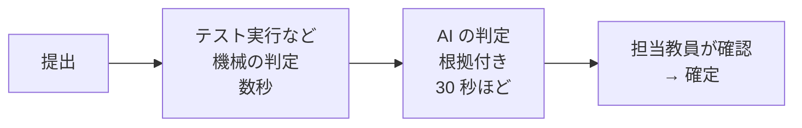

# aiJudge 利用ガイド

aiJudge は、提出した課題をその場で採点し、**理由付きで**返すシステムです。
プログラム・レポート・写真（手書き）を扱えます。AI の判定は**提案**で、
成績は担当教員が確認して確定します。

立場に合わせて読んでください。

<a href="student/"><strong>学生向け</strong>提出する・結果を読む・納得できないときに再確認を依頼する</a>
<a href="ta/"><strong>TA 向け</strong>提出を確認する・確定する・再確認の依頼に答える・blind 採点</a>
<a href="instructor/"><strong>教員向け</strong>コースを作る・課題と締切を出す・ルーブリックと採点の設定</a>

## 2 つの画面

| 画面 | 誰が使うか | できること |
|---|---|---|
| **学習者アプリ** | 学生（教員・TA も試しに提出できます） | 課題を見る・提出する・結果を読む・再確認を依頼する |
| **教員コンソール** | TA・教員 | 提出を確認して確定する・課題と締切を出す・コースの設定 |

URL はコースの案内（シラバスや初回の授業）で配られます。ログインはどちらも同じアカウントです。

## 役割

| 役割 | できること |
|---|---|
| **学生** (learner) | 提出する・自分の結果を見る・再確認を依頼する |
| **TA** (assistant) | 上に加えて、教員コンソールで**採点を確認・確定**する |
| **教員** (instructor) | 上に加えて、**課題・締切・受講者・ルーブリック**を設定する |
| **管理者** (admin) | 上に加えて、コースを作る・利用者とログイン方式を管理する |

## 採点はこう進みます

- **機械の判定**（テスト実行・形式検査）は提出直後に出ます
- **AI の判定**は「どの行を見て、なぜその段階か」を添えて返ります
- 確定するまで点は**暫定**です。確定すると教員の根拠が学生に表示されます
