# 教員向けガイド

採点の確認・確定は [TA 向けガイド](ta.md) と同じ操作です。ここでは**教員にしかできないこと** —
コースを組み、課題と締切を出し、採点の設定を決める — を説明します。

## 学期の流れ

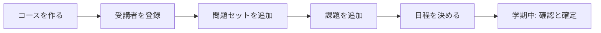

## 1. コースを作る

コンソールのトップ「コースを追加する」から作ります（管理者権限が要ります。無ければ管理者に依頼してください）。

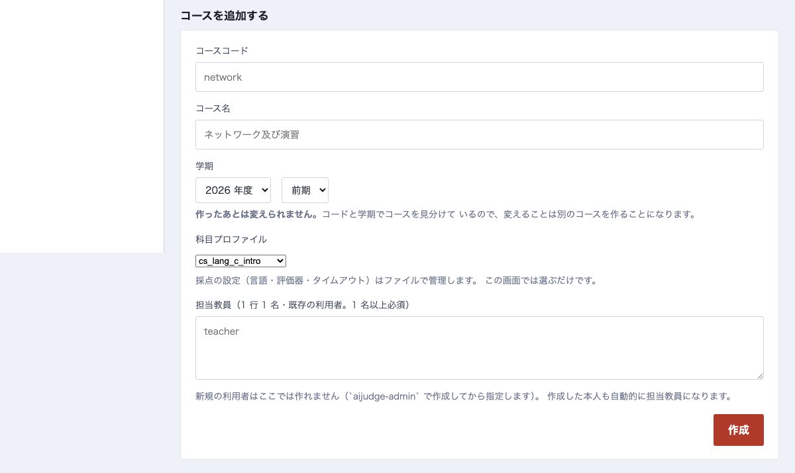

- **コードと学期は作ったあと変えられません**（この 2 つがコースの同一性です）
- **科目プロファイル**は「どの評価器がどの順で走るか」の宣言です。C 言語なら `cs_lang_c_intro`、日本語レポートなら `report_ja` のように選びます
- 前の学期のコースがあるなら、そのコースの「コース全体」→「このコースを複製する」の方が早いです（課題・ルーブリック・設定を引き継ぎ、提出と受講者は引き継ぎません）

## 2. 受講者を登録する

左の帯「受講者」で、学籍番号を 1 行 1 名で貼り付けて登録します。役割は行ごとに変えられます。

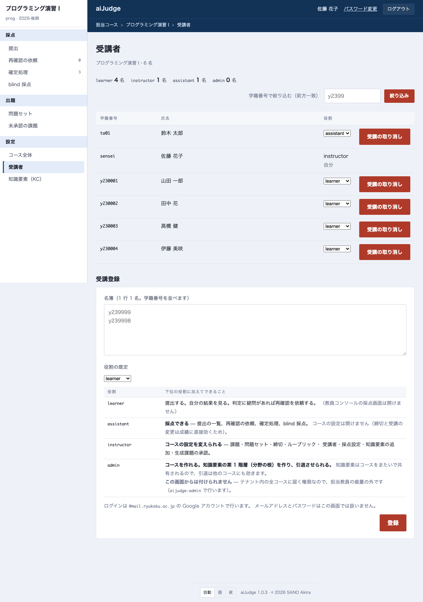

!!! note "90 名を一度に入れるなら CLI"
    名簿ファイルからの一括登録と、**新規利用者の作成**は `aijudge-admin` で行います（パスワードの配布が伴うため画面には出しません）。
    運用担当者に `uv run aijudge-admin enrol --course <id> --roster 名簿.txt` を依頼してください。

## 3. 問題セットと日程

コースの画面（左の帯の一番上、コース名を押した先）には**問題セット**（第 N 回）が並び、公開・開始・締切・未確定の件数が一覧できます。
下の欄に鍵（例: `ex04`）を入れて「追加」すると新しい問題セットができます。

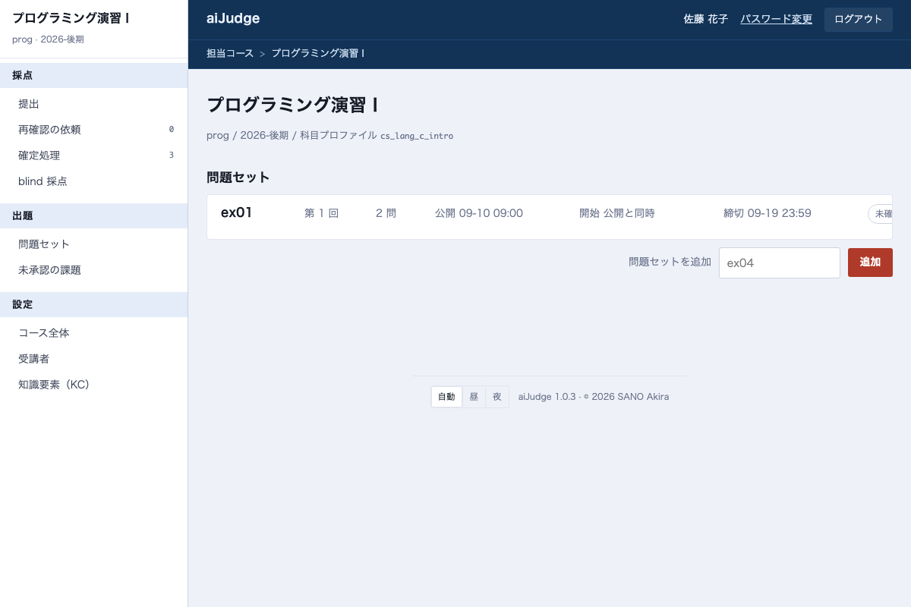

問題セットを開くと日程を決められます。

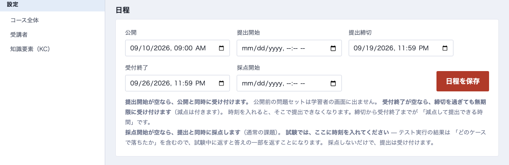

| 欄 | 意味 |
|---|---|
| **公開** | 学生の画面に出る時刻。空なら出ません |
| **提出開始** | 空なら公開と同時 |
| **提出締切** | これを過ぎると遅延の減点が付きます |
| **受付終了** | これを過ぎると提出できません。空なら無期限（減点は付きます） |
| **採点開始** | **試験のとき**に使います。ここに時刻を入れると、その時刻まで採点しません（提出は受け付けます） |

## 4. 課題を追加する

課題の入れ方は 3 つあります。

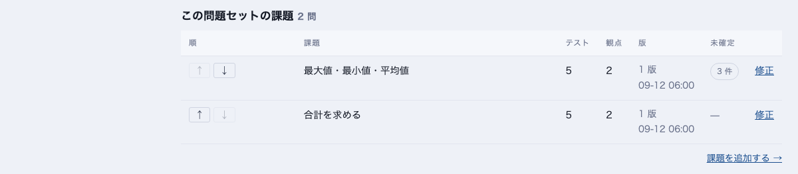

### 画面から書く

「課題を追加する →」で開きます。問題文は Markdown で、1 行目の `## タイトル ##` が題名になります。

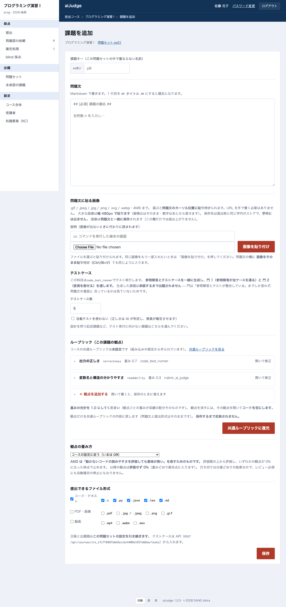

- **テストケース**: 参照解答とテストケースは AI が生成し、「参照解答が全ケースを通る」「変異を落とす」の 2 つの門を通ったものだけが候補になります。**承認するまで出題されません**（次の「未承認の課題」）
- **ルーブリック**: コースの共通ルーブリックが初期値です。この課題だけ変えたいときはここで直します。**重みの合計は 1.0** にしてください
- **提出できるファイル形式**: 写真や PDF を受けるなら「PDF・画像」にチェックします

### zip でまとめて取り込む

課題ごとのフォルダに `task.yaml` を置いた zip を読み込ませます。ひな形をダウンロードして書き換えるのが早いです。
**読み取った内容を確認してから保存**するので、その場で出題されることはありません。

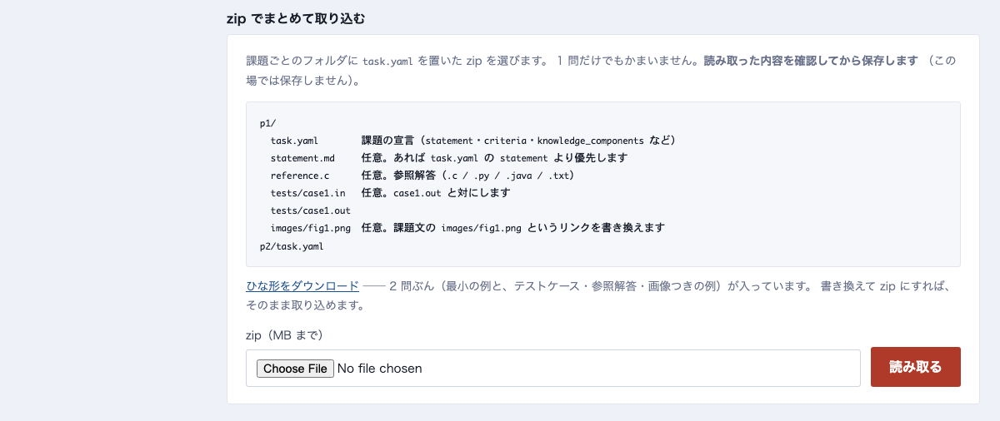

### AI に作らせる

問う**知識要素**（後述）を選ぶと、AI が問題文・参照解答・テストケースを作ります。

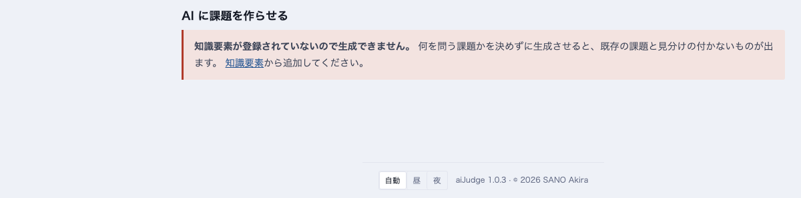

生成された課題は「未承認の課題」に入ります。**読んで承認するまで学生には出ません。**
検査の記録（参照解答がテストを通ったか、問題文と整合しているか）を見て判断してください。

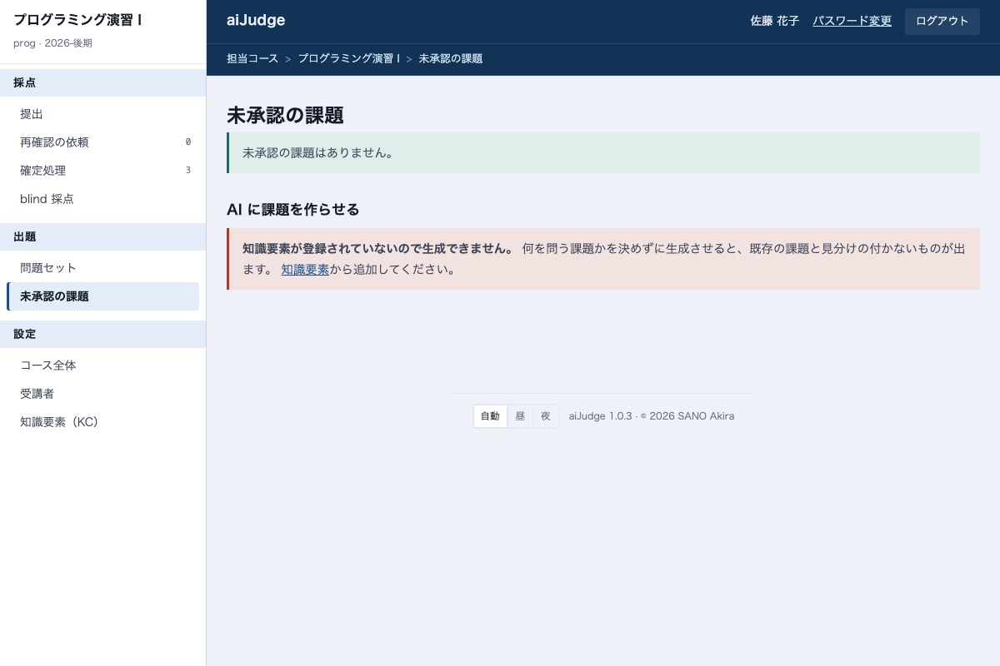

### 出題後に直すとき

課題の行の「修正」で開きます。**問題文や観点を直すと版が上がり**、以前の版で採点された提出はそのままです（過去の採点基準は書き換えません）。
出し直しが必要なら「再採点」を使います。

## 5. コース全体の設定

左の帯の「問題セット」を押すと開きます（コース名・シラバスの本文は「コース全体」です）。

### 成績の自動確定

採点完了から何分で確定するかを決めます。空なら自動確定しません（すべて人が確定します）。

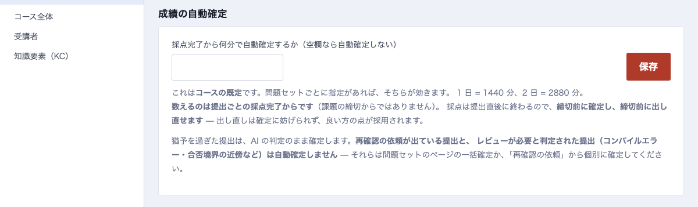

!!! note
    **再確認の依頼が出た提出と、外れ値（コンパイルエラー・合否境界の近く）は自動確定されません。** 人が読むまで残ります。

### 共通ルーブリック

観点の並びと重みです。**新しい課題がこれを引き継ぎます**（既にある課題は変わりません）。
畳み方は OR（重み付きの和）か AND（1 つでも 0% なら打ち切り）です。

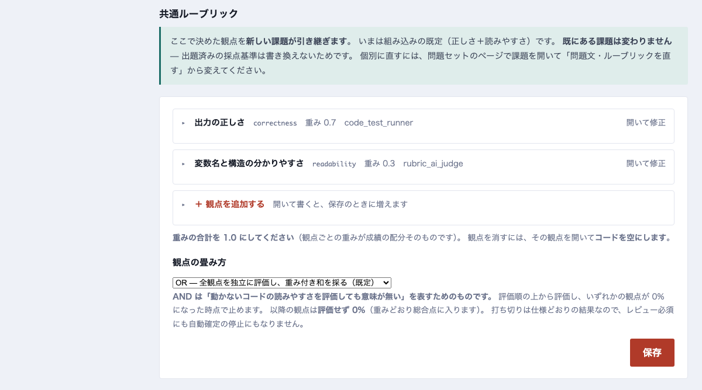

### 採点設定

テストの実行時間、AI の判定を何回引くか、**人が確認する条件**（確信度・合否の境界）、blind 採点の抽出率、使う評価器。
「この設定で試行」で、変更前に 1 件流して確かめられます。

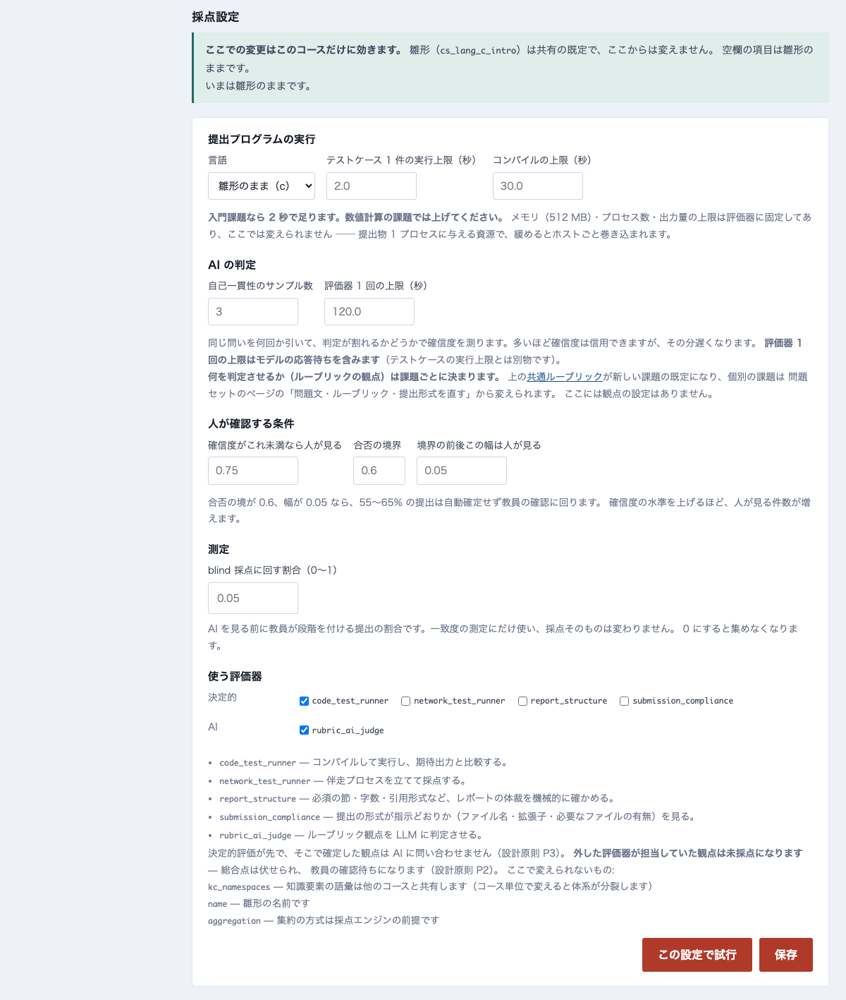

## 6. 確定処理（まとめて）

締切後、依頼の出ていない提出を**問題セット単位**または**課題単位**でまとめて確定できます。
根拠は学生に表示されるので、抽出して確認した旨を書いてください。

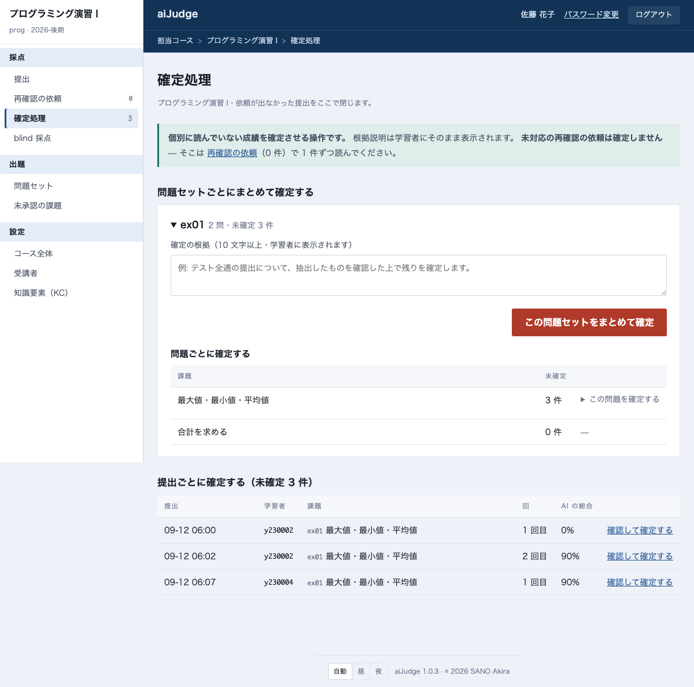

TA が確定した成績を直したいときは、その提出を開いて確定し直します。

## 7. 知識要素（KC）

課題が「何を教えたと言えるか」の語彙です。名前空間（`cs` など）ごとに共有され、
AI 作問で「何を問うか」を決めるのに使います。
シラバス（PDF・DOCX）を「コース全体」→「基本情報」で読み取っておくと、ここで候補を出せます。

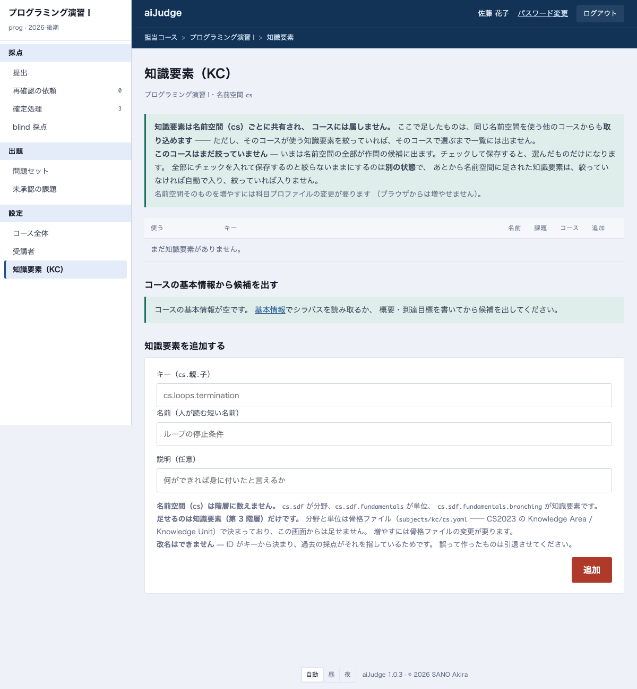

## 8. 管理者向け

テナント全体の設定は、トップ画面の左の帯「テナントの設定」にあります（管理者だけに出ます）。

| 項目 | 何ができるか |
|---|---|
| **利用者** | ローカル利用者の一覧・作成・無効化・パスワード再発行・コースごとの役割 |
| **科目プロファイル** | 採点の宣言の確認。**コースが使っているものは読み取り専用**で、複製してから編集します |
| **ログイン方式** | 大学の Google アカウントでのログイン設定 |

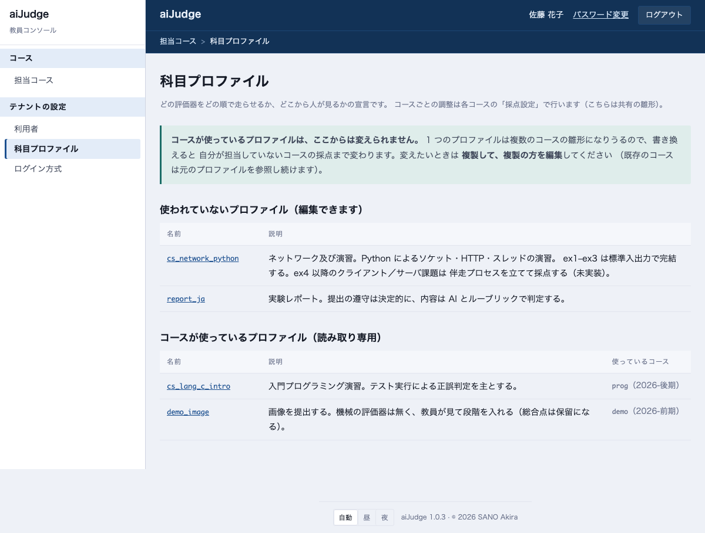

!!! warning "科目プロファイルの編集"
    1 つのプロファイルを複数のコースが使います。使われているものを書き換えると他のコースの採点が変わるため、
    画面は**複製**しか許しません。複製したものを新しいコースに割り当ててください。

## CLI でしかできないこと

サーバに入れる運用担当者に依頼する作業です。

| 作業 | コマンド |
|---|---|
| 名簿から一括登録・新規利用者の作成 | `aijudge-admin enrol` |
| 教員・TA の作成 | `aijudge-admin staff` |
| 利用者の無効化 | `aijudge-admin user disable` |
| Sharif Judge 形式の課題の取り込み | `aijudge-admin task import` |
| お試しコースの初期化 | `aijudge-admin demo reset` |
| 一致率（κ）の測定 | `aijudge-eval` |
