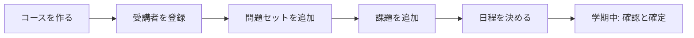
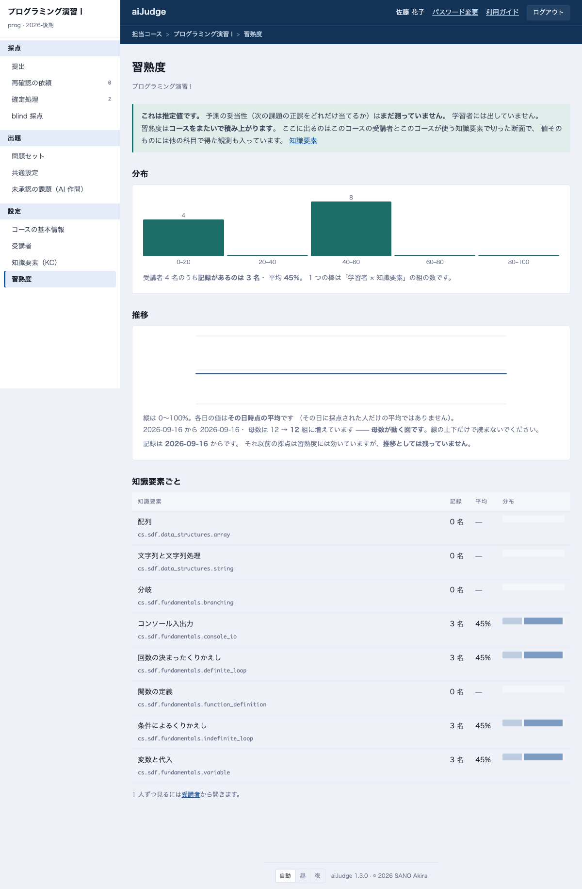
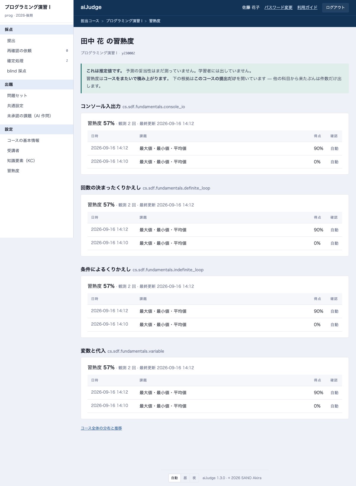

# 教員向けガイド

採点の確認・確定は [TA 向けガイド](ta.md) と同じ操作です。ここでは**教員にしかできないこと** —
コースを組み、課題と締切を出し、採点の設定を決める — を説明します。

## 学期の流れ

## 1. コースを作る

コンソールのトップ「コースを追加する」から作ります（管理者権限が要ります。無ければ管理者に依頼してください）。

- **コードと学期は作ったあと変えられません**（この 2 つがコースの同一性です）
- **科目プロファイル**は「どの評価器がどの順で走るか」の宣言です。C 言語なら `cs_lang_c_intro`、日本語レポートなら `report_ja` のように選びます
- 前の学期のコースがあるなら、そのコースの「共通設定」→「このコースを複製する」の方が早いです（課題・ルーブリック・設定を引き継ぎ、提出と受講者は引き継ぎません）

## 2. 受講者を登録する

左の帯「受講者」で、ログインに使う**アカウント**を 1 行 1 名で貼り付けて登録します。学内ログインの利用者は `学籍番号@mail.ryukoku.ac.jp` のようにドメイン付きで、配布したローカルアカウントは ID そのままです（画面に例が出ます）。学内ログインのアカウントは、本人がまだ一度もログインしていなくても登録できます（初回ログインで結び付きます）。登録すると何件入ったかと、入らなかったアカウントがその場に表示されます。役割は行ごとに変えられます。

!!! note "90 名を一度に入れるなら CLI"
    名簿ファイルからの一括登録と、**新規利用者の作成**は `aijudge-admin` で行います（パスワードの配布が伴うため画面には出しません）。
    運用担当者に `uv run aijudge-admin enrol --course <id> --roster 名簿.txt` を依頼してください。

## 3. 問題セットと日程

左の帯の「問題セット」（またはコース名）を押すと**問題セット**（第 N 回）が並び、公開・開始・締切・未確定の件数が一覧できます。
下の欄に鍵（例: `ex04`）を入れて「追加」すると新しい問題セットができます。

問題セットを開くと日程を決められます。

| 欄 | 意味 |
|---|---|
| **公開** | 学生の画面に出る時刻。空なら出ません |
| **提出開始** | 空なら公開と同時 |
| **提出締切** | これを過ぎると遅延の減点が付きます |
| **受付終了** | これを過ぎると提出できません。空なら無期限（減点は付きます） |
| **採点開始** | **試験のとき**に使います。ここに時刻を入れると、その時刻まで採点しません（提出は受け付けます） |

ここで保存すると、**その問題セットのすべての課題に同じ値**が入ります。

日程が課題ごとにばらついているときは、問題セットの画面と課題の画面の両方に
「この問題セットの日程が課題ごとにばらついています」と出ます。取り込んだ課題が
1 件ずつ日程を持っていた、あとから足した課題にまだ日程が無い、といったときに
起きます。揃えるなら上の「日程を保存」、**1 件だけ直すなら課題の画面の「日程」**を
使ってください。

課題の画面の「日程」は同じ 5 つの欄で、**その課題だけ**に効きます。ここでの保存で
版は上がりません（日程は課題の内容ではないので、過去の採点がどの基準で付いたかは
変わりません）。問題文や観点を直して版を上げても、日程は変わりません。

### 公開前に自分で出して確かめる

**教員・TA は、公開前・提出開始前の課題にも提出できます**（#340）。学生の画面には
まだ出ていない課題でも、自分のコース一覧には「公開前（動作確認）」の印つきで並び、
開けば提出欄が出ます。採点は学生とまったく同じ経路を通るので、**設定が正しいかを
実物で確かめられます** ── 確かめられないと、最初の学生の提出がそのまま最初の
動作確認になります。

出したものは**成績にも得点分布にも難易度の推定にも一致度の測定にも入りません**
（教員・TA の提出は「試行」として扱われます）。

**受付終了を過ぎた課題には出せません。** 広げたのは「まだ始まっていない」側だけで、
「もう終わった」側は教員にも開きません。

### 学内からだけ受け付ける

試験のように「学内で受けさせたい」問題セットは、問題セットの画面の
**「受け付ける場所」**で切り替えます。その問題セットの**すべての課題**に効き、
学外からは提出できなくなります。学生の画面にも「学内のみ」と出ます。

!!! warning "範囲の設定は管理者が行います"
    何を学内と見なすか（アドレスの範囲）は、テナント管理者が
    「学内ネットワーク」で設定します。**設定されていないと、切り替えても
    制限は効きません** — そのときは問題セットの画面にその旨が出ます。

**採点や確定には影響しません。** 既に出された提出はそのまま扱われます。

### エディタで解かせる（オンラインのコーディングテスト）

問題セットの画面の**「答え方」**で「ブラウザのエディタで書いて提出する」を選ぶと、学生は
ファイルの代わりにブラウザのエディタで書いて提出します。その問題セットの**すべての課題**に効きます。

- エディタで選べる形式は、各課題の**提出形式のうち `.c`・`.py`・`.md`** です。どれも含まない課題が
  あるとエディタにはできず、画面に理由が出ます（提出形式は課題ごとの設定で変えます）
- **`.md` だけの課題はオンラインのレポート試験**になります。学生は文章を書いて提出します
- プログラムの課題で、形式が**採点の言語と同じ**なら、学生は採点と同じ環境で**試しに実行**できます。
  非公開のテストケースでは実行できません。試しの実行は採点ではなく、成績には影響しません
- **受付終了の時点で、最後に保存された内容が自動で提出**されます。提出時刻は保存された時刻なので、
  締切と受付終了が同じでも遅延にはなりません。提出の一覧では「受付終了時の自動提出」と印が付きます
- 試験では、今までどおり**採点開始**の時刻と**学内からだけ受け付ける**を合わせて使ってください

!!! note "作業の記録（教員だけが見られます）"
    エディタでの作業（打鍵・貼り付け・コピー・実行・提出・画面を離れた時間）は時刻付きで
    記録されます。提出の一覧の「作業の記録」から、学生ごとの要約（外からの貼り付けの字数、
    画面を離れた時間など）と、記録の欠け・食い違いを見られ、「再生」で経過を順にたどれます。
    **記録から自動で判定・減点はしません。** 数字は経過を確かめる入口で、それだけでは
    何も意味しません。記録を**開いたことは監査ログに残ります**。TA は見られません。

## 4. 課題を追加する

課題の入れ方は 3 つあります。

### 画面から書く

「課題を追加する →」で開きます。問題文は Markdown で、1 行目の `## タイトル ##` が題名になります。

- **入出力セット（テストケース）**: 課題の編集画面で中身を確認でき、「テストケースを直す」から足す・直すができます（保存すると新しい版になります）。TA は確認だけです。観点に `code_test_runner` などを割り当てていれば、0 件でも欄が出ます（0 件のあいだ、その観点は判定されず総点は出ません）
- **テストケースの生成**: 参照解答とテストケースは AI が生成し、「参照解答が全ケースを通る」「変異を落とす」の 2 つの門を通ったものだけが候補になります。**承認するまで出題されません**（次の「未承認の課題（AI 作問）」）
- **ルーブリック**: コースの共通ルーブリックが初期値です。この課題だけ変えたいときはここで直します。**重みの合計は 1.0** にしてください
- **提出できるファイル形式**: 写真や PDF を受けるなら「PDF・画像」にチェックします

### zip でまとめて取り込む

課題ごとのフォルダに `task.yaml` を置いた zip を読み込ませます。ひな形をダウンロードして書き換えるのが早いです。
**読み取った内容を確認してから保存**するので、その場で出題されることはありません。

### AI に作らせる

問う**知識要素**（後述）を選ぶと、AI が問題文・参照解答・テストケースを作ります。

生成された課題は「未承認の課題（AI 作問）」に入ります。**読んで承認するまで学生には出ません。**
検査の記録（参照解答がテストを通ったか、問題文と整合しているか）を見て判断してください。

### 出題後に直すとき

課題の行の「修正」で開きます。**問題文や観点を直すと版が上がり**、以前の版で採点された提出はそのままです（過去の採点基準は書き換えません）。
出し直しが必要なら「再採点」を使います。

## 5. 共通設定

左の帯の「共通設定」を押すと開きます。**このコースの課題すべてに効く値**です
（コース名・シラバスの本文は「コースの基本情報」、1 問ごとの設定は課題の画面です）。

### 成績の自動確定

採点完了から何分で確定するかを決めます。空なら自動確定しません（すべて人が確定します）。

!!! note
    **再確認の依頼が出た提出と、外れ値（コンパイルエラー・合否境界の近く）は自動確定されません。** 人が読むまで残ります。

### 共通ルーブリック

観点の並びと重みです。**新しい課題がこれを引き継ぎます**（既にある課題は変わりません）。
畳み方は OR（重み付きの和）か AND（1 つでも 0% なら打ち切り）です。

### 採点設定

テストの実行時間、AI の判定を何回引くか、**人が確認する条件**（確信度・合否の境界）、blind 採点の抽出率、使う評価器。
「この設定で試行」で、変更前に 1 件流して確かめられます。

## 6. 確定処理（まとめて）

締切後、依頼の出ていない提出を**問題セット単位**または**課題単位**でまとめて確定できます。
根拠は学生に表示されるので、抽出して確認した旨を書いてください。

TA が確定した成績を直したいときは、その提出を開いて確定し直します。

## 7. 知識要素（KC）

課題が「何を教えたと言えるか」の語彙です。名前空間（`cs` など）ごとに共有され、
AI 作問で「何を問うか」を決めるのに使います。
**作ったばかりのコースには何も入っていません。** 名前空間の一覧から分野ごとにまとめて、
または個別に足します。シラバス（PDF・DOCX）を「コースの基本情報」で読み取っておくと、
登録済みの語彙の中から候補を出せます（新しい知識要素は作れません ── 語彙は管理者が
投入する骨格で決まります）。課題の編集画面でも、問題文から候補を出して課題に付けられます。
外すのも個別・分野ごとにできますが、このコースの課題が問うている知識要素は外せません。

### 習熟度を見る

知識要素を付けた課題が採点されると、受講者ごとの**習熟度**が積み上がります。
左の帯の「習熟度」で、コース全体の分布と推移が見られます。

!!! warning "これは推定値です"
    予測の妥当性（次の課題の正誤をどれだけ当てるか）は**まだ測っていません**。
    学習者には出していません。成績そのものではなく、**どこでつまずいているかの手掛かり**として
    読んでください。

図を読むときに気をつけることが 3 つあります。

- **母数は 2 つあります。** 「受講者 30 名のうち記録があるのは 12 名」のように出ます。
  まだ誰も問われていない知識要素は 0 点として数えません（数えると、出題していないだけの
  ものが「できていない」に見えます）
- **推移はその日時点の平均**です。その日に採点された人だけの平均ではありません。
  ただし**母数が増えていく図**なので、線の上下だけで読まないでください
- **記録には始まりがあります。** 画面が「記録は ○月○日 から」と出します。それ以前の採点は
  習熟度そのものには効いていますが、推移としては残っていません

1 人ずつ見るには「受講者」からアカウントを押します。その学習者の知識要素ごとの習熟度と、
**このコースの提出のうちどれが根拠になったか**が出ます。

!!! note "習熟度はコースをまたいで積み上がります"
    知識要素は名前空間ごとに共有されるので、同じ `cs.sdf.fundamentals.branching` を
    別の科目でも問えます。**1 つの値に、あなたが担当していない科目の観測も入っています。**
    根拠はこのコースの提出だけを開き、他から来たぶんは件数だけ出します
    （他の科目の課題名は出しません）。

習熟度が動くのは、**知識要素の付いた課題**が採点されたときだけです。付いていない課題の
成績は記録されません ── 問題セットの一覧で「なし」と出ている課題がそれです。

## 8. 管理者向け

テナント全体の設定は、トップ画面の左の帯「テナントの設定」にあります（管理者だけに出ます）。

| 項目 | 何ができるか |
|---|---|
| **利用者** | ローカル利用者の一覧・作成・無効化・パスワード再発行・コースごとの役割 |
| **科目プロファイル** | 採点の宣言の確認。**コースが使っているものは読み取り専用**で、複製してから編集します |
| **ログイン方式** | 大学の Google アカウントでのログイン設定 |

!!! warning "科目プロファイルの編集"
    1 つのプロファイルを複数のコースが使います。使われているものを書き換えると他のコースの採点が変わるため、
    画面は**複製**しか許しません。複製したものを新しいコースに割り当ててください。

## CLI でしかできないこと

サーバに入れる運用担当者に依頼する作業です。

| 作業 | コマンド |
|---|---|
| 名簿から一括登録・新規利用者の作成 | `aijudge-admin enrol` |
| 教員・TA の作成 | `aijudge-admin staff` |
| 利用者の無効化 | `aijudge-admin user disable` |
| Sharif Judge 形式の課題の取り込み | `aijudge-admin task import` |
| お試しコースの初期化 | `aijudge-admin demo reset` |
| 一致率（κ）の測定 | `aijudge-eval` |
