# 教員向けガイド

採点の確認と確定は、[TA 向けガイド](ta.md) と同じ操作です。このガイドでは、**教員にしかできない操作**を説明します。
コースを作ること、課題と締切を設定すること、採点の設定を決めることです。

## 学期の流れ

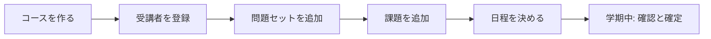
```mermaid
flowchart LR
  A[コースを作る] --> B[受講者を登録]
  B --> C[問題セットを追加]
  C --> D[課題を追加]
  D --> E[日程を決める]
  E --> F[学期中: 確認と確定]
```

## 1. コースを作る

コースは、コンソールのトップの「コースを追加する」から作ります。管理者権限が必要です。権限が無い場合は、管理者に依頼してください。

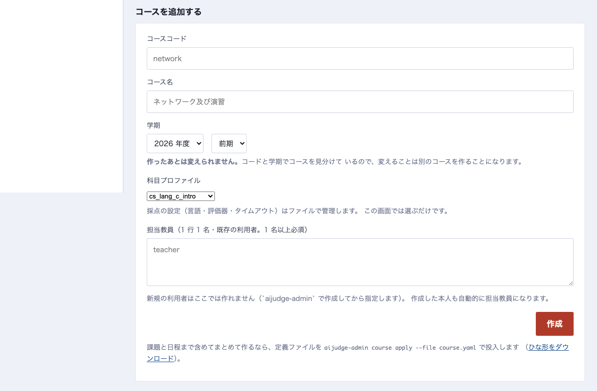

- **コードと学期は、作成後に変更できません**（システムはこの 2 つでコースを識別します）
- **科目プロファイル**は、「どの評価器をどの順で実行するか」を決める宣言です。C 言語なら `cs_lang_c_intro`、日本語レポートなら `report_ja` のように選びます
- 前の学期のコースがある場合は、そのコースの「共通設定」→「このコースを複製する」を使うと早く作れます（課題・ルーブリック・設定は引き継ぎ、提出と受講者は引き継ぎません）

## 2. 受講者を登録する

左の帯の「受講者」で、ログインに使う**アカウント**を 1 行に 1 名ずつ貼り付けて登録します。学内ログインの利用者は `学籍番号@mail.ryukoku.ac.jp` のようにドメイン付きで書き、配布したローカルアカウントは ID をそのまま書きます（画面に例が表示されます）。学内ログインのアカウントは、本人がまだ一度もログインしていなくても登録できます。本人が初めてログインしたときに、登録とアカウントが結び付きます。登録すると、登録できた件数と、登録できなかったアカウントがその場に表示されます。役割は行ごとに変更できます。

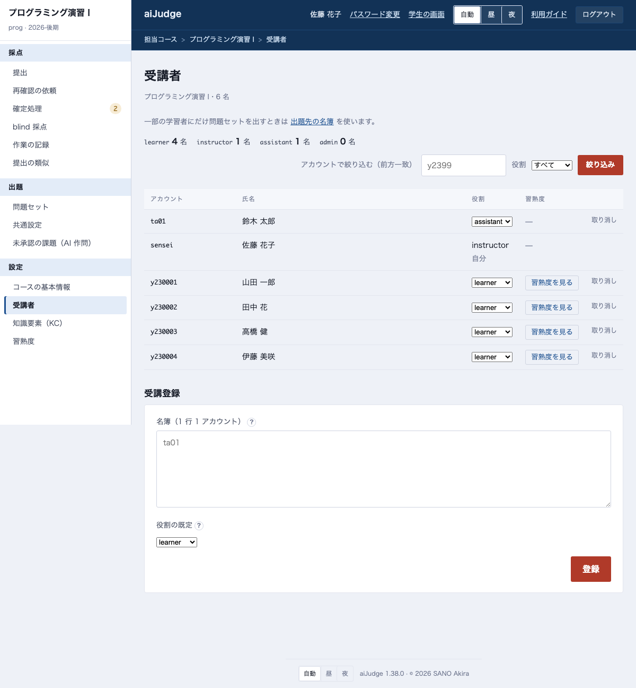

!!! note "90 名を一度に入れるなら CLI"
    名簿ファイルからの一括登録と、**新規利用者の作成**は `aijudge-admin` で行います（パスワードの配布を伴うので、画面には機能を設けていません）。
    運用担当者に `uv run aijudge-admin enrol --course <id> --roster 名簿.txt` を依頼してください。

## 3. 問題セットと日程

左の帯の「問題セット」（またはコース名）を押すと、**問題セット**（第 N 回）の一覧が表示されます。一覧では、公開・開始・締切の日時と未確定の件数を確認できます。
下の欄にキー（例: `ex04`）を入れて「追加」を押すと、新しい問題セットを作れます。

問題セットは、**いま誰に見えているか**によって 3 つの区分に分かれて並びます。学生に見えていない 2 つの区分は、点線の枠で囲まれます。
この区分を見れば、誤って公開した問題セットや、公開し忘れた問題セットに気づけます。

| 区分 | 意味 |
|---|---|
| **学生に公開中** | 公開の時刻を過ぎていて、学生の画面に出ている |
| **未公開（TA まで見える）** | 公開の時刻の前。教員と TA には見え、学生には見えない |
| **教員のみ（TA にも未公開）** | 「公開まで教員だけに見せる」セットの公開前（試験など）。TA にも見えない |

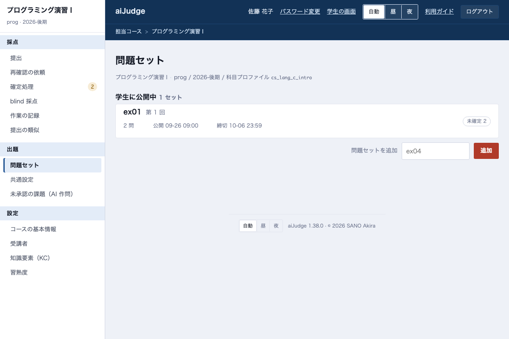

問題セットを開くと、そのセットの**設定**（日程・提出・見せる相手・成績）が 1 つのフォームにまとまっています。
保存ボタンは、画面の一番下にある「**設定を保存**」の 1 つだけです。保存すると、**変更した項目だけが
そのセットのすべての課題に**反映されます。各項目の説明は、項目名の横の **?** を押すと表示されます。

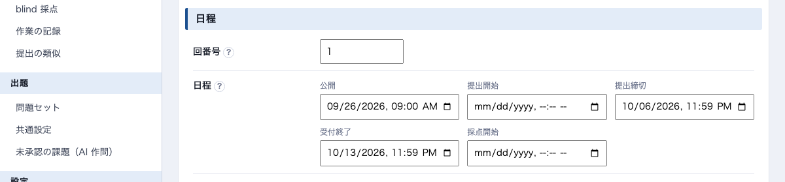

| 欄 | 意味 |
|---|---|
| **公開** | 学生の画面に表示される時刻。空欄なら表示されません |
| **提出開始** | 空なら公開と同時 |
| **提出締切** | これを過ぎると遅延の減点が付きます |
| **受付終了** | これを過ぎると提出できません。空欄なら無期限です（締切後の提出には減点が付きます） |
| **採点開始** | **試験のとき**に使います。時刻を入れると、その時刻まで学生の提出を採点しません（提出は受け付けます）。**教員・TA の提出はすぐに採点される**ので、試験中でも採点が正しく動くかを確かめられます（その結果は提出した本人にしか見えず、成績にも数えません） |

`course.yaml` の `units:` にも、同じ 5 つを書けます（`opens_at`・`submissions_open_at`・
`due_at`・`accepts_until`・`grading_starts_at`）。書いた欄だけが反映され、書かなかった欄は
この画面で入れた値のまま残ります。

課題ごとに値が異なる項目には、「このセットの中で値がばらついています」と表示されます
（取り込んだ課題が 1 件ずつ別の日程を持っていた場合や、あとから追加した課題にまだ日程が無い場合などです）。値を揃えるときは
この画面で保存してください。**1 件だけ直すときは、課題の画面の「この問題への操作」→「この問題の設定」**を使います。
課題ごとの設定には、同じ 5 つの日程に加えて、提出形式と実行時間の上限があります。課題ごとの設定を保存しても、**版は
上がりません**（日程は課題の内容ではないので、過去の採点の基準は変わりません）。

### 公開前に自分で出して確かめる

**教員・TA は、公開前や提出開始前の課題にも提出できます。** そうした課題は、自分のコース一覧に「公開前（動作確認）」の
印付きで並びます。教員・TA の提出も学生の提出とまったく同じ経路で採点されるので、**最初の学生が提出する前に、実際の採点で設定を確かめられます**。
教員・TA の提出は「試行」として扱われ、成績・得点分布・難易度の推定・一致度の測定には含まれません。
受付終了を過ぎた課題には、教員も提出できません。

### 学生の画面で確かめる

画面の上の「**学生の画面**」を押すと、いま開いているコースの学生の画面に移ります。教員・TA として開いた場合は、
**学生には見えていない問題セットが点線の枠で囲まれ**、「学生には未公開（09-30 13:00 公開）」や
「教員のみ（TA・学生には非公開）」の印が付きます。一部の学生だけに出題している問題セットには、
「一部の学生だけに出題」と表示されます。開いた課題が学生から見えていない場合も、そのことが表示されます。
公開の時刻を過ぎると枠が消えるので、誤って公開した場合もこの画面で気づけます。

画面の上には、**昼夜の切り替え**（自動・昼・夜）もあります（学生の画面にもあります）。

### 採点のされ方の印

問題セットの画面の課題の一覧には、課題ごとに**採点のされ方**が印で表示されます。

| 印 | 意味 |
|---|---|
| **テストで判定** | テストケースを実行して判定する観点がある |
| **規則で判定** | 文字列の照合・提出物の検査など、決まった規則で判定する観点がある |
| **AI が判定** | AI がルーブリックに沿って根拠付きで判定する観点がある（レポート・感想など） |
| **教員が採点** | 機械に採点させない観点がある（教員が段階を入れる） |

### 配点とクリア条件

問題セットの中で、やさしい問題に低い配点を、むずかしい問題に高い配点を付けられます。**セットの合計点**を
クリアの条件にすることもできます。

- **配点**は、各課題の定義に `max_score: 20` のように書きます（書かなければ 100 点です）。学生の画面では、提出ごとに
  「16 / 20 点（80%）」のように**割合 × 配点**で点数が表示され、コース一覧には各問題の配点が表示されます
- 配点は**課題の版ごとに決まります**。配点を変えるときは、`course apply --revise` で版を上げます。配点を下げても、
  前の版で取った点は下がりません（版をまたいで採用する提出を選ぶときは、点数で比べます）
- 初めて配点を入れた問題では、それより前の提出もその配点で数えます（それまで学生には割合しか表示して
  いなかったためです）
- **クリア点**は、問題セットの画面の「クリア条件」で入れます（`course.yaml` では `units:` に
  `clear_points: 60` と書きます）。学生のコース一覧では、合計がクリア点以上の問題セットに**クリア**の印が付きます。
  確定前の点を含むときは「クリア（暫定）」と表示されます。クリア点を設定しても、採点そのものは変わりません

## 4. 課題を追加する

課題を追加する方法は 3 つあります。

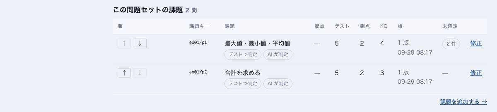

### 画面から書く

「課題を追加する →」を押すと、課題の作成画面が開きます。問題文は Markdown で書きます。1 行目の `## タイトル ##` が題名になります。

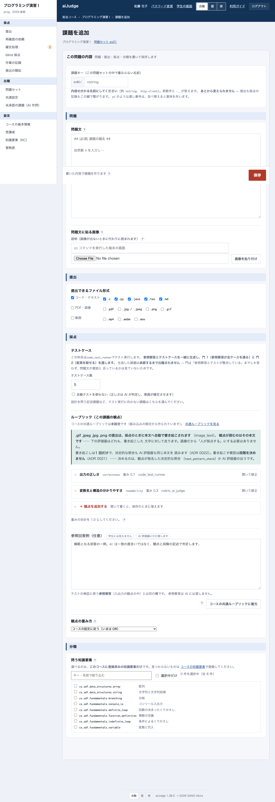

- **入出力セット（テストケース）**: 課題の編集画面で中身を確認できます。「テストケースを直す」から追加や修正ができます（保存すると新しい版になります）。TA は確認だけできます。観点に `code_test_runner` などを割り当てていれば、テストケースが 0 件でも欄が表示されます（0 件の間、その観点は判定されず、総合点は表示されません）
- **テストケースの生成**: AI が参照解答とテストケースを生成します。「参照解答が全ケースを通る」「変異を検出できる」の 2 つの検査に合格したものだけが候補になります。候補は、**教員が承認するまで出題されません**（次の「AI に作らせる」を参照）
- **ルーブリック**: 初期値はコースの共通ルーブリックです。この課題だけ変えたいときは、ここで直します。**重みの合計は 1.0** にしてください
- **提出できるファイル形式**: 写真や PDF を受け付けるときは「PDF・画像」にチェックを入れます。課題を作ったあとは、課題の画面の「この問題への操作」→「この問題の設定」で変更します（版は上がりません）

### zip でまとめて取り込む

課題ごとのフォルダに `task.yaml` を置いて zip にまとめ、画面から読み込みます。ひな形をダウンロードして書き換えると早く作れます。
読み込んだ内容は、確認画面で見てから取り込みます。取り込んだ課題は、画面から作った課題と同じく
**日程に従ってそのまま出題されます**（承認が必要なのは AI 作問の課題だけです）。

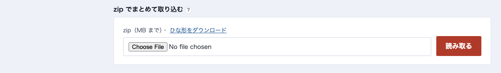

### AI に作らせる

AI 作問は、「未承認の課題（AI 作問）」のページで行います。「AI に課題を作らせる」で、問いたい
**知識要素**（後述）を選ぶと、AI が問題文・参照解答・テストケースを作ります。
問題セットのページの「AI にこのセットの課題を作らせる」から開くと、その問題セットが
**出題先の候補**に選ばれた状態になります（出題先は承認するときに変更できます）。

生成された課題は、同じページの一覧に追加されます。**教員が読んで承認するまで、学生には出題されません。**
検査の記録（参照解答がテストを通ったか、問題文と整合しているか）を見て、承認するかを判断してください。

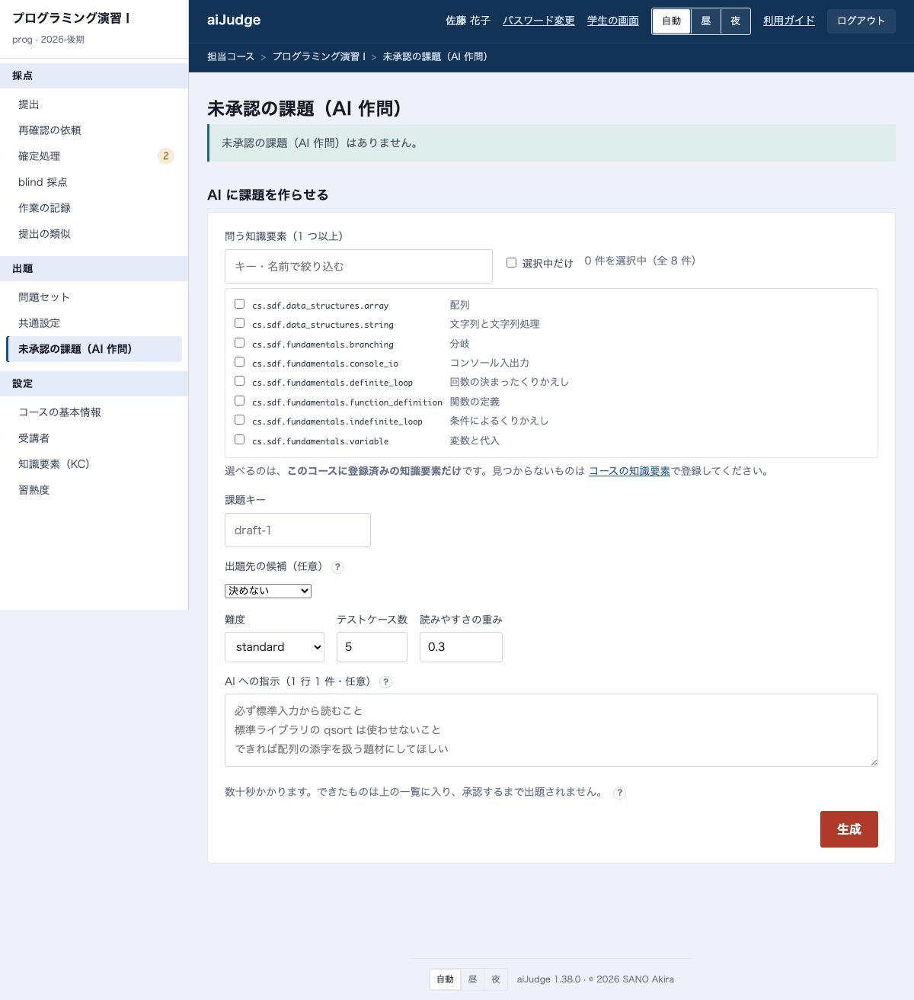

### 課題の画面（内容と操作）

課題の画面には 2 つのタブがあります。**問題の内容**（問題文・テストケース・ルーブリック・知識要素）のタブでは、保存すると
新しい版になります。**この問題への操作**（再採点・この問題の設定・移動とコピー・取り下げ・削除）のタブの操作は、押すと
その場で反映されます。

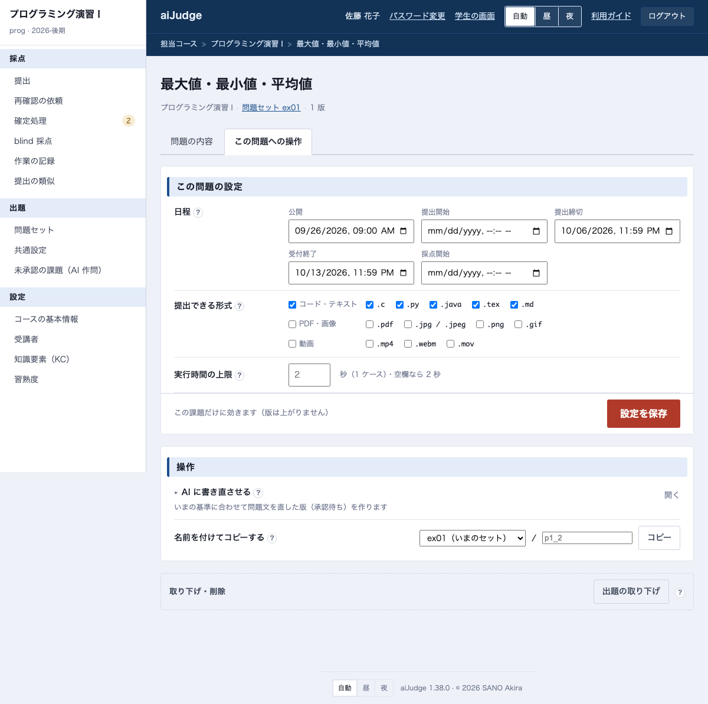

### 出題後に直すとき

課題の行の「修正」を押すと、編集画面が開きます。**問題文や観点を直すと版が上がります。** 以前の版で採点された提出の結果は変わりません（過去の採点基準は書き換えません）。
新しい版で採点し直す必要があるときは、「再採点」を使います。

版が上がっても、学生の以前の提出は消えません。

- 学生の画面では、前の版への提出に「**訂正前の版への提出**」と印が付き、提出の回数も数えられたままです
  （「未提出」には戻りません）
- 提出の**回数は課題の中の通し番号**です（版が変わっても 1 回目に戻りません）
- 教員の提出一覧では、前の版への提出に「**v2（いまは v5）**」のように版が添えられます
- 成績に採用されるのは、版をまたいで最も点の高い提出です（配点がある課題では点数で比べます）

観点の評価器を変更すると、**どの観点からも使われなくなった検証データは、保存時に新しい版から外れます**。
たとえば「出力の正しさ」の評価器をテスト実行（`code_test_runner`）から AI の判定に変更すると、入出力のテストケースと
参照解答が新しい版から外れます（外れたことは保存後に表示されます）。外れたデータは前の版に残っているので、
「版の復元」で戻せます。課題の定義ファイル（`course.yaml`）から投入する場合は、ファイルに書いたとおりに登録されます。

### 学生に見える欄・見えない欄（評価基準と参照回答例）

観点の**題名と説明**は、提出後に学生の結果画面に表示されます（AI 評価器にも渡ります）。
回答例や、どこを見て段階を決めるかの詳しい基準は、説明の欄ではなく次の 2 つの欄に書いてください。
どちらの欄も**学生には見えず、AI 評価器にだけ渡ります**。画面の各欄にも、学生に見えるかどうかが書いてあります。

| 欄 | 置き場所 | 学生に見えるか | AI に渡るか |
|---|---|---|---|
| 題名・説明 | 観点 | 見える（提出後の結果画面） | 渡る |
| 評価基準（任意） | 観点 | 見えない | 渡る |
| 参照回答例（任意） | 課題に 1 つ | 見えない | 渡る |
| 参照解答 | 入出力の観点 | 見えない | **渡らない**（テストの検証だけに使う） |

- 参照回答例は**一例**として渡します。AI は回答例との一致ではなく、観点と段階の記述で判定します
- どちらも空でかまいません。書かなければ、これまでどおり説明と段階だけで判定します
- 課題の定義ファイル（`course.yaml`）では、観点の `judging_notes` と課題の `reference_answer` に書きます

### 課題キーと、別の問題セットへ移す・コピーする

課題には**課題キー**が付きます。形は `<問題セット>/<名前>`（例: `ex04/echoClient2`）です。提出も採点の記録も、このキーで課題に結び付いています。
課題キーは、問題セットの画面の課題一覧で、題名の左に表示されます。

課題の画面の「この問題への操作」から、次のことができます。

- **問題セットを移す・名前を変える**: 移動先の問題セットと名前を選んで「移す」を押します。**キーが付け替わります**（`test4/echoClient` を test5 へ移すと `test5/echoClient`）。同じ問題セットのまま名前だけ変えることもできます
  - 日程（公開・提出開始・締切・自動確定の猶予）は**移動先の問題セットの値に揃います**。課題は移動先の一覧の末尾に並びます
  - 版の履歴・承認の状態・設定はそのまま移ります
  - 動作確認で出した**お試しの提出は消えます**
- **名前を付けてコピーする**: **学生の提出がある課題は移せません**（過去の成績がどの課題の点なのか辿れなくなるためです）。別の問題セットでも出題したいときは、名前を付けてコピーします。元の課題と、その提出・成績はそのまま残ります

問題文に `## タイトル ##` の見出しが無い課題では、キーが題名として表示されます。その課題を移すと、題名も新しいキーに合わせて変わります。題名を固定したいときは、問題文に見出しを書いてください。

### 実行時間の上限を延ばす

数値計算のように、正しい解でも実行に時間のかかる問題では、**その課題だけ**実行時間の上限を延ばせます。
課題の画面の「この問題への操作」→「この問題の設定」を開き、「実行時間の上限」にテストケース 1 件あたりの秒数を入れて「設定を保存」を押してください。

- 空欄にすると、既定の値（科目とコースの採点設定の値。欄に薄く表示されています）に戻ります
- 上限は 60 秒までです（1 件の提出の採点に、最大で上限 × ケースの数の時間がかかります）
- エディタの「実行」にも同じ上限が適用されます
- この設定を保存しても**版は上がりません**。採点に使った上限は採点の記録に残ります
- 設定は、既に採点された提出には適用されません。延ばした上限で採点し直すときは「再採点」を使います

## 5. エディタと試験

### エディタで解かせる

問題セットの設定の**「答え方」**で「ブラウザのエディタで書いて提出する」にチェックを入れると、
学生はブラウザのエディタで答えを書いて提出できます（学生の画面は[学生向けガイド](student.md#editor)を参照してください）。

| 答え方 | 向いている場面 |
|---|---|
| **エディタとファイルの両方** | 演習。エディタが使えない環境でも、ファイルで提出できます |
| **エディタだけ** | 試験。作業の記録を経ない提出を防げます |

両方のチェックを外すことはできません。

- エディタで書ける形式は、各課題の提出形式のうち `.c`・`.py`・`.md` です。**`.md` だけを受け付ける課題は、オンラインのレポート試験**に
  なります。エディタで書ける課題が 1 つも無い問題セットでは、チェックが灰色になり、その理由が表示されます
- プログラムの課題で、形式が採点の言語と同じ場合は、学生は採点と同じ環境で**試しに実行**できます（非公開のテストケースでは
  実行できません。試しの実行は成績に影響しません）
- 画像・PDF の課題では、学生はエディタの画面でファイルを選んで提出します（自動保存と自動提出は行いません）。**動画**の課題が
  ある問題セットでは、ファイル選択のチェックを外せません（動画は課題の画面から提出するためです）
- **受付終了の時点で、最後に保存された内容が自動で提出**されます。提出時刻は保存した時刻になるので、締切と受付終了が
  同じ時刻でも遅延になりません。この提出は、提出の一覧に「受付終了時の自動提出」と表示されます
- **補完**は「エディタで補完を出す」で切り替えます（既定は切）。補完は、そのファイル内の単語と言語のキーワードを候補に表示する
  演習向けの機能です。AI による補完ではありません

!!! tip "試験で組み合わせる設定"
    試験では、日程の**採点開始**（試験中は採点しない）、答え方の**エディタだけ**、**学内からだけ受け付ける**を組み合わせます。
    必要に応じて、**試験中の画面の静止画**と、見せる相手の「**公開まで教員だけに見せる**」も使います。

### 学内からだけ受け付ける

試験のように学内で受験させたい問題セットでは、問題セットの設定の
**「受け付ける場所」**を切り替えます。この設定は、その問題セットの**すべての課題**に適用され、
学生は学外から提出できなくなります。学生の画面にも「学内のみ」と表示されます。
**教員と TA は学外からも提出できます**（動作確認の提出は成績に数えません）。

!!! warning "範囲の設定は管理者が行います"
    学内と見なすアドレスの範囲は、テナント管理者が
    「学内ネットワーク」で設定します。**範囲が設定されていない場合は、切り替えても
    提出は制限されません。** その場合は、問題セットの画面に警告が表示されます。

**この設定は採点と確定には影響しません。** 既に提出されたものは、そのまま扱われます。

### 試験中の画面の静止画

エディタで受験する試験では、学生の**画面全体の静止画**を撮れます。問題セットの設定の
**「試験中の画面の静止画」**にチェックを入れると、その問題セットの**すべての課題**に適用されます。

- 学生は、**画面全体を共有しないとエディタで受験を始められません**。タブやウィンドウだけを共有しようとすると、受け付けられません
- 静止画を撮るのは、5〜15 秒おき（ランダム）、**外からの 100 字以上の貼り付けの直前（最大 10 秒前まで）と直後**、
  エディタの画面を離れた直後です
- **学生が共有を止めると、その学生は手動で提出できなくなります**（共有を再開すれば提出できます）。通信の不調で画像が届かない場合は、
  提出を止めません。受付終了時の自動提出は行われます。教員・TA の動作確認の提出は止めません
- この問題セットでは、学生は課題の画面から**ファイルで提出できません**（共有を止めてエディタを迂回する提出を防ぐためです）
- 静止画は、[作業の記録](#integrity)の再生の画面で見ます（担当教員だけが見られます）。再生の位置に合わせてその時点の画面が表示され、
  貼り付けの行を選ぶと、貼り付けの直前と直後の画面が表示されます
- 保存期間は動画と同じ（締切から 6 か月）です。静止画は**バックアップしません**

!!! warning "試験の前に確かめてください"
    教室の PC と学生の PC のブラウザで `/static/screen_probe.html` を開き、**タブを隠している間も静止画を撮れるか**を
    確かめてください（このページは画像をどこにも送りません）。タブを隠す時間は **6〜7 分**にしてください。Chrome・Edge は、
    隠れて 5 分を過ぎたタブのタイマーの実行回数を大きく減らします。隠す時間が 5 分より短いと、長い離脱を確かめたことになりません。
    結果の画面に表示される「報告用の文」をそのまま送ってもらうと、ブラウザの種類も一緒にわかります。
    スマートフォンのブラウザには対応していません。

## 6. 作業の記録と提出の類似（教員だけ） {#integrity}

作業の記録と提出の類似は、どちらも**担当教員だけ**が見られます（TA は見られません）。**画面を開いたことは監査ログに残ります**。
システムは、記録や類似をもとに**自動で減点や判定をしません**。画面の数字は経過を確かめるきっかけで、数字だけでは何も判断できません。

### 作業の記録

エディタでの作業（打鍵・貼り付け・コピー・実行・提出・画面を離れた時間）は、時刻付きで記録されます。
左の帯の「**作業の記録**」を開くと、受講者全員が並びます（提出していない学生も含みます）。学生を選ぶと、**問題ごとに**次の情報を確認できます。
要約（外からの貼り付けの字数、画面を離れた時間など）・確かめる場所の印・提出（回・得点・採用）・
エディタを開いた回です。提出の一覧と提出の確認画面からも、この画面に移れます。

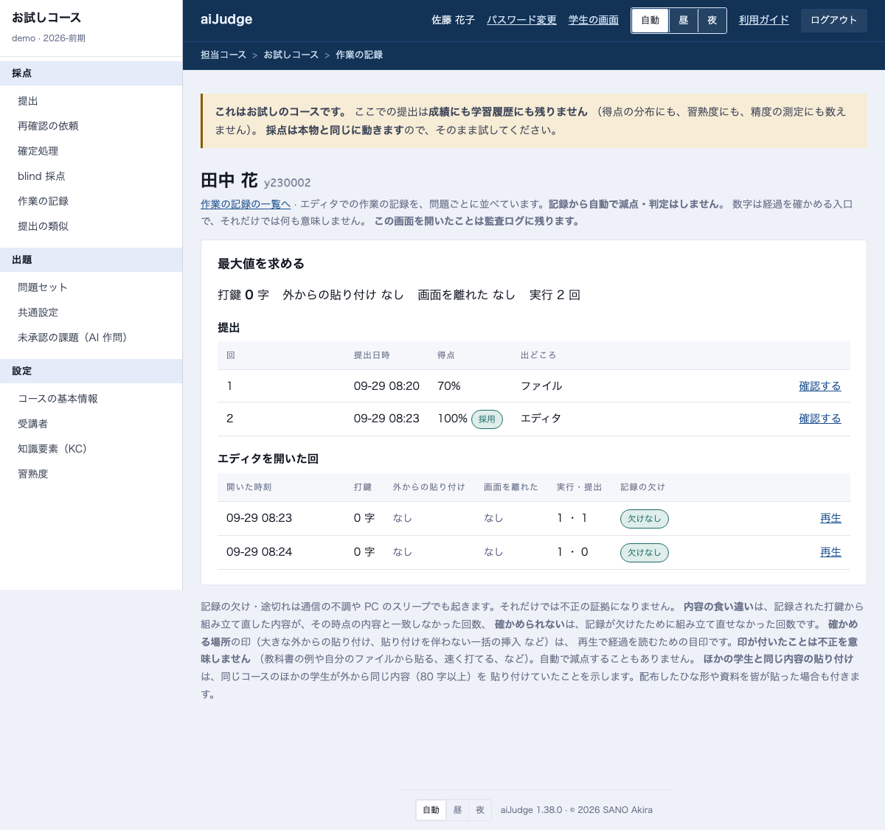

「**再生**」では、時間に沿って作業の経過をたどれます（速さは 1・4・16 倍で、長い空白は詰めて再生します）。
画面の静止画を撮っている試験では、再生の位置に合わせて、その時点の画面も表示されます。

「確かめる場所」の印の 1 つに、**ほかの学生と同じ内容の貼り付け** があります。この印は、同じコースのほかの学生も
外から同じ内容（80 字以上）を貼り付けていたことを示します（人数も表示されます）。配布したひな形や資料を
全員が貼り付けた場合にもこの印が付くので、再生で経過を読んで判断してください。問題文からコピーして貼り付けた内容は対象外です。

### 提出の類似

左の帯の「**提出の類似**」には、同じ課題の提出どうしで似ている組が表示されます（Dolos というツールで調べます）。

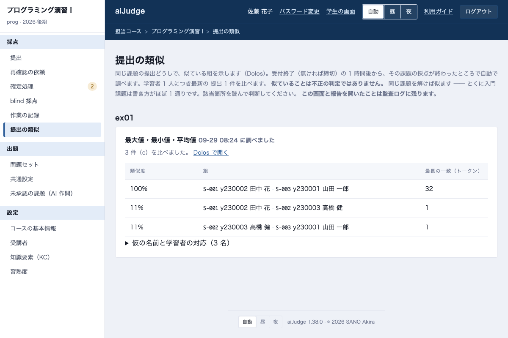

- **いつ調べるか**: 受付終了（無ければ締切）の 1 時間後以降、その課題の**採点が終わった時点で**
  自動で調べます。遅れて届いた提出があれば、次の回で調べ直します。締切の無い課題は調べません
- **何を比べるか**: 学習者 1 人につき、最新の提出 1 件を比べます（教員・TA の提出とお試しの提出は含みません）。
  対象は C（`.c`）と Python（`.py`）の課題です
- **見方**: 課題ごとに、類似度の高い組が 5 つまで表示されます。「**Dolos で開く**」を押すと、組の一覧・2 つを並べた比較
  （一致した箇所に色が付きます）・グラフ・クラスタを見られます（画面は英語です）。Dolos の画面では、
  学生は **S-001 のような仮の名前**で表示されます。仮の名前がどの学生かは、この画面の「仮の名前と学習者の対応」で確かめてください
- **似ていることは不正の判定ではありません。** 同じ課題を解けば、提出は似ます。とくに入門課題では、書き方が
  ほぼ 1 通りに決まります。該当箇所を読み、必要なら作業の記録とあわせて判断してください
- 類似の報告は、元の提出が削除されると一緒に削除されます。報告はバックアップもしません

## 7. 共通設定

左の帯の「共通設定」を押すと開きます。共通設定は、**このコースのすべての課題に適用される値**です
（コース名とシラバスの本文は「コースの基本情報」で、1 問ごとの設定は課題の画面で変更します）。
問題セットの設定と同じく 1 つのフォームになっていて、画面の一番下の「設定を保存」でまとめて保存します。

### 成績の自動確定

採点が完了してから何分後に成績を自動で確定するかを決めます。空欄なら自動確定しません（すべての提出を人が確定します）。

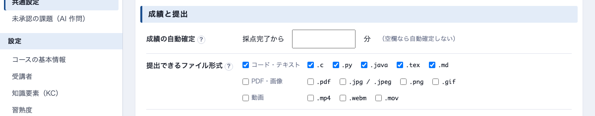

!!! note
    **再確認の依頼が出た提出と、外れ値（コンパイルエラー・合否境界の近く）は自動確定されません。** これらの提出は、人が読んで確定するまで残ります。

### 共通ルーブリック

共通ルーブリックは、観点の並びと重みの初期値です。**新しく作る課題が、この値を引き継ぎます**（既にある課題は変わりません）。
観点の点のまとめ方は、OR（重み付きの和）か AND（1 つでも 0% の観点があれば、以降の観点を打ち切る）から選びます。

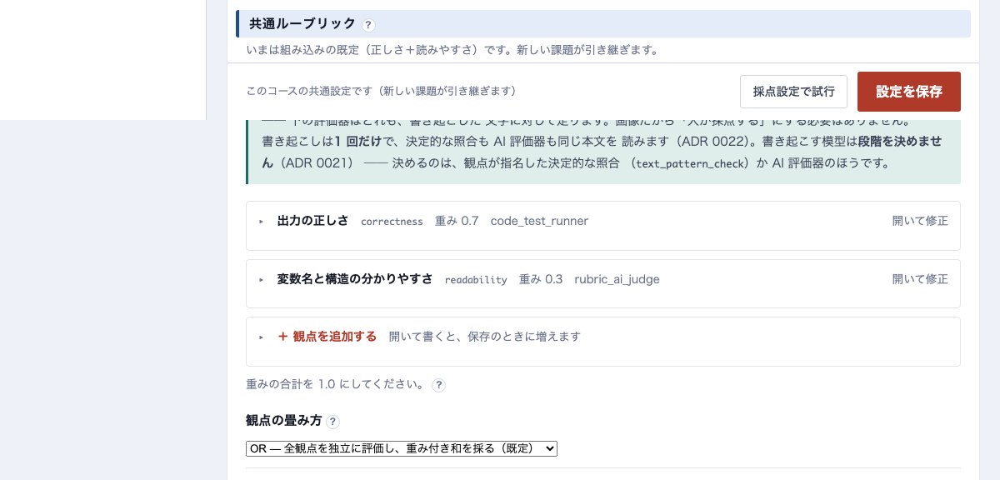

### 採点設定

採点設定では、テストの実行時間、AI に判定させる回数、**人が確認する条件**（確信度・合否の境界）、blind 採点の抽出率、使う評価器を決めます。
「この設定で試行」を押すと、変更を保存する前に、1 件の提出で採点を試せます。

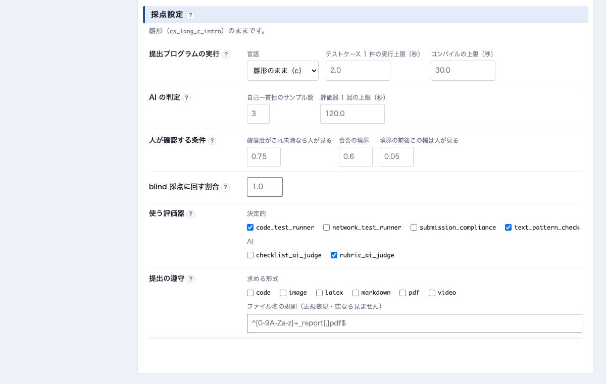

## 8. 確定処理

未確定の提出は 2 種類に分かれます。画面の上に、それぞれの件数が表示されます。

| 表示 | 意味 |
|---|---|
| **手動の確定が必要** | 自動確定の猶予が設定されていない課題の提出と、採点が人の確認を求めた提出（コンパイルエラー・合否の境界の近く など）。**教員か TA が確定しないと成績になりません** |
| **自動確定待ち** | 猶予の期間が終わると自動で確定されます。操作は要りません |

締切後は、依頼の出ていない提出を**問題セット単位**または**課題単位**でまとめて確定できます。
根拠の欄は学生に表示されるので、一部を抽出して確認したことを書いてください。

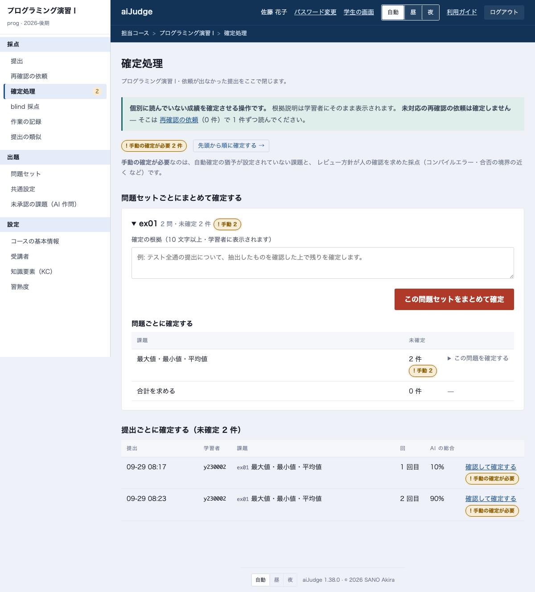

1 件ずつ読んで確定するときは「**先頭から順に確定する →**」を押します（§8.1）。

TA が確定した成績を直したいときは、その提出を開き、「**対応済みの判断を訂正する**」を開いて確定し直してください
（確定済みの提出では、誤って処理し直さないように、確定のフォームを折りたたんでいます）。

### 8.1 1 件ずつ順に処理する（再確認の依頼・blind 採点・確定処理）

再確認の依頼・blind 採点・確定処理の一覧の上には、**対応待ちの件数**と「**先頭から順に処理する →**」が表示されます
（対応待ちが無ければ「待っているものはありません」と表示されます）。このボタンを押すと 1 件目が開き、画面の上に**帯**が表示されます。

- 帯には、対応待ちの件数と、待ち行列の一部（いま開いている 1 件を強調）が表示されます
- 確定や採点のボタンを押すと、帯を表示したまま同じ画面に戻ります。帯の「**次の 1 件へ →**」で次に進みます
- すべて処理すると、「**待ちはありません（すべて対応済み）**」と表示されます。処理した 1 件には「この 1 件は対応済み」と表示されます
- 確定処理の帯に並ぶのは、手動の確定が必要で、再確認の依頼が出ていない提出です（依頼が出ている提出は、
  再確認の依頼の帯で読みます）

### 8.2 左の帯の数字

左の帯の数字は、「人が対応するまで進まない件数」です。**0 件のときは数字を表示しません。**

- **再確認の依頼**: 答えていない依頼の件数
- **確定処理**: 手動の確定が必要な件数。自動確定を待っている件数は、その下に「自動確定待ち N」と小さく表示されます

## 9. 知識要素（KC）

知識要素は、課題で「何を教えたと言えるか」を表す語彙です。知識要素は名前空間（`cs` など）ごとに共有され、
AI 作問で「何を問うか」を決めるときに使います。
**作ったばかりのコースには、知識要素が 1 つも登録されていません。** 名前空間の一覧から、分野ごとにまとめて、
または 1 つずつ追加します。シラバス（PDF・DOCX）を「コースの基本情報」で読み取っておくと、
登録済みの語彙の中から候補を表示できます（新しい知識要素は作れません。語彙は、管理者が
投入する骨格で決まります）。課題の編集画面でも、問題文から候補を表示して課題に付けられます。
知識要素は 1 つずつでも分野ごとでも外せますが、このコースの課題が問うている知識要素は外せません。
知識要素は数百件あるので、「キーワードで探す」でキーや名前から絞り込めます。

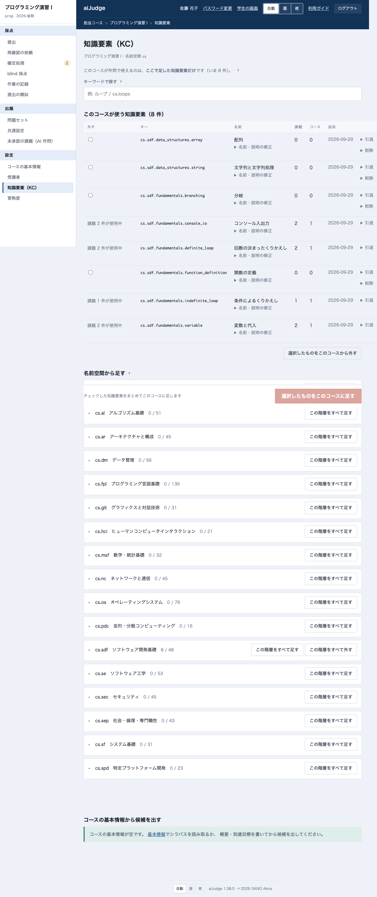

### 習熟度を見る

知識要素を付けた課題が採点されると、受講者ごとの**習熟度**が更新されていきます。
左の帯の「習熟度」で、コース全体の分布と推移を確認できます。

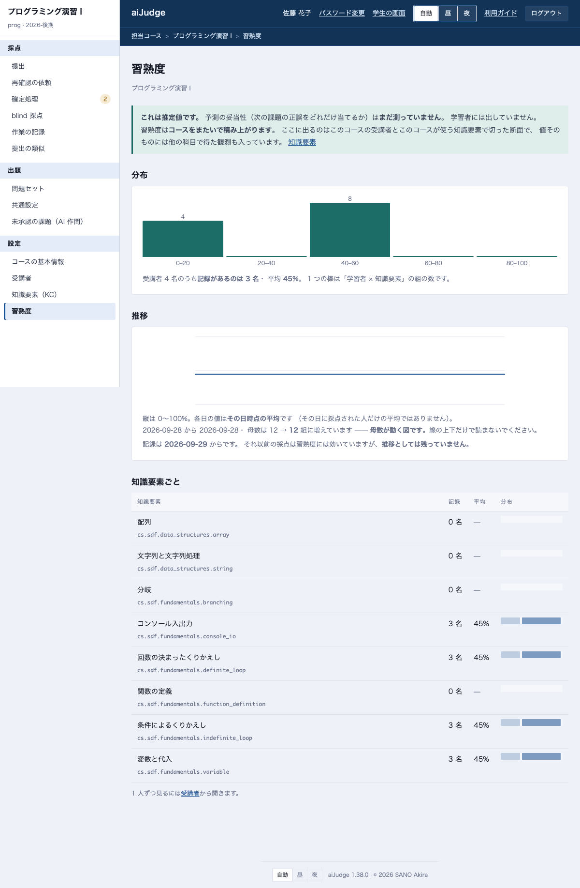

!!! warning "これは推定値です"
    習熟度による予測の妥当性（次の課題の正誤をどれだけ当てるか）は、**まだ測っていません**。
    習熟度は学習者には表示していません。成績そのものではなく、**どこでつまずいているかの手掛かり**として
    読んでください。

図を読むときに気をつけることが 3 つあります。

- **母数は 2 つあります。** 「受講者 30 名のうち記録があるのは 12 名」のように表示されます。
  まだ誰も問われていない知識要素は、0 点として数えません（数えると、出題していないだけの
  知識要素が「できていない」ように見えます）
- **推移の値は、その日時点の平均**です。その日に採点された人だけの平均ではありません。
  ただし、**母数が増えていく図**なので、線の上下だけで判断しないでください
- **記録には開始日があります。** 画面に「記録は ○月○日 から」と表示されます。それ以前の採点は
  習熟度の値には反映されていますが、推移としては残っていません

1 人ずつ見るときは、「受講者」からアカウントを押してください。その学習者の知識要素ごとの習熟度と、
**このコースの提出のうちどれが根拠になったか**が表示されます。

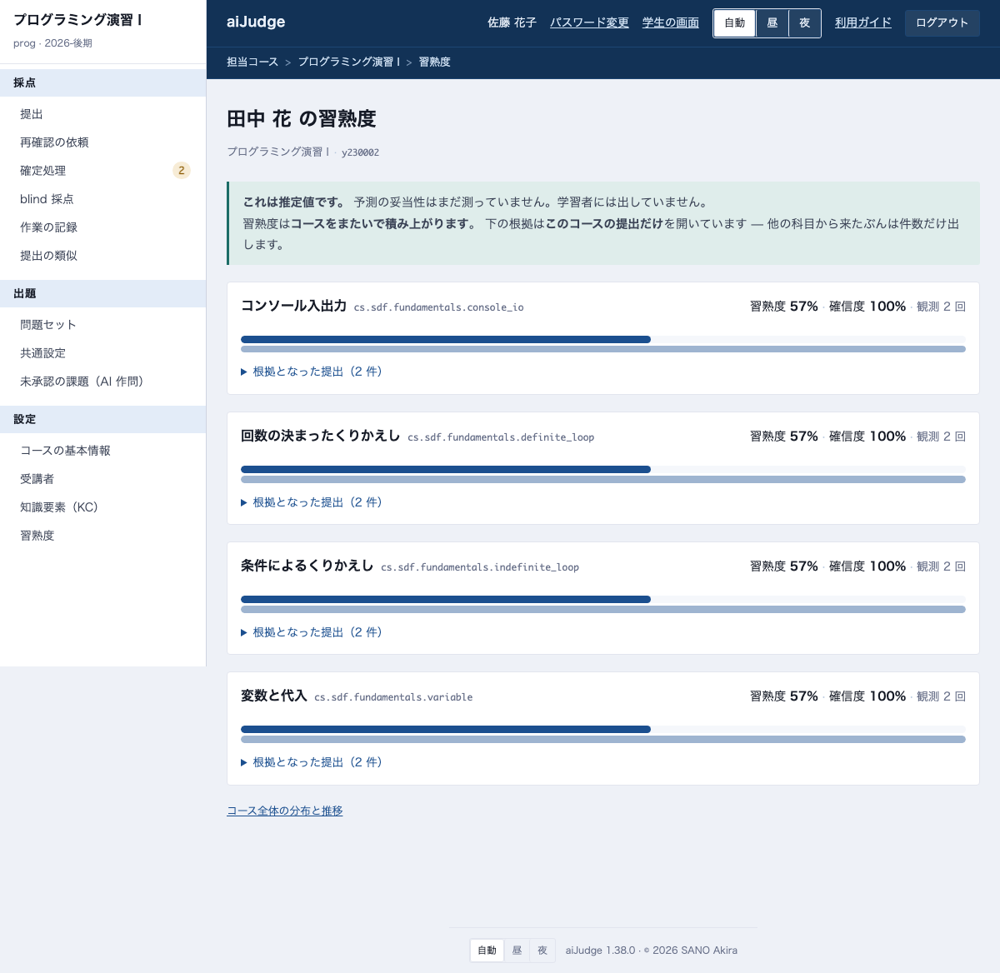

!!! note "習熟度はコースをまたいで積み上がります"
    知識要素は名前空間ごとに共有されるので、同じ `cs.sdf.fundamentals.branching` を
    別の科目でも問えます。**1 つの習熟度の値に、あなたが担当していない科目の観測も含まれています。**
    根拠として開けるのはこのコースの提出だけで、ほかの科目から来た観測は件数だけを表示します
    （ほかの科目の課題名は表示しません）。

習熟度が更新されるのは、**知識要素の付いた課題**が採点されたときだけです。知識要素の付いていない課題の
成績は、習熟度には記録されません。問題セットの一覧で「なし」と表示されている課題が、これに当たります。

## 10. 管理者向け

テナント全体の設定は、トップ画面の左の帯の「テナントの設定」にあります（管理者だけに表示されます）。

| 項目 | 何ができるか |
|---|---|
| **利用者** | ローカル利用者の一覧・作成・無効化・パスワード再発行・コースごとの役割 |
| **科目プロファイル** | 採点の宣言の確認。**コースが使っているものは読み取り専用**で、複製してから編集します |
| **ログイン方式** | 大学の Google アカウントでのログイン設定 |

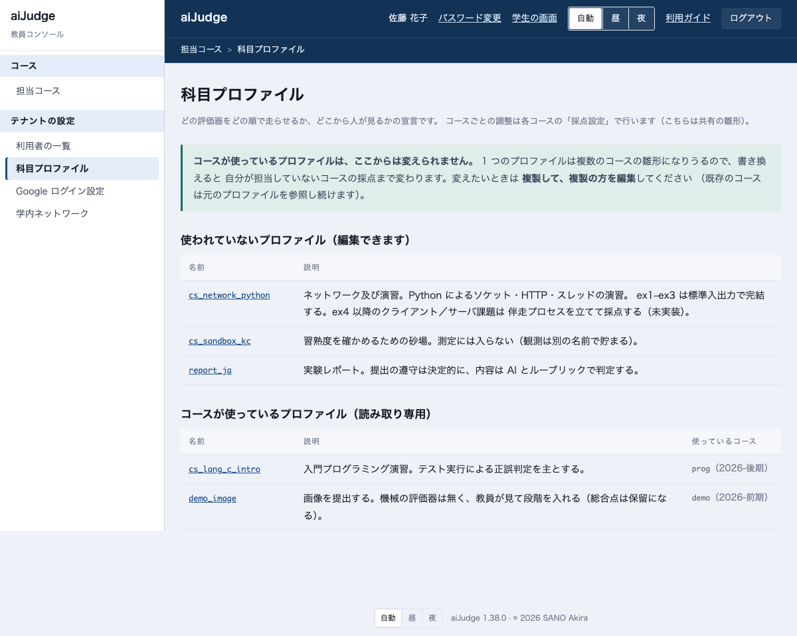

!!! warning "科目プロファイルの編集"
    1 つのプロファイルを複数のコースが使います。コースが使っているプロファイルを書き換えると、ほかのコースの採点も変わります。
    そのため、画面では**複製**だけができます。複製したプロファイルを新しいコースに割り当ててください。

## CLI でしかできないこと

次の作業は、サーバにログインできる運用担当者に依頼してください。

| 作業 | コマンド |
|---|---|
| 名簿から一括登録・新規利用者の作成 | `aijudge-admin enrol` |
| 教員・TA の作成 | `aijudge-admin staff` |
| 利用者の無効化 | `aijudge-admin user disable` |
| Sharif Judge 形式の課題の取り込み | `aijudge-admin task import` |
| お試しコースの初期化 | `aijudge-admin demo reset` |
| 提出の類似を今すぐ調べる | `aijudge-admin similarity run` |
| 一致率（κ）の測定 | `aijudge-eval` |
