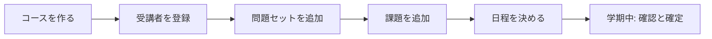

# 教員向けガイド

採点の確認・確定は [TA 向けガイド](ta.md) と同じ操作です。ここでは**教員にしかできないこと** —
コースを組み、課題と締切を出し、採点の設定を決める — を説明します。

## 学期の流れ

```mermaid
flowchart LR
  A[コースを作る] --> B[受講者を登録]
  B --> C[問題セットを追加]
  C --> D[課題を追加]
  D --> E[日程を決める]
  E --> F[学期中: 確認と確定]
```

## 1. コースを作る

コンソールのトップ「コースを追加する」から作ります（管理者権限が要ります。無ければ管理者に依頼してください）。

- **コードと学期は作ったあと変えられません**（この 2 つがコースの同一性です）
- **科目プロファイル**は「どの評価器がどの順で走るか」の宣言です。C 言語なら `cs_lang_c_intro`、日本語レポートなら `report_ja` のように選びます
- 前の学期のコースがあるなら、そのコースの「共通設定」→「このコースを複製する」の方が早いです（課題・ルーブリック・設定を引き継ぎ、提出と受講者は引き継ぎません）

## 2. 受講者を登録する

左の帯「受講者」で、ログインに使う**アカウント**を 1 行 1 名で貼り付けて登録します。学内ログインの利用者は `学籍番号@mail.ryukoku.ac.jp` のようにドメイン付きで、配布したローカルアカウントは ID そのままです（画面に例が出ます）。学内ログインのアカウントは、本人がまだ一度もログインしていなくても登録できます（初回ログインで結び付きます）。登録すると何件入ったかと、入らなかったアカウントがその場に表示されます。役割は行ごとに変えられます。

!!! note "90 名を一度に入れるなら CLI"
    名簿ファイルからの一括登録と、**新規利用者の作成**は `aijudge-admin` で行います（パスワードの配布が伴うため画面には出しません）。
    運用担当者に `uv run aijudge-admin enrol --course <id> --roster 名簿.txt` を依頼してください。

## 3. 問題セットと日程

左の帯の「問題セット」（またはコース名）を押すと**問題セット**（第 N 回）が並び、公開・開始・締切・未確定の件数が一覧できます。
下の欄に鍵（例: `ex04`）を入れて「追加」すると新しい問題セットができます。

問題セットは**いま誰に見えているか**で 3 つに分けて並びます。学生に見えていない 2 つは点線の枠で囲みます。
誤って公開した、公開し忘れた、に気づくための区分です。

| 区分 | 意味 |
|---|---|
| **学生に公開中** | 公開の時刻を過ぎていて、学生の画面に出ている |
| **未公開（TA まで見える）** | 公開の時刻の前。教員と TA には見え、学生には見えない |
| **教員のみ（TA にも未公開）** | 「公開まで教員だけに見せる」セットの公開前（試験など）。TA にも見えない |

問題セットを開くと、そのセットの**設定**が 1 つのフォームにまとまっています（日程・提出・
見せる相手・成績）。保存ボタンは画面の底の「**設定を保存**」1 つで、**変えた項目だけが
そのセットのすべての課題に**入ります。項目の説明は名前の横の **?** に畳んであります。

| 欄 | 意味 |
|---|---|
| **公開** | 学生の画面に出る時刻。空なら出ません |
| **提出開始** | 空なら公開と同時 |
| **提出締切** | これを過ぎると遅延の減点が付きます |
| **受付終了** | これを過ぎると提出できません。空なら無期限（減点は付きます） |
| **採点開始** | **試験のとき**に使います。ここに時刻を入れると、その時刻まで学生の提出を採点しません（提出は受け付けます）。**教員・TA の提出はすぐ採点される**ので、試験中でも採点の動きを確かめられます（結果は本人にしか見えず、成績にも数えません） |

`course.yaml` からも同じ 5 つを `units:` に書けます（`opens_at`・`submissions_open_at`・
`due_at`・`accepts_until`・`grading_starts_at`）。書いた欄だけが入り、書かない欄は
この画面で入れた値のまま残ります。

課題ごとに値がばらついているときは、その項目に「このセットの中で値がばらついています」と出ます
（取り込んだ課題が 1 件ずつ日程を持っていた、あとから足した課題にまだ日程が無い、など）。揃えるなら
ここで保存し、**1 件だけ直すなら課題の画面の「この問題への操作」→「この問題の設定」**を使います。
課題ごとの設定は同じ 5 つの日程に提出形式と実行時間の上限が加わったもので、保存しても**版は
上がりません**（日程は課題の内容ではないので、過去の採点の基準は変わりません）。

### 公開前に自分で出して確かめる

**教員・TA は、公開前・提出開始前の課題にも提出できます。** 自分のコース一覧に「公開前（動作確認）」の
印つきで並び、採点は学生とまったく同じ経路を通るので、**最初の学生より先に設定を実物で確かめられます**。
出したものは「試行」として扱われ、成績・得点分布・難易度の推定・一致度の測定には入りません。
受付終了を過ぎた課題には、教員も出せません。

### 学生の画面で確かめる

画面の上の「**学生の画面**」で、いま開いているコースの学生の画面に移ります。教員・TA として開くと、
**学生には見えていない問題セットが点線の枠で囲まれ**、「学生には未公開（09-30 13:00 公開）」や
「教員のみ（TA・学生には非公開）」の印が付きます。一部の学生だけに出題しているものには
「一部の学生だけに出題」と出ます。課題を開いたときも、学生から見えていなければその旨が出ます。
公開の時刻を過ぎると枠が消えるので、誤って公開した場合もそこで気づけます。

画面の上には**昼夜の切り替え**（自動・昼・夜）もあります（学生の画面も同じ）。

### 採点のされ方の印

問題セットの画面の課題の一覧には、課題ごとに**採点のされ方**が出ます。

| 印 | 意味 |
|---|---|
| **テストで判定** | テストケースを走らせて判定する観点がある |
| **規則で判定** | 文字列の照合・提出物の検査など、決まった規則で判定する観点がある |
| **AI が判定** | AI がルーブリックに沿って根拠付きで判定する観点がある（レポート・感想など） |
| **教員が採点** | 機械に採点させない観点がある（教員が段階を入れる） |

### 配点とクリア条件

問題セットの中で、やさしい問題に低い配点、むずかしい問題に高い配点を付け、**セットの合計点**を
クリアの条件にできます。

- **配点**は各課題の定義に `max_score: 20` のように書きます（書かなければ 100 点）。学生には、提出ごとに
  「16 / 20 点（80%）」のように**割合 × 配点**で点数が出て、コース一覧には各問題の配点が出ます
- 配点は**課題の版に付きます**。変えるには `course apply --revise` で版を上げます。配点を下げても、
  前の版で取った点は下がりません（版をまたいだ採用は点数で比べます）
- 配点を初めて入れた問題では、それより前の提出もその配点で数えます（それまで学生には割合しか出して
  いなかったため）
- **クリア点**は問題セットの画面の「クリア条件」で入れます（`course.yaml` なら `units:` に
  `clear_points: 60`）。学生のコース一覧で、合計がクリア点以上の問題セットに**クリア**が付きます。
  確定前の点を含むときは「クリア（暫定）」です。採点そのものは変わりません

## 4. 課題を追加する

課題の入れ方は 3 つあります。

### 画面から書く

「課題を追加する →」で開きます。問題文は Markdown で、1 行目の `## タイトル ##` が題名になります。

- **入出力セット（テストケース）**: 課題の編集画面で中身を確認でき、「テストケースを直す」から足す・直すができます（保存すると新しい版になります）。TA は確認だけです。観点に `code_test_runner` などを割り当てていれば、0 件でも欄が出ます（0 件のあいだ、その観点は判定されず総点は出ません）
- **テストケースの生成**: 参照解答とテストケースは AI が生成し、「参照解答が全ケースを通る」「変異を落とす」の 2 つの門を通ったものだけが候補になります。**承認するまで出題されません**（次の「未承認の課題（AI 作問）」）
- **ルーブリック**: コースの共通ルーブリックが初期値です。この課題だけ変えたいときはここで直します。**重みの合計は 1.0** にしてください
- **提出できるファイル形式**: 写真や PDF を受けるなら「PDF・画像」にチェックします。作ったあとは、課題の画面の「この問題への操作」→「この問題の設定」で変えます（版は上がりません）

### zip でまとめて取り込む

課題ごとのフォルダに `task.yaml` を置いた zip を読み込ませます。ひな形をダウンロードして書き換えるのが早いです。
読み取った内容を確認画面で見てから取り込みます。取り込んだ課題は画面から作った課題と同じく、
**日程に従ってそのまま出題されます**（承認が要るのは AI 作問だけです）。

### AI に作らせる

AI 作問は「未承認の課題（AI 作問）」のページで行います。「AI に課題を作らせる」で、問う
**知識要素**（後述）を選ぶと、AI が問題文・参照解答・テストケースを作ります。
問題セットのページの「AI にこのセットの課題を作らせる」から開くと、そのセットが
**出題先の候補**に選ばれた状態になります（承認するときに変えられます）。

生成された課題は同じページの一覧に入ります。**読んで承認するまで学生には出ません。**
検査の記録（参照解答がテストを通ったか、問題文と整合しているか）を見て判断してください。

### 課題の画面（内容と操作）

課題の画面は 2 つのタブです。**問題の内容**（問題文・テストケース・ルーブリック・知識要素）は保存すると
新しい版になり、**この問題への操作**（再採点・この問題の設定・移動とコピー・取り下げ・削除）は押すと
その場で効きます。

### 出題後に直すとき

課題の行の「修正」で開きます。**問題文や観点を直すと版が上がり**、以前の版で採点された提出はそのままです（過去の採点基準は書き換えません）。
出し直しが必要なら「再採点」を使います。

版が上がっても、学生の以前の提出は消えません。

- 学生の画面では、前の版への提出に「**訂正前の版への提出**」と印が付き、提出の回数も数えられたままです
  （「未提出」には戻りません）
- 提出の**回数は課題の中の通し番号**です（版が変わっても 1 回目に戻りません）
- 教員の提出一覧では、前の版への提出に「**v2（いまは v5）**」のように版が添えられます
- 成績に採用される提出は、版をまたいで最も高い点のものです（配点がある課題では点数で比べます）

観点の評価器を変えて、**どの観点も使わなくなった検証データは、保存のときに新しい版から外れます**。
たとえば「出力の正しさ」をテスト実行（`code_test_runner`）から AI の判定に変えると、入出力のテストケースと
参照解答が外れます（外したことは保存後に表示します）。外したものは前の版に残っているので、
「版の復元」で戻せます。課題の定義ファイル（`course.yaml`）から流す場合は、ファイルに書いたとおりに入ります。

### 学生に見える欄・見えない欄（評価基準と参照回答例）

観点の**題名と説明**は、提出後に学生の結果画面に出ます（AI 評価器にも渡ります）。
回答例や、どこを見て段階を決めるかの詳しい基準は、説明には書かず、次の欄に書きます。
どちらも**学生には見えず、AI 評価器にだけ渡ります**。画面の各欄にも、学生に見えるかが書いてあります。

| 欄 | 置き場所 | 学生に見えるか | AI に渡るか |
|---|---|---|---|
| 題名・説明 | 観点 | 見える（提出後の結果画面） | 渡る |
| 評価基準（任意） | 観点 | 見えない | 渡る |
| 参照回答例（任意） | 課題に 1 つ | 見えない | 渡る |
| 参照解答 | 入出力の観点 | 見えない | **渡らない**（テストの検証だけに使う） |

- 参照回答例は**一例**として渡します。AI は回答例との一致ではなく、観点と段階の記述で判定します
- どちらも空でかまいません。書かなければ、これまでどおり説明と段階だけで判定します
- 課題の定義ファイル（`course.yaml`）では、観点の `judging_notes` と課題の `reference_answer` に書きます

### 課題キーと、別の問題セットへ移す・コピーする

課題には**課題キー**が付きます。形は `<問題セット>/<名前>`（例: `ex04/echoClient2`）で、提出も採点の記録もこのキーで課題に結び付いています。
問題セットの画面の課題一覧で、題名の左に出ます。

課題の画面の「この問題への操作」から、次のことができます。

- **問題セットを移す・名前を変える**: 移動先の問題セットと名前を選んで「移す」を押します。**キーが付け替わります**（`test4/echoClient` を test5 へ移すと `test5/echoClient`）。同じ問題セットのまま名前だけ変えることもできます
  - 日程（公開・提出開始・締切・自動確定の猶予）は**移動先の問題セットに揃い**、並びは移動先の末尾に入ります
  - 版の履歴・承認の状態・設定はそのまま移ります
  - 動作確認で出した**お試しの提出は消えます**
- **名前を付けてコピーする**: **学生の提出がある課題は移せません**（過去の成績が何の課題の点なのか辿れなくなるため）。別の問題セットでも出したいときは、名前を付けてコピーします。元の課題と提出・成績はそのまま残ります

問題文に `## タイトル ##` の見出しが無い課題は、題名がキーになります。移したときは題名も新しいキーに合わせて変わります。題名を決めたいときは、問題文に見出しを書いてください。

### 実行時間の上限を延ばす

数値計算のように、正しい解でも実行に時間のかかる問題は、**その課題だけ**上限を延ばせます。
課題の画面の「この問題への操作」→「この問題の設定」の「実行時間の上限」に、テストケース 1 件あたりの秒数を入れて「設定を保存」を押します。

- 空欄なら既定（科目とコースの採点設定の値。欄に薄く出ています）に戻ります
- 上限は 60 秒までです（ケースの数を掛けた時間だけ採点が占有されます）
- エディタの「実行」にも同じ上限が効きます
- この保存で**版は上がりません**。使った上限は採点の記録に残ります
- 既に採点された提出には効きません。延ばした上限で付け直すなら「再採点」を使います

## 5. エディタと試験

### エディタで解かせる

問題セットの設定の**「答え方」**で「ブラウザのエディタで書いて提出する」にチェックを入れると、
学生はブラウザのエディタで書いて提出できます（学生の画面は[学生向けガイド](student.md#editor)）。

| 答え方 | 向いている場面 |
|---|---|
| **エディタとファイルの両方** | 演習。エディタが使えない環境の逃げ道になります |
| **エディタだけ** | 試験。作業の記録を経ない提出を防げます |

両方を外すことはできません。

- エディタで書ける形式は、各課題の提出形式のうち `.c`・`.py`・`.md` です。**`.md` だけの課題はオンラインのレポート試験**に
  なります。書ける課題が 1 つも無いセットでは、チェックが灰色になり理由が出ます
- プログラムの課題で形式が採点の言語と同じなら、学生は採点と同じ環境で**試しに実行**できます（非公開のテストケースでは
  実行できません。成績には影響しません）
- 画像・PDF の課題は、エディタの画面でファイルを選んで出します（自動保存・自動提出はしません）。**動画**の課題が
  あるセットでは、ファイル選択のチェックを外せません（動画は課題の画面から出します）
- **受付終了の時点で、最後に保存された内容が自動で提出**されます。提出時刻は保存した時刻なので、締切と受付終了が
  同じでも遅延になりません。提出の一覧では「受付終了時の自動提出」と出ます
- **補完**は「エディタで補完を出す」で切り替えます（既定は切）。そのファイルの単語と言語のキーワードを候補に出す
  演習向けの機能で、AI による補完はありません

!!! tip "試験で組み合わせる設定"
    日程の**採点開始**（試験中は採点しない）、答え方の**エディタだけ**、**学内からだけ受け付ける**、
    必要なら**試験中の画面の静止画**と、見せる相手の「**公開まで教員だけに見せる**」を合わせて使います。

### 学内からだけ受け付ける

試験のように「学内で受けさせたい」問題セットは、問題セットの設定の
**「受け付ける場所」**で切り替えます。その問題セットの**すべての課題**に効き、
学外からは提出できなくなります。学生の画面にも「学内のみ」と出ます。
**教員と TA は学外からも提出できます**（動作確認の提出は成績に数えません）。

!!! warning "範囲の設定は管理者が行います"
    何を学内と見なすか（アドレスの範囲）は、テナント管理者が
    「学内ネットワーク」で設定します。**設定されていないと、切り替えても
    制限は効きません** — そのときは問題セットの画面にその旨が出ます。

**採点や確定には影響しません。** 既に出された提出はそのまま扱われます。

### 試験中の画面の静止画

エディタで受ける試験で、学生の**画面全体の静止画**を撮れます。問題セットの設定の
**「試験中の画面の静止画」**にチェックを入れると、その問題セットの**すべての課題**に効きます。

- 学生は**画面全体を共有しないとエディタで受験を始められません**。タブやウィンドウだけの共有は断られます
- 撮るのは 5〜15 秒おき（ランダム）と、**外からの 100 字以上の貼り付けの直前（最大 10 秒前まで）と直後**、
  エディタの画面を離れた直後です
- **共有を止めると、学生の手動の提出が止まります**（再開すれば出せます）。画像が通信の不調で届かないことでは
  止めません。受付終了時の自動提出は行われます。教員・TA の動作確認は止めません
- この問題セットでは、課題の画面からの**ファイルでの提出は学生には閉じます**（共有を止めて迂回できないように）
- 見るのは[作業の記録](#integrity)の再生の画面です（担当教員だけ）。再生の位置に合わせてその時点の画面が出て、
  貼り付けの行を選ぶと直前と直後の画面が出ます
- 保存期間は動画と同じ（締切から 6 か月）で、**バックアップしません**

!!! warning "試験の前に確かめてください"
    教室の PC と学生の PC のブラウザで、`/static/screen_probe.html` を開いて**タブを隠している間も撮れているか**を
    確かめてください（画像はどこにも送られません）。隠す時間は **6〜7 分**にしてください ── Chrome・Edge は
    隠れて 5 分を過ぎたタブのタイマーを強く間引くので、それより短いと長い離脱を確かめたことになりません。
    結果の画面に出る「報告用の文」をそのまま送ってもらえば、ブラウザの種類も一緒に届きます。
    スマートフォンのブラウザは対応していません。

## 6. 作業の記録と提出の類似（教員だけ） {#integrity}

どちらも**担当教員だけ**が見られ（TA は見られません）、**開いたことは監査ログに残ります**。
記録や類似から**自動で減点・判定はしません**。数字は経過を確かめる入口で、それだけでは何も意味しません。

### 作業の記録

エディタでの作業（打鍵・貼り付け・コピー・実行・提出・画面を離れた時間）は時刻付きで記録されます。
左の帯の「**作業の記録**」に受講者全員が並び（提出していない学生も含む）、学生を選ぶと**問題ごとに**、
要約（外からの貼り付けの字数、画面を離れた時間など）・確かめる場所の印・提出（回・得点・採用）・
エディタを開いた回が見られます。提出の一覧と提出の確認画面からも移れます。

「**再生**」では時間に沿って経過をたどれます（速さは 1・4・16 倍、長い空白は詰めて再生）。
画面の静止画を撮っている試験では、再生の位置に合わせてその時点の画面も出ます。

「確かめる場所」の印の 1 つに **ほかの学生と同じ内容の貼り付け** があります。同じコースのほかの学生が、
外から同じ内容（80 字以上）を貼り付けていたことを示します（人数も出ます）。配布したひな形や資料を
皆が貼った場合も付くので、再生で経過を読んで判断してください。問題文からコピーして貼ったものは対象外です。

### 提出の類似

左の帯の「**提出の類似**」に、同じ課題の提出どうしで似ている組が出ます（Dolos という道具で調べます）。

- **いつ調べるか**: 受付終了（無ければ締切）の 1 時間後から、その課題の**採点が終わったところで**
  自動で調べます。遅れて届いた提出があれば、次の回で調べ直します。締切の無い課題は調べません
- **何を比べるか**: 学習者 1 人につき最新の提出 1 件です（教員・TA の提出とお試しの提出は入りません）。
  対象は C（`.c`）と Python（`.py`）の課題です
- **見方**: 課題ごとに類似度の高い組が 5 つまで出ます。「**Dolos で開く**」で、組の一覧・2 つを並べた比較
  （一致した箇所に色が付きます）・グラフ・クラスタが見られます（英語の画面です）。Dolos の画面では
  学生は **S-001 のような仮の名前**で出ます。誰が誰かは、この画面の「仮の名前と学習者の対応」で確かめます
- **似ていることは不正の判定ではありません。** 同じ課題を解けば似ます ── とくに入門課題は書き方が
  ほぼ 1 通りです。該当箇所を読み、必要なら作業の記録とあわせて判断してください
- 報告は元の提出が消えると一緒に消えます。バックアップもしません

## 7. 共通設定

左の帯の「共通設定」を押すと開きます。**このコースの課題すべてに効く値**です
（コース名・シラバスの本文は「コースの基本情報」、1 問ごとの設定は課題の画面です）。
問題セットと同じく 1 つのフォームで、画面の底の「設定を保存」でまとめて保存します。

### 成績の自動確定

採点完了から何分で確定するかを決めます。空なら自動確定しません（すべて人が確定します）。

!!! note
    **再確認の依頼が出た提出と、外れ値（コンパイルエラー・合否境界の近く）は自動確定されません。** 人が読むまで残ります。

### 共通ルーブリック

観点の並びと重みです。**新しい課題がこれを引き継ぎます**（既にある課題は変わりません）。
畳み方は OR（重み付きの和）か AND（1 つでも 0% なら打ち切り）です。

### 採点設定

テストの実行時間、AI の判定を何回引くか、**人が確認する条件**（確信度・合否の境界）、blind 採点の抽出率、使う評価器。
「この設定で試行」で、変更前に 1 件流して確かめられます。

## 8. 確定処理

未確定の提出は 2 種類に分かれます。画面の上にそれぞれの件数が出ます。

| 表示 | 意味 |
|---|---|
| **手動の確定が必要** | 自動確定の猶予が設定されていない課題の提出と、採点が人の確認を求めた提出（コンパイルエラー・合否の境界の近く など）。**教員か TA が確定しないと成績になりません** |
| **自動確定待ち** | 猶予が明けると自動で確定されます。操作は要りません |

締切後、依頼の出ていない提出を**問題セット単位**または**課題単位**でまとめて確定できます。
根拠は学生に表示されるので、抽出して確認した旨を書いてください。

1 件ずつ読んで確定するときは「**先頭から順に確定する →**」を押します（§8.1）。

TA が確定した成績を直したいときは、その提出を開いて「**対応済みの判断を訂正する**」を開き、確定し直します
（確定済みの提出では、確定のフォームを折りたたんでいます。誤って処理し直さないためです）。

### 8.1 1 件ずつ順に処理する（再確認の依頼・blind 採点・確定処理）

再確認の依頼・blind 採点・確定処理の一覧には、上に**待ちの件数**と「**先頭から順に処理する →**」が出ます
（待ちが無ければ「待っているものはありません」と出ます）。押すと 1 件目が開き、画面の上に**帯**が付きます。

- 帯には待ちの件数と待ち行列の一部（いま開いている 1 件を強調）が出ます
- 確定や採点を押すと、帯が付いたまま同じ画面に戻ります。帯の「**次の 1 件へ →**」で進みます
- 全部終わると「**待ちはありません（すべて対応済み）**」と出ます。処理した 1 件には「この 1 件は対応済み」と出ます
- 確定処理の帯に並ぶのは、手動の確定が必要で、再確認の依頼が出ていない提出です（依頼が出ているものは
  再確認の依頼の帯で読みます）

### 8.2 左の帯の数字

左の帯の数字は「人が動かないと進まない件数」です。**0 件のときは数字を出しません。**

- **再確認の依頼**: 答えていない依頼の件数
- **確定処理**: 手動の確定が必要な件数。自動確定を待っている件数は、その下に「自動確定待ち N」と小さく出ます

## 9. 知識要素（KC）

課題が「何を教えたと言えるか」の語彙です。名前空間（`cs` など）ごとに共有され、
AI 作問で「何を問うか」を決めるのに使います。
**作ったばかりのコースには何も入っていません。** 名前空間の一覧から分野ごとにまとめて、
または個別に足します。シラバス（PDF・DOCX）を「コースの基本情報」で読み取っておくと、
登録済みの語彙の中から候補を出せます（新しい知識要素は作れません ── 語彙は管理者が
投入する骨格で決まります）。課題の編集画面でも、問題文から候補を出して課題に付けられます。
外すのも個別・分野ごとにできますが、このコースの課題が問うている知識要素は外せません。
数百件あるので、「キーワードで探す」でキーや名前から絞り込めます。

### 習熟度を見る

知識要素を付けた課題が採点されると、受講者ごとの**習熟度**が積み上がります。
左の帯の「習熟度」で、コース全体の分布と推移が見られます。

!!! warning "これは推定値です"
    予測の妥当性（次の課題の正誤をどれだけ当てるか）は**まだ測っていません**。
    学習者には出していません。成績そのものではなく、**どこでつまずいているかの手掛かり**として
    読んでください。

図を読むときに気をつけることが 3 つあります。

- **母数は 2 つあります。** 「受講者 30 名のうち記録があるのは 12 名」のように出ます。
  まだ誰も問われていない知識要素は 0 点として数えません（数えると、出題していないだけの
  ものが「できていない」に見えます）
- **推移はその日時点の平均**です。その日に採点された人だけの平均ではありません。
  ただし**母数が増えていく図**なので、線の上下だけで読まないでください
- **記録には始まりがあります。** 画面が「記録は ○月○日 から」と出します。それ以前の採点は
  習熟度そのものには効いていますが、推移としては残っていません

1 人ずつ見るには「受講者」からアカウントを押します。その学習者の知識要素ごとの習熟度と、
**このコースの提出のうちどれが根拠になったか**が出ます。

!!! note "習熟度はコースをまたいで積み上がります"
    知識要素は名前空間ごとに共有されるので、同じ `cs.sdf.fundamentals.branching` を
    別の科目でも問えます。**1 つの値に、あなたが担当していない科目の観測も入っています。**
    根拠はこのコースの提出だけを開き、他から来たぶんは件数だけ出します
    （他の科目の課題名は出しません）。

習熟度が動くのは、**知識要素の付いた課題**が採点されたときだけです。付いていない課題の
成績は記録されません ── 問題セットの一覧で「なし」と出ている課題がそれです。

## 10. 管理者向け

テナント全体の設定は、トップ画面の左の帯「テナントの設定」にあります（管理者だけに出ます）。

| 項目 | 何ができるか |
|---|---|
| **利用者** | ローカル利用者の一覧・作成・無効化・パスワード再発行・コースごとの役割 |
| **科目プロファイル** | 採点の宣言の確認。**コースが使っているものは読み取り専用**で、複製してから編集します |
| **ログイン方式** | 大学の Google アカウントでのログイン設定 |

!!! warning "科目プロファイルの編集"
    1 つのプロファイルを複数のコースが使います。使われているものを書き換えると他のコースの採点が変わるため、
    画面は**複製**しか許しません。複製したものを新しいコースに割り当ててください。

## CLI でしかできないこと

サーバに入れる運用担当者に依頼する作業です。

| 作業 | コマンド |
|---|---|
| 名簿から一括登録・新規利用者の作成 | `aijudge-admin enrol` |
| 教員・TA の作成 | `aijudge-admin staff` |
| 利用者の無効化 | `aijudge-admin user disable` |
| Sharif Judge 形式の課題の取り込み | `aijudge-admin task import` |
| お試しコースの初期化 | `aijudge-admin demo reset` |
| 提出の類似を今すぐ調べる | `aijudge-admin similarity run` |
| 一致率（κ）の測定 | `aijudge-eval` |
