# 学生向けガイド

課題を出すと、**すぐに採点結果と理由が返ってきます**。
点が確定するのは担当教員が確認したあとです。

## 1. ログインする

授業で案内された URL を開き、ログインします。
通常は「龍大全学認証アカウントでログイン」です。配布された ID とパスワードがある場合は、その案内にあるローカルのログイン画面を使います。

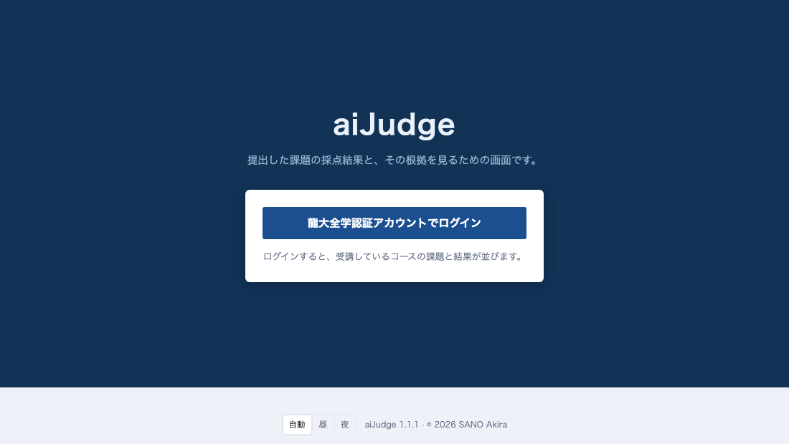

## 2. コースと課題を開く

ログインすると受講しているコースが並びます。コース名を押してください。

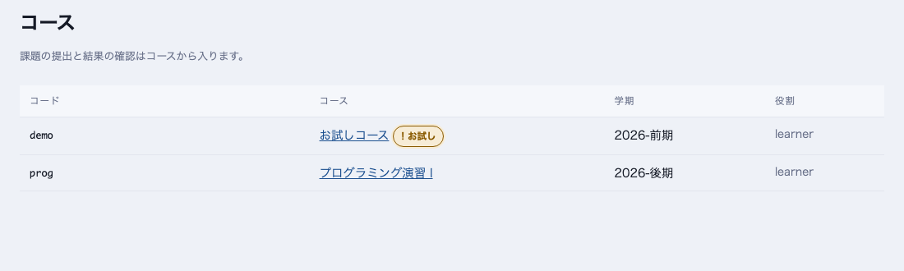

コースの中は **問題セット**（第 N 回）ごとに課題が並びます。
締切・残り時間・提出回数・いまの得点がここで分かります。「開く」で課題へ進みます。

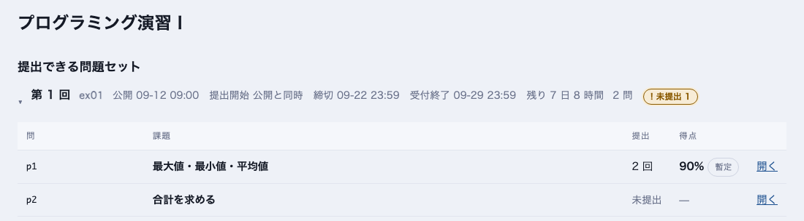

!!! note "「未提出」のバッジ"
    まだ出していない課題があると、問題セットの見出しに **未提出 N** と出ます。

## 3. 提出する

課題の画面に問題文があります。下の「提出する」でファイルを選び、**提出**を押します。
受け付ける拡張子は欄に書いてあります（例: `.c`、`.py`、レポートなら `.pdf` や `.md`）。

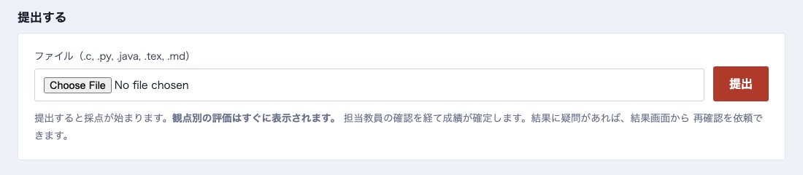

- 出した直後に結果の画面へ移ります
- **同じ内容をもう一度出しても、新しい提出にはなりません**（同じ結果が表示されます）

!!! warning "「学内のみ」と付いている課題"
    試験などで、**学内のネットワークからしか提出できない**課題があります。
    課題の一覧に「学内のみ」と出ます。課題を開くと、いまの接続で提出できるか
    どうかがその場に表示されます。学外からは提出できないので、学内の
    ネットワークに接続してから開き直してください。

### エディタで解く問題セット

問題セットによっては、ファイルを選ぶ代わりに**ブラウザのエディタで書いて提出**します。
コースの画面で問題セットの見出しの下に **エディタで解く** が出ていれば、それを押します。

- 問題ごとに**タブ**が並びます。左に問題文、右にエディタがあります
- **形式**は、その問題が受け付けるものから選びます（`.c`・`.py` はプログラム、`.md` は文章）
- プログラムは**標準入力を与えて試しに実行**できます。公開サンプルがあれば「このサンプルで実行」でも試せます。
  試しの実行は採点ではなく、点には関係しません。`.md` の文章は実行せず、書いて提出します
- 書いた内容は **10 秒ごとに自動で保存**されます。ページを閉じても、別の PC から開いても続きから書けます
- 「ファイルを読み込む」で、手元のファイルの中身をエディタに入れられます
- 問題ごとに**提出**を押して提出します。何度でも出せて、**最も高い得点が採用**されます
- 右上に**受付終了までの残り時間**が出ます
- 問題セットによっては**補完**（書いた単語やキーワードの候補）が出ます。候補は Tab で確定します。
  試験では出ないことがあります

!!! note "受付終了のときに自動で提出されます"
    受付が終わった時点で、**最後に保存された内容が自動で提出**されます（まだ出していない問題と、
    出したあとに書き換えた問題）。提出時刻は最後に保存された時刻なので、それが締切より前なら
    遅れた扱いにはなりません。得点は提出のうち最も高いものが採用されるので、自動の提出で
    点が下がることはありません。受付終了の直前に書いた数秒分は間に合わないことがあります。

!!! warning "作業の記録について"
    エディタでは、答えを作る過程（打鍵、貼り付け、コピー、実行、提出、画面を離れていた時間、
    ときどきの全文）が**時刻付きで記録**されます。最初に開いたときに説明が出るので、読んで
    「確認して始める」を押してください。記録を見られるのは**そのコースの担当教員だけ**で、
    **記録から自動で減点したり、不正と判定したりはしません**。締切から 6 か月（締切の無い課題は
    1 年）で消します。書きかけの自動保存は受付終了から 1 か月で消します。消したあとも、災害に
    備えたバックアップに最大 6 か月残り、その後自動的に消えます。

### この課題で問うこと

課題によっては、問題文の下に**この課題で問うこと**（知識要素）が並びます。
「回数の決まったくりかえし」「配列」のような、その課題が確かめようとしている
内容です。採点の結果はこれらの記録として積み上がります。

提出の画面にも「問われたこと」として同じものが出ます（採点が済んでから）。

### 身についたこと

コースの画面の「**身についたこと**」から、知識要素ごとの**習熟度**と**確信度**が
見られます。数値と帯グラフで並び、それぞれの根拠になった提出は畳んであります
（押すと開きます）。

!!! warning "これは推定値で、成績ではありません"
    採点結果から「どれくらい身についていそうか」を見積もったものです。
    **この見積もりがどれだけ当たるかは、まだ測っていません。**
    成績は課題ごとの点で決まります。
    確信度が低いときは、提出を重ねると見積もりが落ち着きます。

## 4. 結果を読む

### 結果は 2 段階で届きます

**テスト実行などの機械の判定は数秒**、**AI の判定は 30 秒ほど**あとに届きます。
待っている間は画面の上にその旨が出て、届くと自動で表示が更新されます。

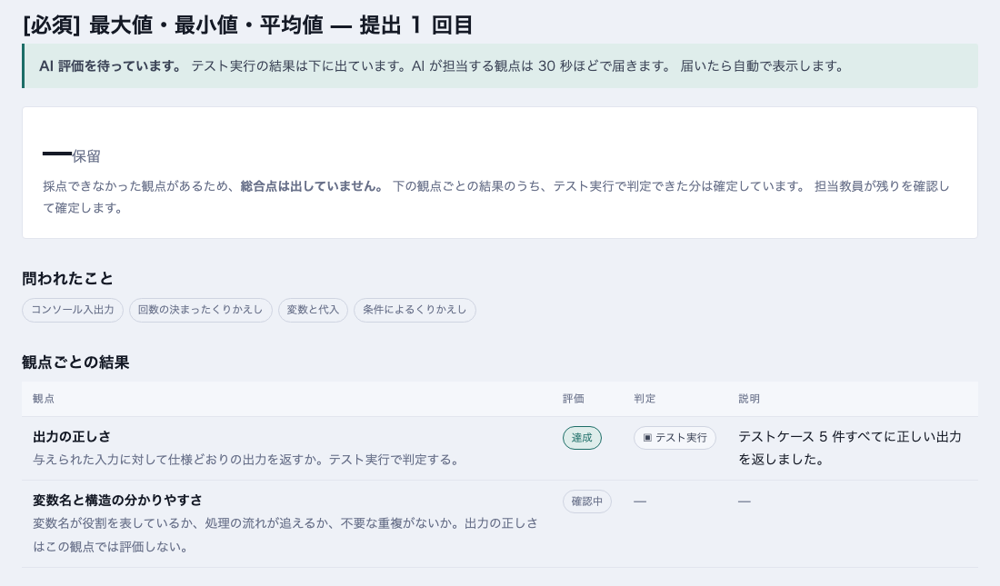

### 観点ごとに理由が付きます

すべて届くと、総合点と観点ごとの結果が出ます。
**「判定」列**でどう判定されたかが分かります。

| 判定 | 意味 |
|---|---|
| **テスト実行** | あなたのプログラムを実際に動かして、出力を比べた結果 |
| **AI** | モデルが根拠を添えて判定したもの。「該当行」はコードのどの行を見たか |
| **人** | 担当教員が見て決める観点（写真・手書きなど） |

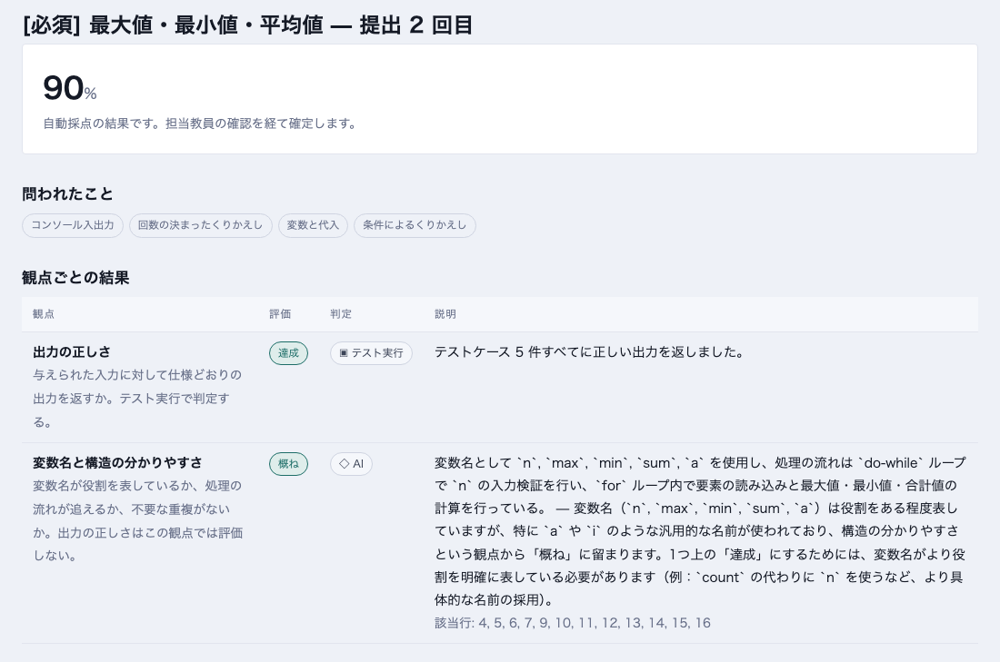

!!! tip "「暫定」と「確定」"
    総合点の下に **自動採点の結果です。担当教員の確認を経て確定します** とあるうちは暫定です。
    教員が確認すると「担当教員が確認した成績です」に変わり、教員からのコメントが表示されます。

!!! warning "「保留」で総合点が出ないとき"
    人が見る観点が残っている課題（写真の提出など）では、機械や AI が採点できた観点だけを
    合計した点は出しません。**担当教員が確認するまで総合点は「保留」**です。故障ではありません。

## 5. 出し直す

締切まで何度でも出せます。**最も高い点の提出が成績に採用されます**（「採用」のバッジ）。
課題の画面の下に、これまでの提出が並びます。

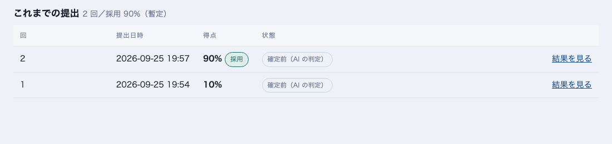

!!! note "締切を過ぎたら"
    「受付終了」までは提出できますが、**遅延として減点**されます。
    減点は内容の評価とは分けて表示されるので、点が低い理由が「内容」なのか「遅れ」なのかが分かります。

## 6. 納得できないとき — 再確認を依頼する

判定に疑問があるときは、結果の画面の「採点の再確認を依頼する」に
**どの観点の、どこが違うと考えるか**を書いて送ります（10 文字以上）。

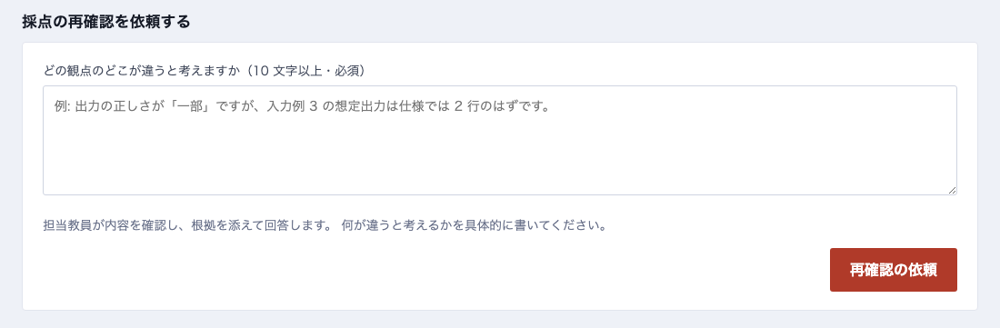

担当教員が内容を確認し、根拠を添えて回答します。回答は同じ画面の「担当教員から」に出ます。

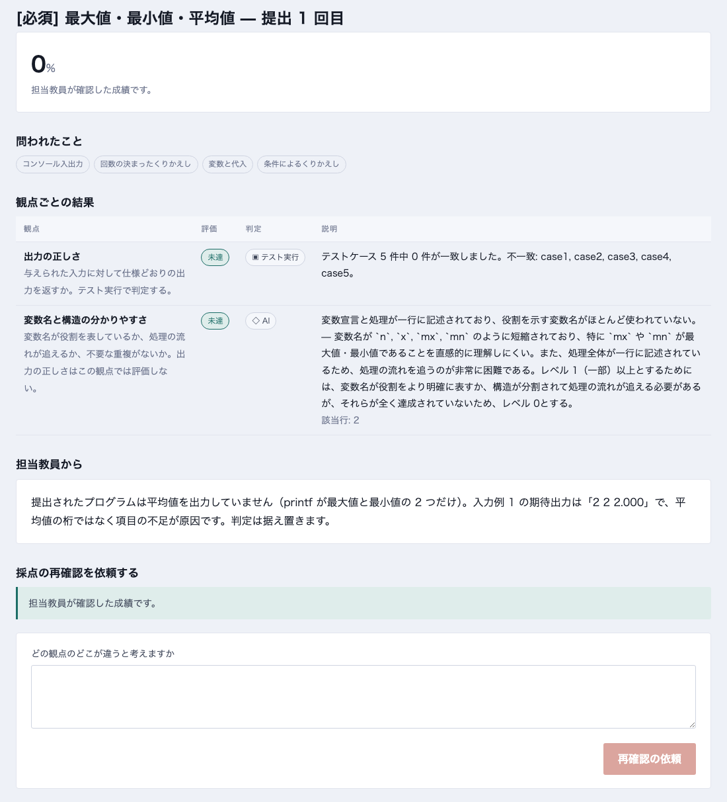

!!! tip "書き方のコツ"
    「点が低い」ではなく、「入力例 2 の期待出力は仕様では 2 行のはずです」のように
    **具体的に**書くと、確認が早く進みます。

## 7. スマホでも使えます

幅の狭い画面では表が 1 件ずつのカードになります。できることは同じです。

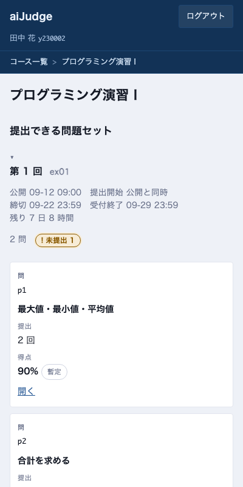{ .narrow }

## 8. お試しコース

「お試しコース」は自由に触るためのコースです。
**ここでの提出は成績にも学習履歴にも残りません。** 提出の流れや結果の読み方を確かめたいときに使ってください。

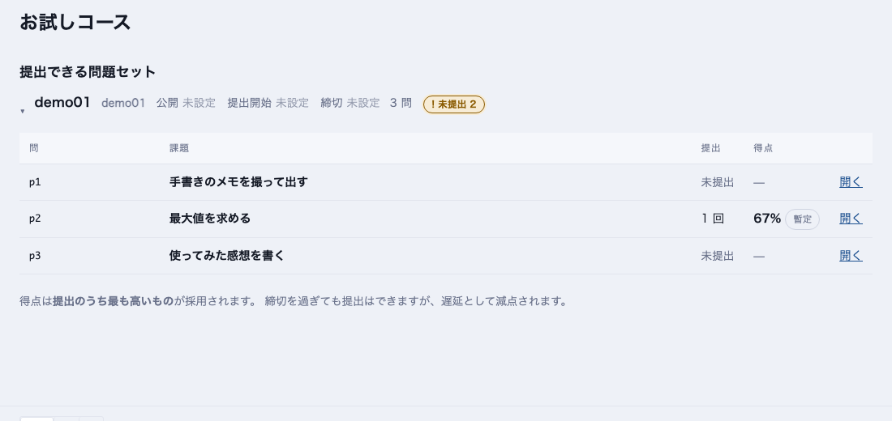

## よくある質問

**Q. 出したのに結果が出ません**
: 画面を再読み込みしてください。AI の判定は混み合うと数分かかることがあります。
  「採点されていません」のまま長く続くときは担当教員に連絡してください。

**Q. コンパイルエラーになりました**
: 「出力の正しさ」の説明欄にエラーの内容が出ます。直して出し直してください。回数の制限はありません。

**Q. 点は誰が決めるのですか**
: AI は提案するだけです。確定するのは担当教員（または TA）で、確定時の根拠が画面に表示されます。

**Q. 提出したファイルは外部に送られますか**
: いいえ。採点は学内のサーバで行い、学外のサービスには送りません。
