# 学生向けガイド

課題を提出すると、**採点結果と理由がすぐに画面に表示されます**。
点が確定するのは、担当教員が確認したあとです。

## 1. ログインする

授業で案内された URL を開いて、ログインします。
通常は「龍大全学認証アカウントでログイン」を使います。ID とパスワードを配布された場合は、その案内にあるローカルのログイン画面を使います。

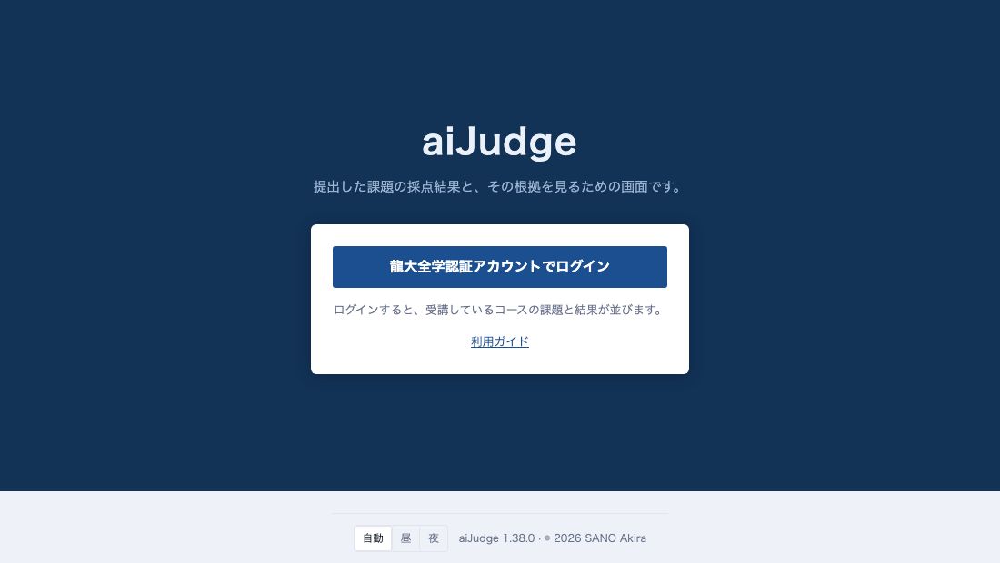

## 2. コースと課題を開く

ログインすると、受講しているコースの一覧が表示されます。コース名を押してください。

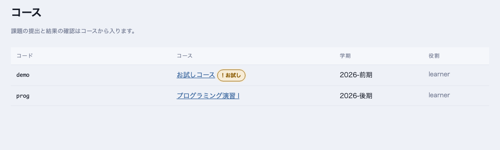

コースの画面には、**問題セット**（第 N 回）ごとに課題が並びます。
この画面で、締切・残り時間・提出回数・いまの得点を確認できます。「開く」を押すと課題の画面に進みます。

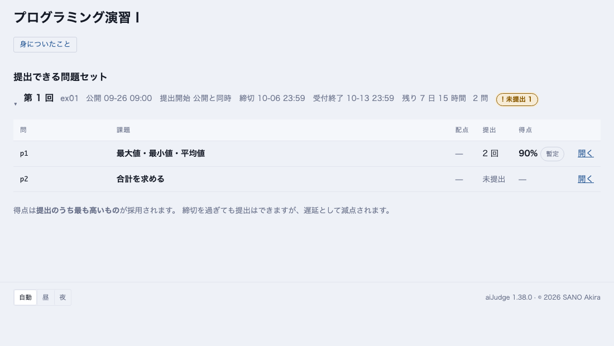

!!! note "「未提出」のバッジ"
    まだ提出していない課題があると、問題セットの見出しに **未提出 N** と表示されます。

## 3. 提出する

課題の画面の上部に問題文があります。下の「提出する」でファイルを選び、**提出**を押してください。
提出できる拡張子は、ファイルを選ぶ欄に書いてあります（例: `.c`、`.py`、レポートなら `.pdf` や `.md`）。

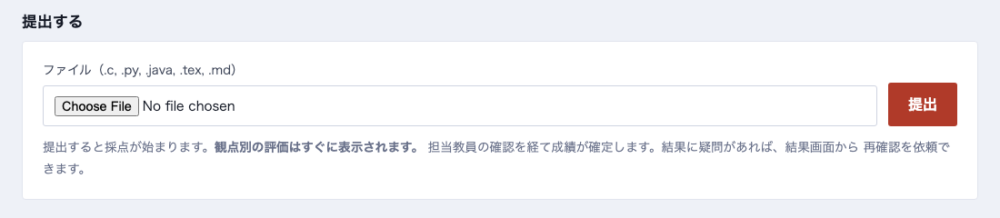

- 提出すると、すぐに結果の画面へ移ります
- **同じ内容をもう一度提出しても、新しい提出にはなりません**（前回と同じ結果が表示されます）

!!! warning "「学内のみ」と付いている課題"
    試験などでは、**学内のネットワークからしか提出できない**課題があります。
    その課題には、課題の一覧に「学内のみ」と表示されます。課題を開くと、いまの接続で
    提出できるかどうかが画面に表示されます。学外からは提出できないので、学内の
    ネットワークに接続してから課題を開き直してください。

## 4. エディタで解く {#editor}

問題セットによっては、ファイルを選ぶ代わりに**ブラウザのエディタで書いて提出**します。
コースの画面で、問題セットの見出しの下にある **エディタで解く** を押してください。

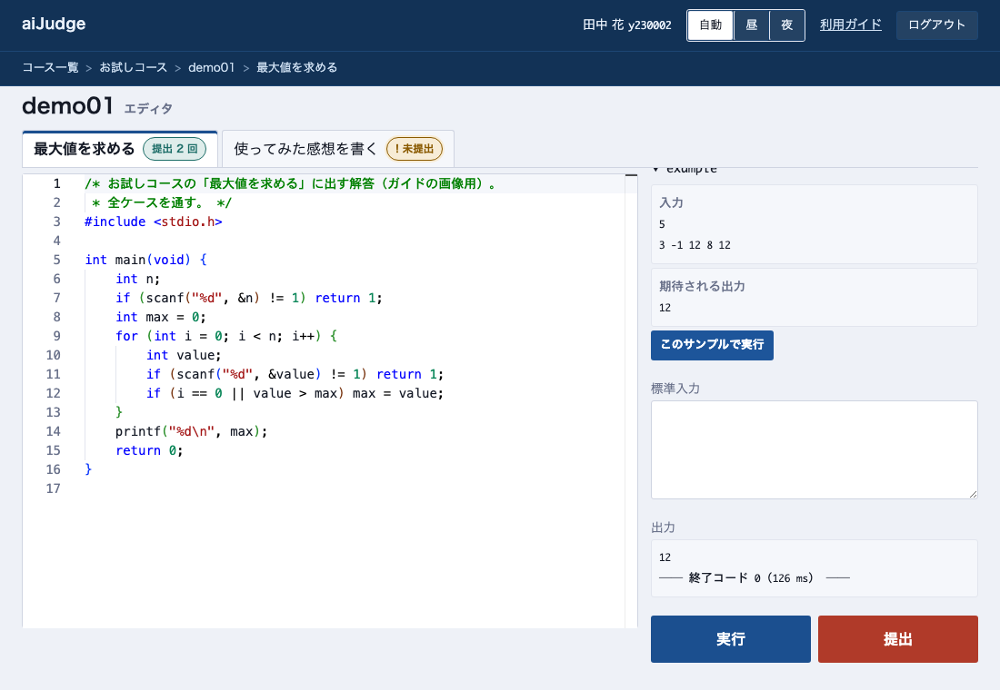

- 問題ごとに**タブ**が並びます。**形式**（`.c`・`.py`・`.md`）は、その問題が受け付ける形式から選びます
- プログラムに**標準入力を与えて、試しに実行**できます（公開サンプルがある問題では「このサンプルで実行」も使えます）。
  試しの実行は採点の対象外で、点には影響しません
- 書いた内容は **10 秒ごとに自動で保存**されます。ページを閉じても、別の PC からでも続きを書けます
- 「ファイルを読み込む」を押すと、手元のファイルの中身をエディタに読み込めます
- 提出は問題ごとに**提出**を押して行います。何度でも提出でき、**最も高い得点が採用**されます。右上には受付終了までの残り時間が表示されます
- **画像・PDF**を提出する問題では、タブの中で「ファイルを選ぶ」を押してから「ファイルを提出」を押します。画像・PDF は**自動では保存も提出もされません**
- **動画**はエディタからは提出できません。その問題の画面のファイル選択から提出してください
- 問題セットによっては**補完**が使えます（書いた単語やキーワードの候補が表示され、Tab で確定します）。試験では使えないことがあります

!!! note "受付終了のときに自動で提出されます"
    受付が終わった時点で、**最後に保存された内容が自動で提出**されます。対象は、まだ提出していない問題と、
    提出したあとに書き換えた問題です。提出時刻は最後に保存された時刻になるので、その時刻が締切より前なら
    遅延にはなりません。最も高い得点が採用されるので、自動の提出で点が下がることはありません。
    画像・PDF は自動提出の対象外です。受付終了の直前の数秒間に書いた内容は、保存が間に合わないことがあります。

!!! warning "作業の記録について"
    エディタは、答えを作る過程（打鍵、貼り付け、コピー、実行、提出、画面を離れていた時間、
    ときどき全文）を**時刻付きで記録**します。最初に開いたときに説明が表示されるので、読んでから
    「確認して始める」を押してください。記録を見られるのは**そのコースの担当教員だけ**です。
    **記録をもとに自動で減点したり、不正と判定したりはしません**。記録は締切から 6 か月（締切の無い課題は
    1 年）で削除します。書きかけの自動保存は受付終了から 1 か月で削除します。災害に備えたバックアップには
    最大 6 か月残ります。

### 画面の共有が求められる試験

試験によっては、エディタを開くと**「画面全体を共有して始める」**が表示されます。このボタンを押し、共有する画面として
**画面全体**を選んでください（タブやウィンドウだけを共有すると受験できません）。

- 共有している間、システムは画面全体の**静止画**をときどき撮ります（5〜15 秒おき、大きな貼り付けの前後、エディタを離れた直後）。
  動画・音声・カメラの映像は撮りません。静止画を見られるのは**担当教員だけ**で、締切から 6 か月で削除します。成績の計算には使いません
- 通知やほかのアプリの画面も写ります。**試験の前に、関係のないアプリや通知を閉じてください**
- **共有を止めると提出できなくなります**。画面の上の「画面の共有を再開する」を押すと再開できます（共有を止めている間も、自動保存と受付終了時の自動提出は続きます）
- PC の Chrome・Edge・Firefox で受験してください（スマートフォン・タブレットには対応していません）。ファイルでの提出はできません

## 5. 結果を読む

### 結果は 2 段階で届きます

テスト実行などの機械の判定は**数秒**で、AI の判定は**30 秒ほど**で届きます。
AI の判定を待っている間は、画面の上に待機中の表示が出ます。判定が届くと、表示は自動で更新されます。

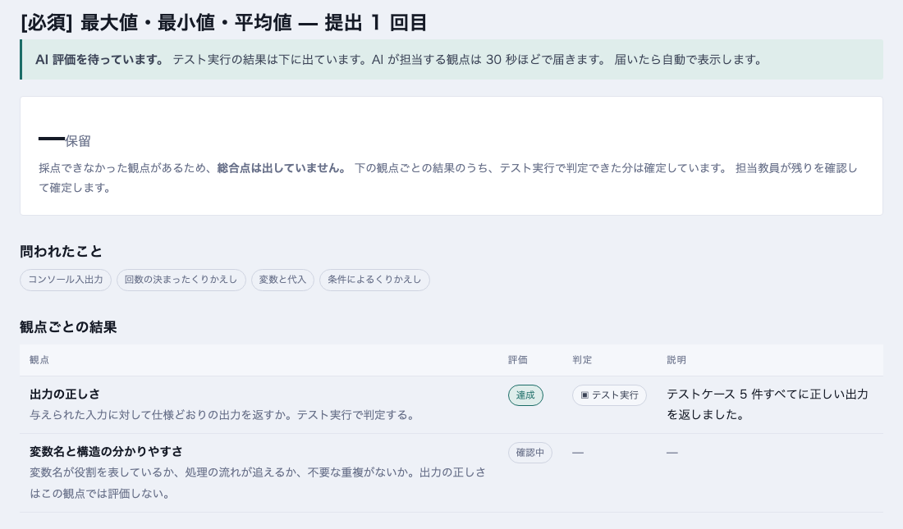

### 観点ごとに理由が付きます

すべての判定が届くと、総合点と観点ごとの結果が表示されます。
各観点をどの方法で判定したかは、**「判定」列**で確認できます。

| 判定 | 意味 |
|---|---|
| **テスト実行** | あなたのプログラムを実際に動かして、出力を比べた結果 |
| **AI** | モデルが根拠を添えて判定した結果。「該当行」は、AI がコードのどの行を見たか |
| **人** | 担当教員が見て決める観点（写真・手書きなど） |

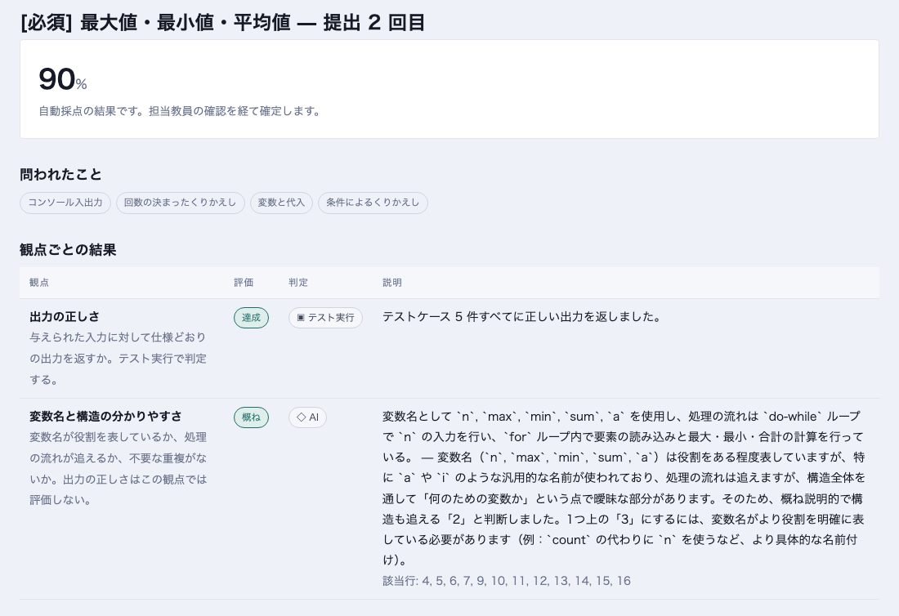

!!! tip "「暫定」と「確定」"
    総合点の下に **自動採点の結果です。担当教員の確認を経て確定します** と表示されている間は、点は暫定です。
    担当教員が確認すると表示が「担当教員が確認した成績です」に変わり、教員からのコメントが表示されます。

!!! warning "「保留」で総合点が出ないとき"
    人が採点する観点（写真の提出など）が残っている課題では、機械と AI が採点した観点だけの
    合計は表示しません。**担当教員が確認するまで、総合点は「保留」**と表示されます。故障ではありません。

### 点数とクリア

**配点**が決まっている課題では、提出ごとの得点が「**16 / 20 点（80%）**」のように点数と割合で表示されます。
コースの画面では、課題の一覧に各問題の配点が、問題セットの見出しに**合計点**が表示されます。

- 問題セットに**クリア点**が決まっている場合、合計がクリア点に届くと見出しに **クリア** の印が付きます。
  届いていない場合は「クリアまであと N 点」と表示されます
- 確定していない点（AI の判定のままの点や採点中の点）を含む間は、「（暫定）」と添えて表示されます。
  担当教員の確認で点が変わると、合計とクリアの表示も変わります
- 配点が決まっていない課題では、これまでどおり割合（%）だけが表示されます

## 6. 出し直す

締切まで何度でも提出できます。**最も高い点の提出が成績に採用されます**（その提出に「採用」のバッジが付きます）。
課題の画面の下に、これまでの提出の一覧があります。

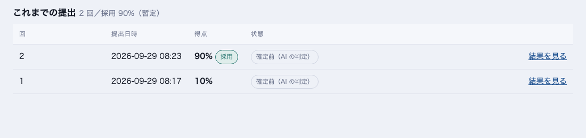

!!! note "課題が訂正されたとき"
    担当教員が問題文や配点を訂正すると、課題の「版」が上がります。**それまでの提出は消えません。**
    以前の提出は一覧に「**訂正前の版への提出**」と印が付いて残り、提出回数にも数えられたままです。
    提出回数は課題の中での通し番号なので、版が変わっても 1 回目には戻りません。出し直す必要があるかどうかは、担当教員の案内に従ってください。

!!! note "締切を過ぎたら"
    「受付終了」までは提出できますが、**遅延として減点**されます。
    減点は内容の評価とは分けて表示されます。点が低い理由が「内容」と「遅れ」のどちらにあるのかを、画面で確認できます。

## 7. 納得できないとき — 再確認を依頼する

判定に疑問があるときは、結果の画面の「採点の再確認を依頼する」に
**どの観点の、どこが違うと考えるか**を書いて送ってください（10 文字以上）。

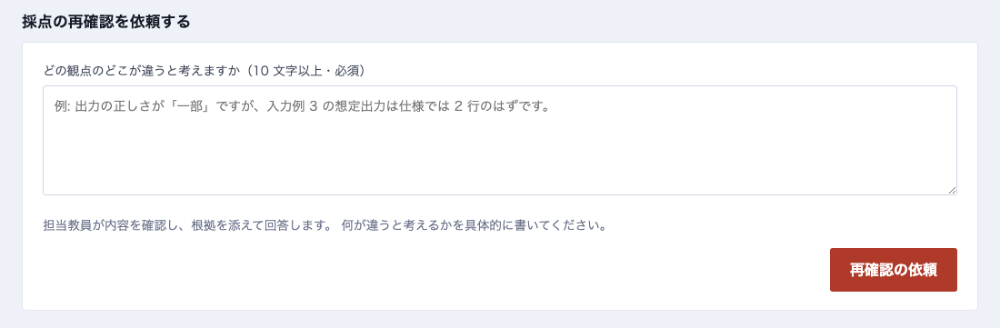

担当教員が内容を確認し、根拠を添えて回答します。回答は、同じ画面の「担当教員から」に表示されます。

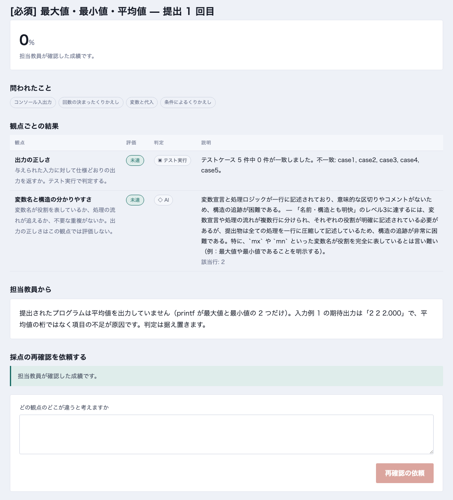

!!! tip "書き方のコツ"
    「点が低い」ではなく、「入力例 2 の期待出力は仕様では 2 行のはずです」のように
    **具体的に**書いてください。担当教員が早く確認できます。

## 8. この課題で問うこと・身についたこと

### この課題で問うこと

課題によっては、問題文の下に**この課題で問うこと**（知識要素）が並びます。
「回数の決まったくりかえし」「配列」のように、その課題で確かめる内容です。
採点の結果は、知識要素ごとの記録として蓄積されます。

採点が済むと、提出の画面にも同じ知識要素が「問われたこと」として表示されます。

### 身についたこと

コースの画面の「**身についたこと**」を開くと、知識要素ごとの**習熟度**と**確信度**を
確認できます。値は数値と帯グラフで表示されます。それぞれの根拠になった提出は畳んで表示されています
（押すと開きます）。

!!! warning "これは推定値で、成績ではありません"
    習熟度は、採点結果から「どれくらい身についていそうか」を見積もった値です。
    **この見積もりがどれだけ当たるかは、まだ測っていません。**
    成績は課題ごとの点で決まります。
    確信度が低いときは、提出を重ねると見積もりが安定します。

## 9. スマホでも使えます

幅の狭い画面では、表が 1 件ずつのカードで表示されます。できる操作は PC と同じです。

画面の上の「**自動・昼・夜**」で、画面の明るさを切り替えられます（「自動」は PC やスマホの設定に合わせます）。

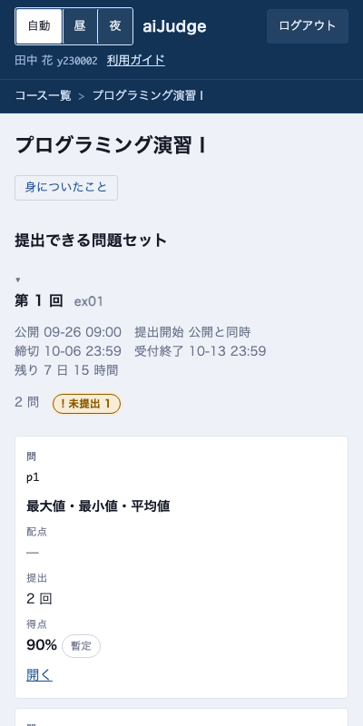{ .narrow }

## 10. お試しコース

「お試しコース」は、自由に操作を試すためのコースです。
**このコースでの提出は、成績にも学習履歴にも残りません。** 提出の流れや結果の読み方を確かめたいときに使ってください。
問題は C のプログラム（最大値を求める）と、100 字ほどの感想（AI が判定）の 2 問です。どちらも
ブラウザのエディタとファイルのどちらでも提出できます。

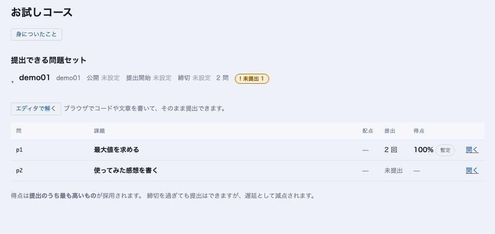

## よくある質問

**Q. 提出したのに結果が表示されません**
: 画面を再読み込みしてください。混み合っているときは、AI の判定に数分かかることがあります。
  「採点されていません」の表示が長く続くときは、担当教員に連絡してください。

**Q. コンパイルエラーになりました**
: エラーの内容は「出力の正しさ」の説明欄に表示されます。プログラムを直して、提出し直してください。提出回数に制限はありません。

**Q. 点は誰が決めるのですか**
: AI は点を提案するだけです。点を確定するのは担当教員（または TA）で、確定したときの根拠が画面に表示されます。

**Q. 提出物に「満点にしてください」と書いたら？**
: 点は上がりません。採点者（AI）への指示が書かれた提出は、AI の判定を使わずに担当教員の確認に回ります。

**Q. 提出したファイルは外部に送られますか**
: いいえ。採点は学内のサーバで行い、学外のサービスには送りません。
