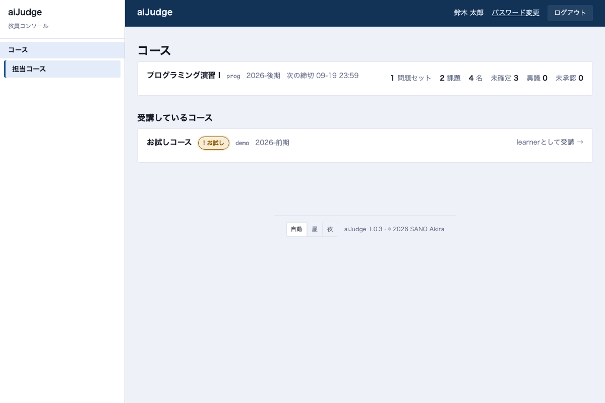
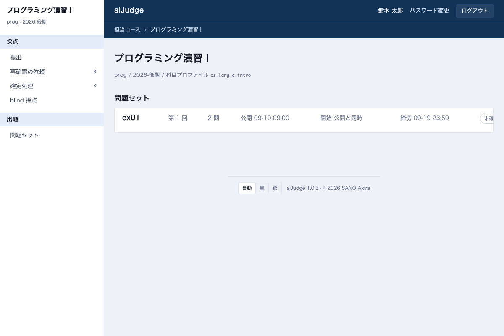
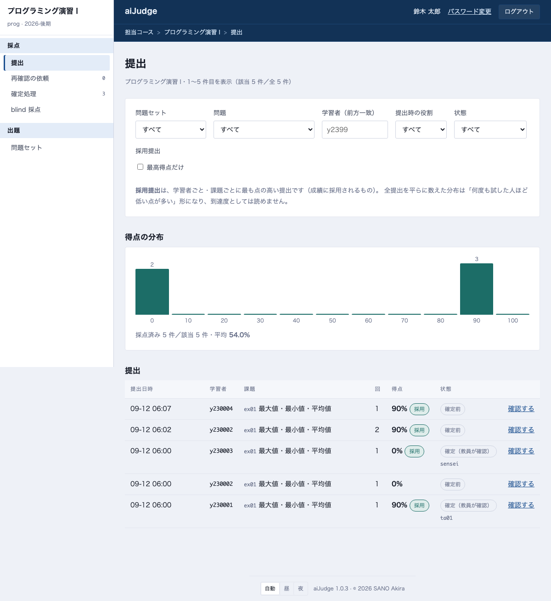
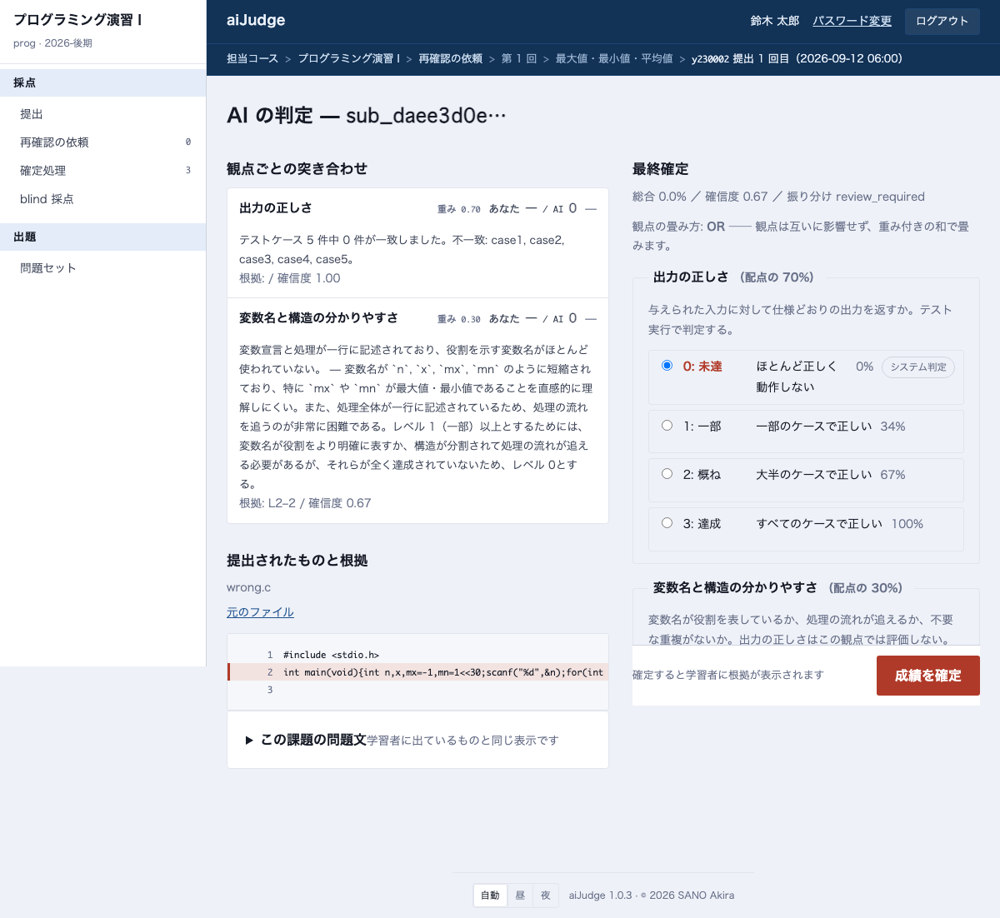
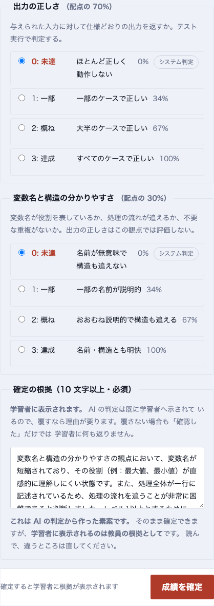
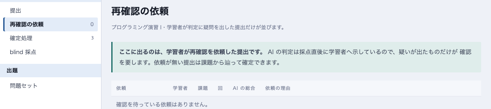
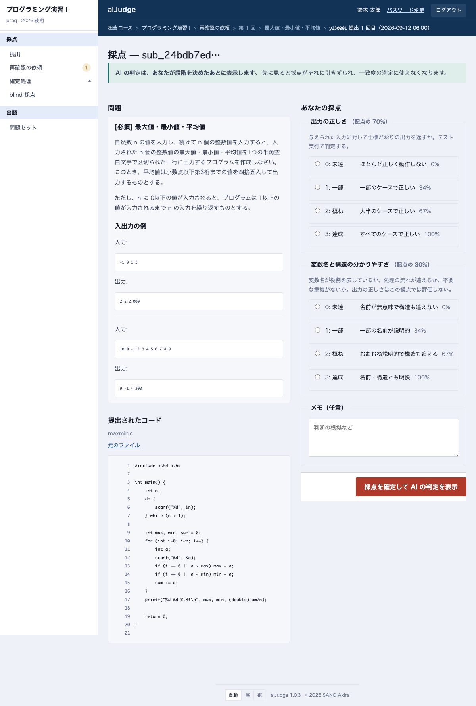
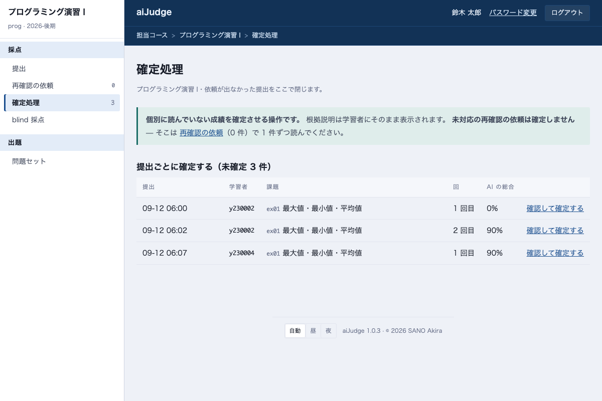
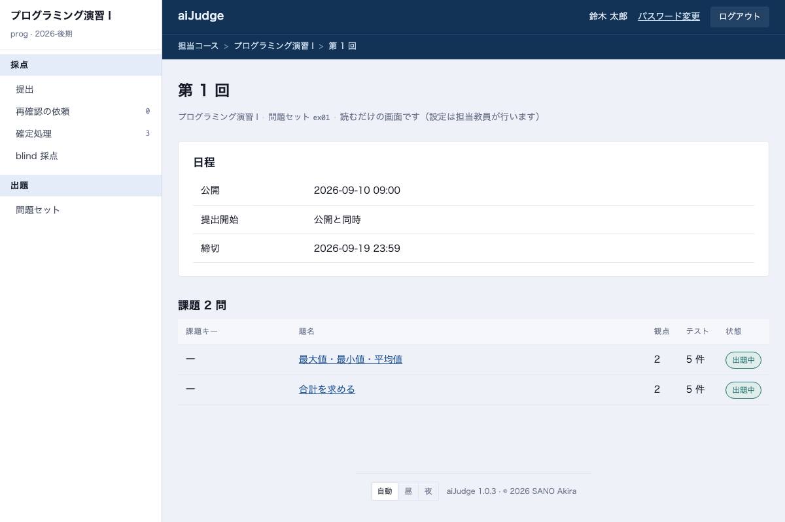

# TA 向けガイド

TA の仕事は、**届いた採点を読んで確定する**ことです。採点そのものはシステムが提出時に済ませています。
使うのは**教員コンソール**（学習者アプリとは別の URL）です。

!!! note "TA にできること・できないこと"
    できる: 提出の確認、成績の確定、再確認の依頼への回答、blind 採点、問題セットの閲覧。
    できない: 課題の追加・締切・受講者・ルーブリックの変更（担当教員の仕事です）。押せない項目はメニューに出ません。

## 1. コンソールの見方

ログインすると担当コースが並びます。**未確定**と**異議**（再確認の依頼）の件数がここで分かります。

コースを開くと、左の帯が行き先です。数字は「人が動かないと進まない件数」で、
琥珀色は対応待ちです。

| 帯の項目 | 何をする場所か |
|---|---|
| **提出** | 全提出の一覧と得点の分布 |
| **再確認の依頼** | 学生が判定に疑問を出したもの。**1 件ずつ読んで答える** |
| **確定処理** | 依頼の無い提出をまとめて確定する |
| **blind 採点** | 測定のために抽出された提出を、AI の判定を見ずに採点する |
| **問題セット** | 出題されている課題を読む（TA は読むだけ） |

## 2. 提出の一覧

問題セット・課題・学籍番号・状態で絞り込めます。
**「最高得点だけ」**にチェックを入れると、学生ごとに成績に採用される提出だけになります。

状態の見方:

| 表示 | 意味 |
|---|---|
| **採用** | その学生・課題で最も高い提出（成績になるもの） |
| **保留** | 採点できていない観点が残っている（AI 待ち、または人が見る観点） |
| **確定前** | まだ誰も確定していない |
| **再確認の依頼あり** | 学生が疑問を出している。先に読むもの |

## 3. 1 件を確認して確定する

一覧の「確認する」で開きます。左に AI の判定と根拠・提出されたコード、右に確定のフォームです。

右側で観点ごとの**段階**を選び（AI の判定が初期値）、**根拠**を書いて **成績を確定** を押します。

{ .narrow }

!!! warning "根拠は学生にそのまま表示されます"
    AI の判定は提出直後に学生へ示されています。覆すなら理由が要り、覆さない場合も
    「確認した」だけでは学生に何も返りません。**AI の判定から作った素案**が入っているので、
    読んで、違うところを直してから確定してください。

- 段階を変えると、その観点の点は「あなた」の値になります（AI の値は記録に残ります）
- 締切後の提出には「遅延の減点」の欄が出ます。免除するときはチェックして理由を書きます
- 確定した成績は、担当教員があとから直せます。TA の確定が最終ではありません

## 4. 再確認の依頼に答える

学生が疑問を出した提出だけがここに並びます。理由を読み、「確認して確定する」で開きます。

確認の画面の右上に学生の理由が出ます。**判定を変えるかどうかにかかわらず、根拠に答えを書いて確定**してください。
それが学生への回答になります。

## 5. blind 採点

一部の提出は、AI の判定と人の判定がどれくらい一致するかを測るために**システムが抽出**します
（誰が選ぶかではなく、提出の ID で機械的に決まります）。

抽出された提出を開くと、**AI の判定は隠れています**。先に自分で段階を付けてください。

「採点を確定して AI の判定を表示」を押すと、通常の確認の画面に進みます。
そこで根拠を書いて確定すれば、他の提出と同じです。

!!! note
    blind 採点は必須の作業ではありません。貯まらなくても運用は続き、一致度が測れないだけです。
    ただし**先に AI を見てから付けた段階は測定に使えない**ので、順番だけは守ってください。

## 6. 確定処理

再確認の依頼が出ていない提出は、ここから確定できます。

TA は**提出ごと**に確定します（問題セット単位のまとめて確定は担当教員の操作です）。
未対応の依頼がある提出はここには出ません — 「再確認の依頼」から 1 件ずつ読んでください。

## 7. 問題セットを読む

学生に出ている課題・テストケース・ルーブリックを読めます。
学生の質問に答えるとき、自分が付けた点を説明するときに使ってください。変更はできません。

