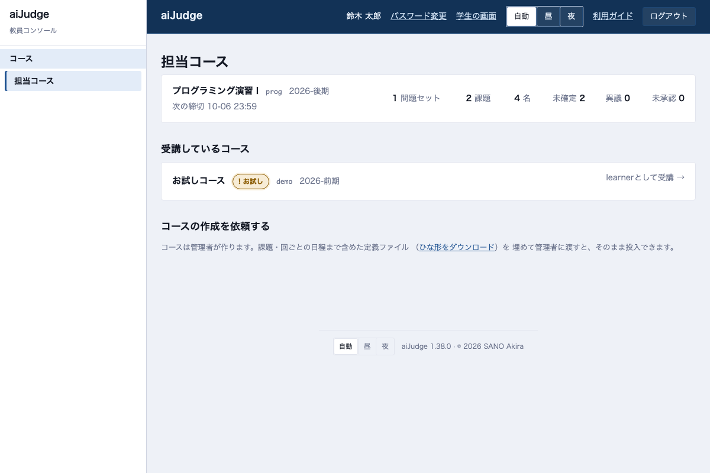
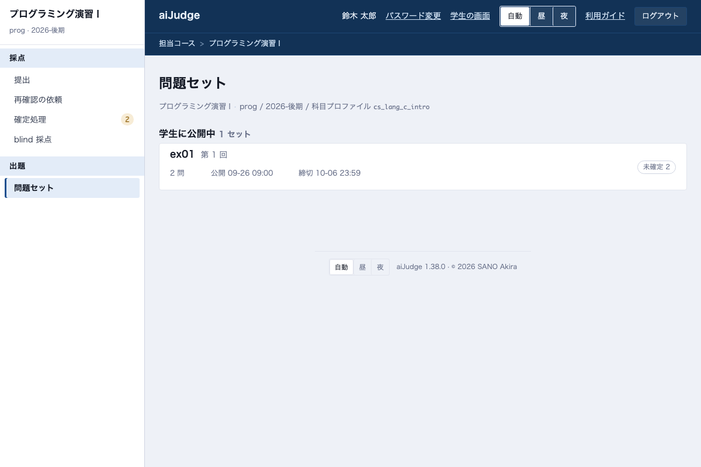
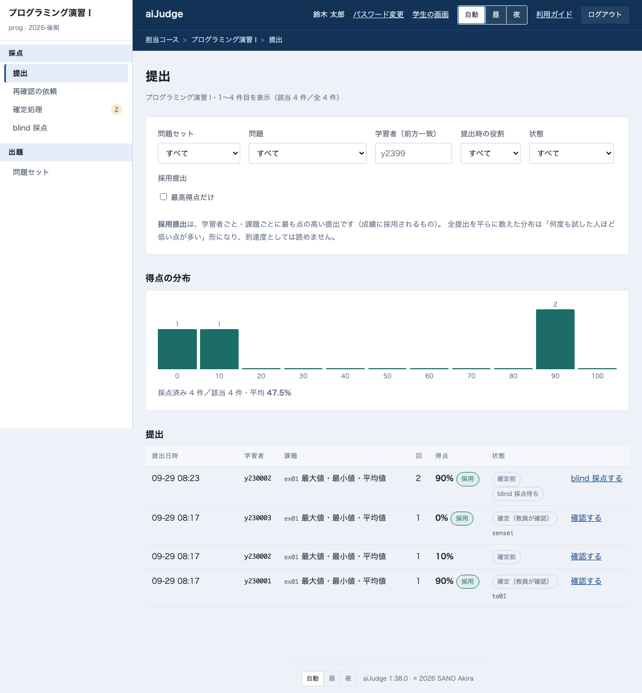
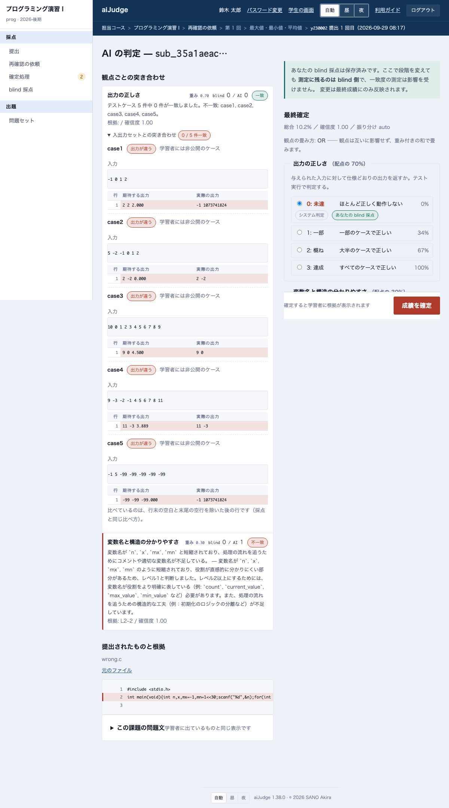
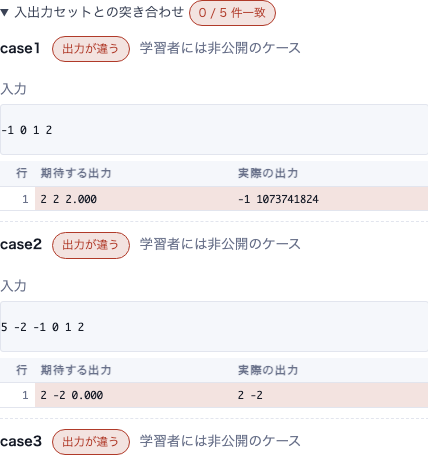
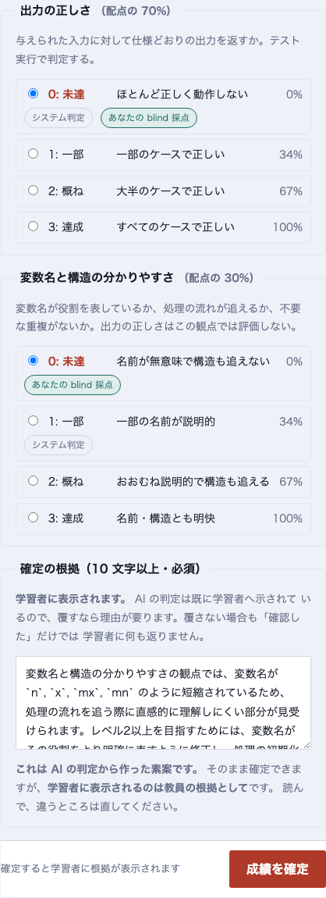
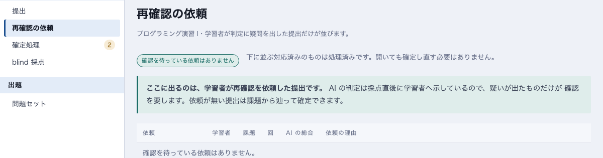
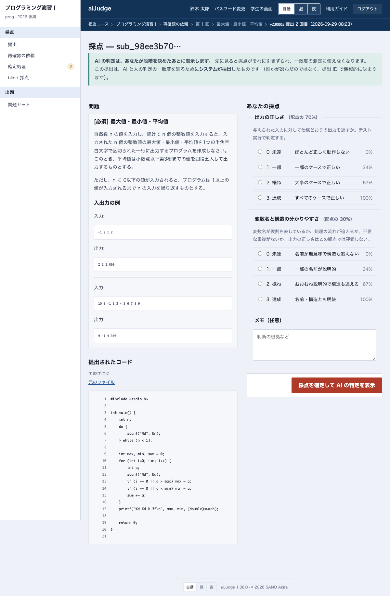
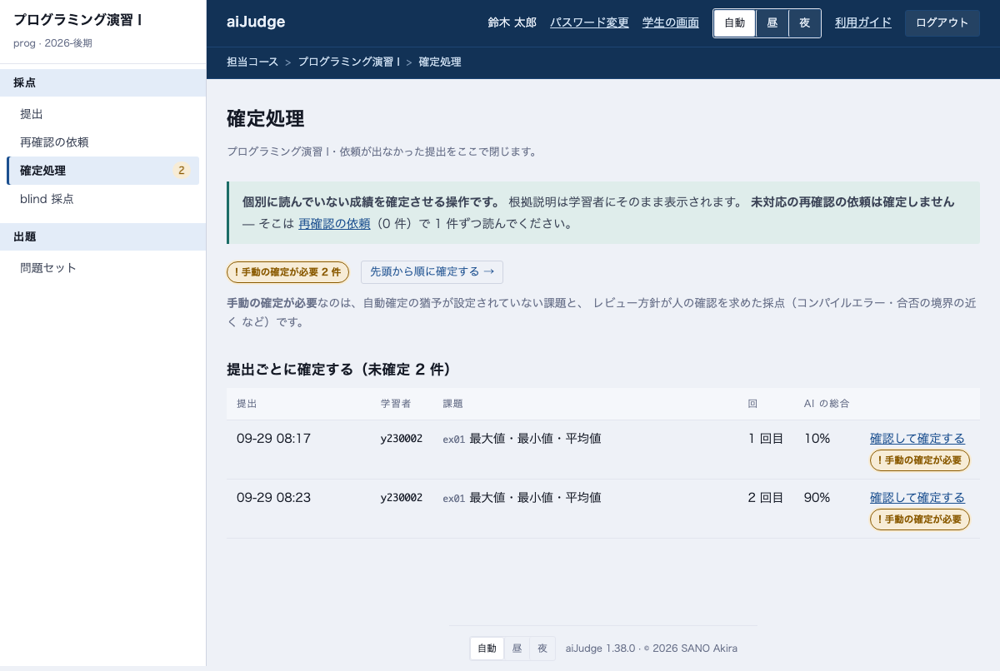
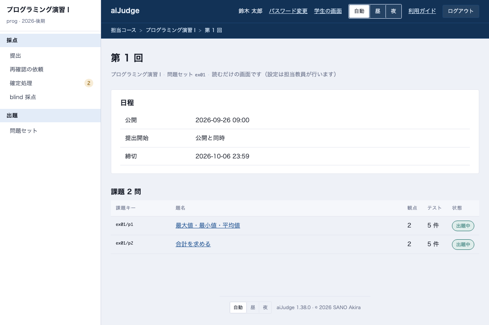

# TA 向けガイド

TA の仕事は、**システムが付けた採点を読んで確定する**ことです。採点そのものは、提出の時点でシステムが済ませています。
TA は**教員コンソール**（学習者アプリとは別の URL）を使います。

!!! note "TA にできること・できないこと"
    できる: 提出の確認、成績の確定、再確認の依頼への回答、blind 採点、問題セットの閲覧。
    できない: 課題の追加・締切・受講者・ルーブリックの変更（担当教員の仕事です）。TA が使えない項目は、メニューに表示されません。

## 1. コンソールの見方

ログインすると、担当コースの一覧が表示されます。この画面で、**未確定**と**異議**（再確認の依頼）の件数を確認できます。

コースを開くと、左の帯に各画面へのリンクが並びます。帯の数字は「人が対応するまで進まない件数」で、
琥珀色の数字は対応待ちを表します。**0 件のときは数字を表示しません。** 「確定処理」の数字は**手動の確定が必要な件数**です。
自動確定を待っている件数は、その下に「自動確定待ち N」と小さく表示されます（時間が来れば自動で確定するので、操作は要りません）。

画面の上には、「**学生の画面**」（学生にどう見えているかを確かめるリンク）と、昼夜の切り替えがあります。

| 帯の項目 | 何をする場所か |
|---|---|
| **提出** | 全提出の一覧と得点の分布 |
| **再確認の依頼** | 学生が判定に疑問を出したもの。**1 件ずつ読んで答える** |
| **確定処理** | 依頼の無い提出をまとめて確定する |
| **blind 採点** | 測定のために抽出された提出を、AI の判定を見ずに採点する |
| **問題セット** | 出題されている課題を読む（TA は読むだけ） |

## 2. 提出の一覧

問題セット・課題・学籍番号・状態で絞り込めます。
**「最高得点だけ」**にチェックを入れると、学生ごとに、成績に採用される提出だけが表示されます。

状態の表示は次のとおりです。

| 表示 | 意味 |
|---|---|
| **採用** | その学生・課題で最も高い提出（成績になるもの） |
| **保留** | 採点できていない観点が残っている（AI 待ち、または人が見る観点） |
| **確定前** | まだ誰も確定していない |
| **再確認の依頼あり** | 学生が疑問を出している。先に読むもの |
| **blind 採点待ち** | 測定のために抽出された提出。開くと AI の判定を見る前に採点する（§5） |
| **エディタ** | 学生がブラウザのエディタで書いて提出したもの（採点のされ方はファイルの提出と同じ） |
| **受付終了時の自動提出** | 学生が押したのではなく、受付終了の時点で保存されていた内容が自動で提出されたもの |
| **v2（いまは v5）** | 課題が訂正される前の版に対する提出（回の欄に出ます）。回数は課題の中の通し番号です |

## 3. 1 件を確認して確定する

一覧の「確認する」を押すと、確認の画面が開きます。左側には上から順に、提出されたコードと問題文、観点ごとの AI の判定と根拠の突き合わせが並びます。右側は確定のフォームです。

右側のフォームで観点ごとの**段階**を選び（初期値は AI の判定です）、**根拠**を書いて **成績を確定** を押してください。

入出力セットで判定した観点には、**入出力セットとの突き合わせ**が表示されます。一致しなかった
ケースごとに、期待する出力と実際の出力が 1 行ずつ並び、違う行に色が付きます。違いが書式だけか、
答えそのものかをここで見分けてから、段階を決めてください（時間切れ・異常終了・コンパイル
エラーのときは、その理由とエラー出力が表示されます）。

{ .narrow }

!!! warning "根拠は学生にそのまま表示されます"
    学生は、提出の直後から AI の判定を見ています。判定を変えるなら、学生に理由を示す必要があります。判定を変えない場合も、
    「確認した」とだけ書いたのでは、学生には何も伝わりません。根拠の欄には **AI の判定から作った素案**が入っているので、
    読んで、違うところを直してから確定してください。

- 段階を変えると、その観点の点は「あなた」の値になります（AI の値も記録に残ります）
- 締切後の提出には「遅延の減点」の欄が表示されます。減点を免除するときは、チェックを入れて理由を書きます
- TA が確定した成績は、担当教員があとから直せます。TA の確定は最終の判断ではありません

## 4. 再確認の依頼に答える

この画面には、学生が疑問を出した提出だけが並びます。一覧の上には**対応待ちの件数**が表示されます（無ければ
「確認を待っている依頼はありません」と表示されます）。「**先頭から順に処理する →**」を押して 1 件目から開くと、画面の上に
**帯**が表示されます。確定しても帯は表示されたままなので、「**次の 1 件へ →**」で次の依頼に進めます。
すべて処理すると、「待ちはありません（すべて対応済み）」と表示されます。1 件だけ処理するときは、「確認して確定する」で開いてください。

確認の画面の右上に、学生が書いた理由が表示されます。**判定を変える場合も変えない場合も、根拠の欄に回答を書いて確定**してください。
根拠の欄の内容が、そのまま学生への回答になります。

!!! warning "対応済みの依頼を処理し直さない"
    確定済みの提出を開くと、確定のフォームは「**対応済みの判断を訂正する**」の中に畳まれています。
    一覧の下にある「対応済みの依頼」は、処理が済んだ依頼です。開いて読むことはできますが、確定し直す必要はありません
    （確定した判断を直せるのは担当教員だけです）。

## 5. blind 採点

システムは、AI の判定と人の判定がどれくらい一致するかを測るために、**一部の提出を抽出**します。
どの提出を抽出するかは、人が選ぶのではなく、提出の ID から機械的に決まります。

抽出された提出は、提出の一覧で状態が **blind 採点待ち** になり、リンクが「確認する」ではなく
「blind 採点する」になります。開いた画面には、**AI の判定が表示されません**。先に自分で段階を付けてください。

入出力セットで判定する観点がある課題では、左の提出コードの下に**コード実行との対比**
（期待する出力と実際の出力）が表示されます。この対比はテストを実行した結果で、AI の判定ではありません。

「採点を確定して AI の判定を表示」を押すと、通常の確認の画面に進みます。
そこから先は、ほかの提出と同じように根拠を書いて確定してください。

blind 採点の一覧でも、「**先頭から順に採点する →**」を押すと、帯を表示して 1 件ずつ進められます（§4 と同じです）。

!!! note
    blind 採点は必須の作業ではありません。blind 採点が済んでいない提出が残っても運用は続き、一致度を測れないだけです。
    ただし、**AI の判定を見たあとに付けた段階は測定に使えません**。自分で段階を付けてから AI の判定を見る、という順番だけは守ってください。

## 6. 確定処理

再確認の依頼が出ていない提出は、ここから確定できます。

TA は**提出ごと**に確定します（問題セット単位でまとめて確定する操作は、担当教員が行います）。
未対応の依頼がある提出は、この画面には表示されません。その提出は「再確認の依頼」から 1 件ずつ読んでください。

各提出には、「**手動の確定が必要**」か「**自動確定待ち**」の印が付きます。自動確定待ちの提出は、猶予の期間が終わると
自動で確定するので、急ぐ必要はありません。手動の確定が必要な提出は、「**先頭から順に確定する →**」を押すと、
帯を表示して 1 件ずつ進められます（§4 と同じです）。

## 7. 問題セットを読む

学生に出題されている課題・テストケース・ルーブリックを読めます。
学生の質問に答えるときや、自分が付けた点を説明するときに使ってください。TA は内容を変更できません。

問題セットの一覧は、「学生に公開中」と「未公開（TA まで見える）」に分かれています。
「**公開まで教員だけに見せる**」問題セット（試験など）は、公開の時刻まで TA には見えません。

!!! note "習熟度は出ません"
    知識要素ごとの習熟度を見られるのは、担当教員とテナント管理者だけです。
    TA は採点を分担しますが、習熟度は履修の管理に属する情報として扱っています。
